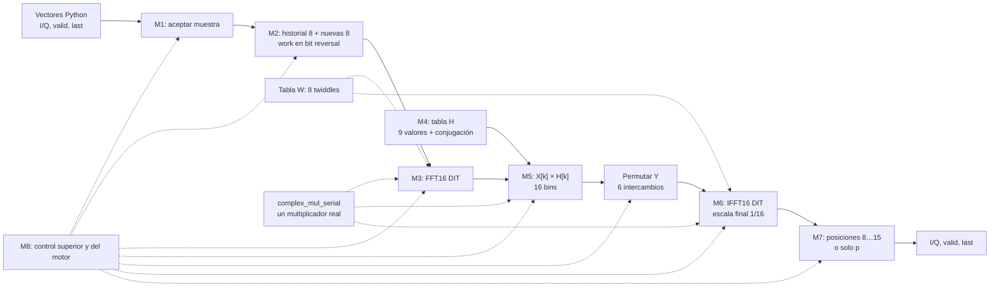
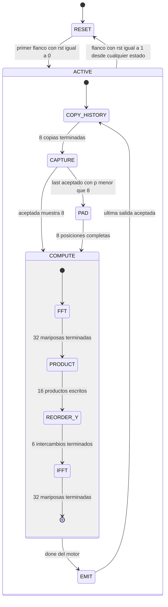

# C01 — Arquitectura RTL del filtro en frecuencia serial

**Estado:** especificación de trabajo para implementar C02; usa la interfaz propuesta en E03 y mantiene los formatos fijos pendientes de A04. Basado en la [revisión de C01 del 9/10/2026](revision-c01-y-modulos-comunes.md), el [contrato de interfaz](contratos/interfaz-rtl.md), el [contrato de frecuencia](contratos/frecuencia.md) y la tabla de taps de [config/project.json](../config/project.json).

## 1. Qué se implementa

El núcleo recibe **muestras complejas ya sobremuestreadas** y calcula `y[n] = Σ(k=0…7) h[k]·x[n−k]`. Procesa una ventana de 16 muestras con ocho anteriores y ocho nuevas: FFT16 → 16 productos por H[k] → IFFT16 → salidas 8…15. Por cada muestra aceptada entrega exactamente una salida con el mismo índice lógico; no emite cola. Un último bloque con p<8 muestras nuevas se rellena con ceros para calcular y entrega solo p resultados.

La primera versión se divide en **tres módulos RTL sintetizables**. La separación sigue las fronteras reales de datos y control:

| Archivo previsto | Módulo | Responsabilidad principal |
|---|---|---|
| `rtl/frequency/fir_frequency_serial.sv` | `fir_frequency_serial` | Interfaz externa, historial de ocho muestras, armado de ventana, longitud de bloque/trama y emisión con pausas. |
| `rtl/frequency/frequency_block_engine.sv` | `frequency_block_engine` | Banco `work` de 16 muestras, FFT, productos por H, permutación, IFFT, constantes H/W y control local de cálculo. |
| `rtl/frequency/complex_mul_serial.sv` | `complex_mul_serial` | Un producto complejo usando un solo multiplicador real en cuatro pasos; instancia única dentro del motor de bloque. |

M1…M8 son **funciones**, no ocho archivos. M1/M7 y el control de tramas pertenecen al módulo superior; M3…M6 al motor de bloque. La misma mariposa física ejecuta FFT e IFFT en momentos distintos, y ambos modos comparten con el producto espectral la instancia `complex_mul_serial`. H y los twiddles son constantes dentro del motor; no requieren ROM externas. C03/C04 podrán cambiar el paralelismo sin alterar el contrato funcional.

El testbench previsto `tb/frequency/tb_fir_frequency_serial.sv` no forma parte del RTL sintetizable y usará vectores Python inyectados directamente en la entrada. Al crear RTL y testbench, registrar **los tres archivos** como fuentes de la variante en `config/rtl_targets.json`. El generador QPSK, el upsampler y una etapa de salida común no son dependencias RTL de C01/C02 tras el [cierre de R01](https://github.com/EnzoFernandezz11/rrc-fir-rtl/issues/31).

## 2. Contratos de los módulos RTL

### 2.1 `fir_frequency_serial`: núcleo e interfaz externa

Los nombres de puertos siguen la propuesta E03 para las cuatro variantes; el nombre del módulo lo define C02. I/Q son componentes **signed** en complemento a dos y viajan juntas. `W_IN=2`, `F_IN=0` es la base de entrada de E02/E03; `W_OUT/F_OUT` y los formatos internos los fijará A04. `F_*` indica bits fraccionarios y no agrega un puerto.

| Parámetro de formato | Valor de trabajo | Estado |
|---|---|---|
| `W_IN`, `F_IN` | 2, 0 | Entrada exacta para −1, 0, +1 según E02/E03. |
| `W_OUT`, `F_OUT` | Por fijar | Resultado externo común de ambos filtros; A04. |
| Anchos de `work`, H, W y productos | Por fijar | Deben soportar FFT sin escala e IFFT escalada al final; A04. |

| Puerto | Dirección | Ancho | Significado |
|---|---|---|---|
| `clk` | Entrada | 1 | Reloj; transferencias en flanco ascendente. |
| `rst` | Entrada | 1 | Reset síncrono activo alto: cancela trabajo y salidas pendientes, limpia contadores e historial en el flanco. |
| `in_i`, `in_q` | Entrada | `W_IN` cada uno | Muestra compleja en formato `W_IN/F_IN`; incluye ceros válidos del sobremuestreo. |
| `in_valid` | Entrada | 1 | La fuente presenta `{in_i, in_q, in_last}`. |
| `in_ready` | Salida | 1 | El núcleo puede aceptar una muestra nueva. |
| `in_last` | Entrada | 1 | Marca la última muestra de una trama; solo cuenta al aceptarse. |
| `out_i`, `out_q` | Salida | `W_OUT` cada uno | Resultado causal ya escalado y convertido a `W_OUT/F_OUT`. |
| `out_valid` | Salida | 1 | Hay un resultado presentado. |
| `out_ready` | Entrada | 1 | El receptor acepta un resultado. |
| `out_last` | Salida | 1 | Marca solo el último resultado de la trama. |

Una entrada se acepta únicamente en el flanco con `rst=0 && in_valid && in_ready`; una salida se entrega únicamente con `rst=0 && out_valid && out_ready`. Si una transferencia está detenida, su productor mantiene `valid`, I/Q y `last` estables. `in_ready=0` durante copia de historial, cálculo y emisión; no hay FIFO ni captura del bloque siguiente mientras se procesa el actual. `in_ready` no depende combinacionalmente de `in_valid` y `out_valid` no depende combinacionalmente de `out_ready`. Con `rst=1`, `in_ready=out_valid=0`; en ese flanco se cancelan el cálculo y las salidas pendientes y se limpia el historial. En el primer flanco con `rst=0` puede comenzar otra trama con `x[0]`. Una trama vacía consiste en ninguna transferencia y ninguna salida, sin comando especial.

El módulo superior conserva `history[0…7]` en orden temporal. Copia esas ocho muestras al motor y después le entrega hasta ocho muestras nuevas; cada entrada aceptada actualiza su posición de `history`. Si `last` llega antes de completar ocho, entrega ceros al motor hasta cerrar la ventana. Una vez que el motor avisa `done`, lee sus resultados 8…15 y presenta solo las salidas correspondientes a muestras reales. Conserva `out_i/q/last` durante pausas y limpia `history` al terminar una trama. No calcula FFT, H ni productos espectrales.

### 2.2 `frequency_block_engine`: procesamiento de una ventana

Este módulo **posee el único banco `work[0…15]`**. Su interfaz con `fir_frequency_serial` es interna y síncrona; no usa `valid/ready` porque el módulo superior ya controla cuándo puede cargarlo y cuándo empieza el cálculo.

| Puerto | Dirección | Ancho | Contrato |
|---|---|---|---|
| `clk`, `rst` | Entrada | 1 cada uno | Mismo reloj y reset síncrono del núcleo; reset aborta un cálculo en curso. |
| `load_en` | Entrada | 1 | Escribe una muestra en el flanco mientras el motor está libre. |
| `load_index` | Entrada | 4 | Índice **temporal** 0…15; el motor escribe internamente `work[bitrev4(load_index)]`. |
| `load_i`, `load_q` | Entrada | `W_IN` cada uno | Muestra del historial, entrada aceptada o cero de relleno. |
| `start` | Entrada | 1 | Pulso de un ciclo después de cargar los 16 índices; inicia FFT → producto → permutación → IFFT. |
| `done` | Salida | 1 | Pulso al quedar escrito el último resultado IFFT; a partir de entonces pueden leerse salidas. |
| `result_index` | Entrada | 3 | Selecciona r=0…7, equivalente a `work[8+r]` en orden natural. |
| `result_i`, `result_q` | Salida | `W_OUT` cada uno | Resultado combinacional escalado por `1/16` y convertido al formato externo; estable mientras no cambien `result_index` ni `work`. |

`load_en` y `start` no se activan durante el cálculo; después de `done`, el banco se conserva intacto hasta terminar la emisión. El motor recorre 32 mariposas DIT en FFT, 16 bins en orden natural para `Y[k]=X[k]H[k]`, seis intercambios bit reversal y 32 mariposas DIT en IFFT. Usa una sola instancia `complex_mul_serial` tanto para twiddles como para H. Dos lecturas combinacionales y hasta dos escrituras registradas de `work` permiten escribir los dos resultados de una mariposa o intercambiar una pareja en un ciclo.

H y W **no son puertos**: son tablas constantes dentro de `frequency_block_engine`. Sus valores RTL se generarán a partir de los taps cuantizados comunes de A04: `H_q = Q_H(DFT16([h_q, 0…0]))`. Se almacenan `H[0…8]` y se reconstruyen `H[9…15]` por conjugación; W contiene ocho twiddles explícitos y cambia el signo imaginario en modo IFFT. Los anchos, la negación, el redondeo y la saturación los fija A04 antes de codificar esas constantes.

### 2.3 `complex_mul_serial`: multiplicador compartido

El motor lo invoca para `W·B` en cada mariposa y para `X·H` en cada bin. **No tiene interfaz externa al filtro** ni sabe si opera en FFT, producto espectral o IFFT: recibe ya seleccionado el coeficiente complejo.

| Puerto | Dirección | Ancho | Contrato |
|---|---|---|---|
| `clk`, `rst` | Entrada | 1 cada uno | Reset síncrono aborta el producto y baja `done`. |
| `start` | Entrada | 1 | Pulso cuando está libre; captura ambos operandos. No se inicia otro producto hasta `done`. |
| `a_i`, `a_q` | Entrada | `W_A` cada uno | Primer operando complejo signed, en formato `W_A/F_A`. |
| `b_i`, `b_q` | Entrada | `W_B` cada uno | Segundo operando complejo signed, en formato `W_B/F_B`. El motor alinea H y W a esta interfaz. |
| `p_i`, `p_q` | Salida | `W_P` cada uno | Producto complejo con `F_A+F_B` bits fraccionarios, antes del recorte del motor; `W_P ≥ W_A+W_B+1` cubre la suma/resta de dos productos reales. |
| `done` | Salida | 1 | Producto válido durante el ciclo de combinación final; el motor puede registrarlo en ese flanco. |

La unidad usa **un multiplicador real** durante cuatro ciclos para `a_i·b_i`, `a_q·b_q`, `a_i·b_q` y `a_q·b_i`; después forma `p_i = a_i·b_i − a_q·b_q` y `p_q = a_i·b_q + a_q·b_i`. Guarda los cuatro productos reales antes de combinarlos. El motor aplica el recorte numérico que defina A04, según use el resultado como twiddle o como producto espectral. Este `done` en el ciclo de combinación permite escribir `Y[k]` en ese flanco; para la mariposa, el motor registra T y escribe `A±T` al siguiente. Así se conserva el presupuesto de seis ciclos por bin y siete por mariposa, sin agregar un ciclo de enlace entre módulos.

## 3. Diagrama de flujo de alto nivel

FFT e IFFT aparecen como dos **fases** del flujo, pero usan el mismo banco `work`, la misma mariposa y la misma tabla W; las flechas del multiplicador indican **un recurso físico compartido**, no tres instancias. El diagrama omite el testbench y los modelos porque quedan fuera del núcleo medido para PPA.

## 4. Ubicación de las funciones M1–M8

Los nombres M1–M8 describen el flujo; esta tabla indica **qué módulo RTL posee cada estado y registro**.

| Función | Módulo RTL responsable | Dato o control que produce |
|---|---|---|
| M1 — recepción | `fir_frequency_serial` | Aceptación `in_valid && in_ready`, muestra y `in_last` registrados para la trama. |
| M2 — historial y ventana | `fir_frequency_serial` + `frequency_block_engine` | El superior conserva `history[0…7]` y cuenta p; el motor carga `work[bitrev4(load_index)]`. |
| M3/M6 — FFT e IFFT | `frequency_block_engine` | Recorre etapa/pareja, lee W, forma `A±T` y escribe `work`; usa `complex_mul_serial` para T. |
| M4 — H | `frequency_block_engine` | Entrega `H[k]`; para k>8 toma `H[16−k]` con signo imaginario opuesto. |
| M5 — producto espectral | `frequency_block_engine` | Lee `X[k]`, solicita `X[k]·H[k]` y escribe `Y[k]` en el mismo índice. |
| Permutación de M6 | `frequency_block_engine` | Intercambia las seis parejas bit reversal antes de IFFT. |
| M7 — emisión | `fir_frequency_serial` | Selecciona r=0…p−1, sostiene `out_valid`, I/Q y `out_last` durante pausas. |
| M8 — control | Superior + motor | El superior secuencia copia/captura/cálculo/emisión; el motor secuencia FFT/producto/permutación/IFFT. |

`bitrev4` invierte los cuatro bits de una dirección, no los bits de I/Q. El superior envía `history[r]` con `load_index=r`, r=0…7, antes de sobrescribir ese historial; después envía cada muestra nueva j con `load_index=8+j` y la guarda en `history[j]`. El motor efectúa el bit reversal al escribir su banco. `work` tiene dos lecturas combinacionales y hasta dos escrituras registradas por ciclo; sus accesos quedan excluidos por fase. Durante la emisión el superior solo cambia `result_index` al aceptarse una salida, de modo que el banco permanece intacto y el resultado presentado se mantiene estable.

La mariposa DIT forma `T=W·B` y escribe `A+T` y `A−T` usando los operandos originales. No se presuponen atajos para twiddles triviales. La FFT deja X en orden natural; M5 sobrescribe cada `X[k]` solo después de leerlo. Los seis intercambios preparan Y en bit reversal para la IFFT, que deja la salida temporal en orden natural. El motor aplica la división total por 16 al leer resultados para M7, con ancho interno suficiente según A04.

## 5. Secuencia de control y casos de trama

`RESET` representa el efecto del reset síncrono en el flanco, no un registro adicional de la FSM. El módulo superior controla `COPY_HISTORY`, `CAPTURE`, `PAD`, `COMPUTE` y `EMIT`; dentro de `COMPUTE`, `frequency_block_engine` controla FFT, producto, permutación e IFFT y devuelve `done`. En `CAPTURE`, p cuenta muestras **ya aceptadas**: permanece en ese estado ante burbujas, pausas o transferencias que aún no completan ocho muestras ni llevan `last`. En `EMIT` permanece hasta que se acepta el último resultado del bloque; el `last` de trama solo determina si se limpia `history` en esa transición. Los contadores de las 32 mariposas, los 16 productos y los seis intercambios son locales al motor.

Tras reset, `history` vale cero y comienza la copia de ocho posiciones. En `CAPTURE`, solo `in_valid && in_ready` incrementa el conteo; una burbuja o una pausa no inserta ceros. Si se aceptan ocho muestras sin `last`, se procesa un bloque completo y se conserva el historial nuevo para el siguiente. Si `last` se acepta antes de ocho, `PAD` escribe los `8−p` ceros faltantes sin contarlos como entradas. Si `last` llega en la octava, se procesa un bloque completo y no se crea otro bloque vacío.

En `EMIT`, se leen `work[8]…work[15]` en orden natural o solo `work[8]…work[8+p−1]` para un parcial. El índice avanza solo con `out_valid && out_ready`; una pausa conserva I/Q y `out_last`. `out_last` aparece en la última salida del bloque **solo si** ese bloque cerró la trama. Después de aceptar esa salida, se limpia el historial para la próxima trama; de lo contrario, queda el historial de las ocho muestras nuevas. El núcleo no acepta muestras de la trama siguiente hasta terminar esta emisión y su preparación de ventana.

Ejemplo: si la tercera muestra aceptada lleva `in_last=1`, el núcleo añade cinco ceros internos para calcular la IFFT y entrega exactamente `y[0]`, `y[1]`, `y[2]`; `out_last=1` solo acompaña a `y[2]`. Los ceros de relleno no se presentan como entradas ni generan salidas.

## 6. Recursos, tiempos y verificación prevista

La base usa **un multiplicador real**, una mariposa, 16 registros complejos de trabajo en el motor, ocho de historial en el superior, nueve constantes complejas H y ocho twiddles complejos W, además de contadores y registros aritméticos. Con un producto real registrado por ciclo, sin esperas ni ciclos vacíos entre módulos/fases: copia 8 + captura 8 + FFT 32×7 + producto 16×6 + permutación 6 + IFFT 32×7 + emisión 8 = **574 ciclos por bloque completo**. Un parcial de p=1…7 ocupa **566+p ciclos**, pues el relleno completa las ocho posiciones de captura y se emiten p salidas. Son presupuestos de microarquitectura, sujetos a la implementación de lecturas, sumas y conversión; no son medidas de timing.

Con la definición de [E03](contratos/interfaz-rtl.md#latencia-y-throughput), el presupuesto ideal de latencia `L` es **558 ciclos** desde la aceptación de una muestra hasta la presentación de su resultado, incluso para el peor índice del bloque: `x[0]` se acepta en el ciclo 9 y `y[0]` se presenta en el 567; `x[7]` se acepta en el 16 y `y[7]` en el 574. El intervalo entre aceptaciones es 1 ciclo dentro del bloque y 567 ciclos entre bloques completos; por eso el promedio es **574/8 = 71,75 ciclos por muestra**, con throughput ideal `8·f_clk/574`. A 10 MHz equivale a unas 139 373 muestras/s, sujeto a simulación y timing. Burbujas, backpressure o ciclos adicionales de implementación aumentan esas cifras.

| Prueba de C02 | Qué debe demostrar |
|---|---|
| `fir_frequency_serial` | Conteo una salida por entrada; dos bloques consecutivos; parcial de 1…7, bloque de 8 y tramas independientes; pausas, `last` y reset sin pérdida ni duplicación. |
| `frequency_block_engine` | Carga bit reversal, orden de bins FFT, 16 productos, seis intercambios, selección IFFT 8…15 y `done` solo después de escribir el último resultado. |
| `complex_mul_serial` | Cuatro productos reales correctos con signos, un `done` por `start`, resultado estable durante `done` y cancelación por reset. |
| Integración con el modelo | Impulso y QPSK en fronteras de bloque; coincidencia por palabra con el modelo fijo cuando A04 cierre la aritmética. |

A03 debe cubrir la correspondencia flotante; A04 debe demostrar SQNR ≥ 40 dB y fijar la tolerancia entre dominios. C02 medirá `L`, intervalos de aceptación y throughput en simulación. Para PPA se usará la propuesta E03: Vivado out-of-context sobre Artix-7 `xc7a35tcpg236-1`, con [reloj de 10 MHz](../constraints/clk_10mhz.xdc) para esta variante lenta, `report_utilization`, `report_timing_summary` y `report_power` con SAIF del vector QPSK de A05. El contrato mantiene D03/D05/D06 en estado «propuesto» hasta la revisión conjunta; los anchos de A04 siguen abiertos.
