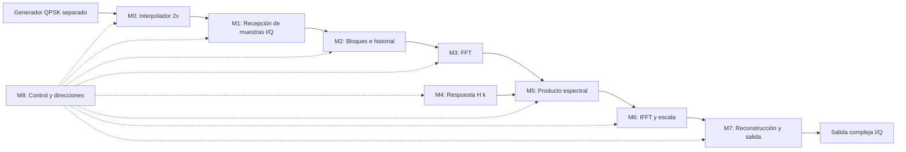

# C01 — Borrador de diseño del filtro en frecuencia serial

**Estado:** borrador de microarquitectura, basado en las decisiones de E01; implementaciones por módulo pendientes.

**Issue:** [C01 / #13](https://github.com/EnzoFernandezz11/rrc-fir-rtl/issues/13).

**Rama de trabajo:** `enzo/c01-frecuency-filter-design`.

**Inicio del borrador:** 2026-10-06.

**Responsable:** @EnzoFernandezz11; revisión de C01: @andres332271.

Este documento es el lugar de trabajo para conversar el diseño módulo por módulo: entender qué debe hacer cada bloque, comparar implementaciones y registrar las decisiones con sus motivos. Los nombres de módulos son tentativos y no implican que ya existan archivos RTL.

## 1. Alcance y fuentes

La [consigna actualizada del 5/10](consigna-actualizada.md) exige filtrado en frecuencia por bloques con **50 % de superposición**, pruebas QPSK (+/−1), un diagrama completo y descripciones de las etapas, comparación flotante/fijo e implementación de una interfaz serie. También pide una implementación paralela y maximizar la paralelización de la etapa FFT.

La base de trabajo es el [contrato de E01 en el commit `3a9cbb1`](https://github.com/EnzoFernandezz11/rrc-fir-rtl/blob/3a9cbb1/docs/contratos/frecuencia.md), leído desde la rama `enzo/e01-define-frecuency-filter`. Esa rama todavía no está integrada en esta rama C01: el enlace identifica la versión consultada y evita confundirla con el contrato local anterior.

E01 registra decisiones confirmadas por Enzo el 5/10, pendientes de revisión de Andrés y Julián. Complementa ambas consignas: conserva RRC8, roll-off 0,5 y sobremuestreo 2× para frecuencia; el filtro temporal es un IIR independiente. Cada implementación se compara con su propio modelo, sin exigir igualdad entre IIR y RRC.

| Tema | Base heredada de E01 |
|---|---|
| Filtro | RRC de ocho taps, roll-off 0,5; tabla exacta y normalización pendientes de E02. |
| Bloques | Overlap-save con FFT16/IFFT16; ocho muestras de historial y ocho nuevas, avance de ocho. |
| Entrada | Generador QPSK reutilizable separado; interpolador 2× separado: símbolo, cero. El núcleo recibe muestras. |
| Respuesta espectral | H precalculada en Python a partir de los ocho taps y ocho ceros; constantes o ROM en hardware. |
| Escala y orden | FFT sin escala; IFFT con escala total 1/16; índices externos en orden natural. |
| Salida | Conservar posiciones 8…15; emitir solo p en un parcial; 2S salidas por S símbolos, sin cola. |
| Base serial | Un bloque a la vez: capturar → FFT → productos → IFFT → emitir; la fuente puede frenarse. |
| Optimización | Paralelismo y pipeline se desarrollan en C03/C04. |
| Implementación pendiente | Puertos, reset, memorias, operadores, FSM, calendario y formatos internos. |

El backlog indica E01 como dependencia para empezar C01 y E03/A03 para cerrarla. Leer sus decisiones permite preparar este borrador, pero no sustituye su revisión o cierre formal. No se cambia el estado de las issues ni se incorporan los commits de E01 con esta edición.

## 2. Cómo vamos a tomar decisiones

Para cada bloque: fijar su función → comparar alternativas → elegir una propuesta → definir interfaz y ciclos → establecer cómo verificarlo. Una propuesta pasa a decisión de trabajo cuando la conversemos explícitamente. Si afecta el comportamiento compartido, debe trasladarse al contrato correspondiente para revisión del equipo.

| Orden | Conversación | Resultado que debemos dejar escrito | Estado |
|---|---|---|---|
| D01 | Algoritmo y significado del 50 % de superposición | RRC8, FFT16, overlap-save y avance ocho | Heredado de E01 |
| D02 | Qué significa la versión serial | Un bloque a la vez; FFT con una mariposa radix-2 reutilizada | Operadores internos y ciclos pendientes |
| D03 | Entrada, armado de bloques e historial | `valid/ready`; banco de trabajo de 16 muestras y banco de historial de ocho, con registros | Organización elegida; puertos y ciclos pendientes |
| D04 | FFT/IFFT | Motor radix-2 folded DIT compartido y tabla explícita de ocho twiddles; microarquitectura y escalado pendientes | Parcialmente decidido |
| D05 | Respuesta espectral y multiplicación | H precalculada y tabla reducida por simetría conjugada, índices 0…8; producto pendiente | Parcialmente decidido |
| D06 | Reconstrucción y salida | Salida `valid/ready` desde el banco de trabajo; descarte y conteos definidos | Lectura y detalle por ciclos pendientes |
| D07 | Control, recursos y cronograma | FSM global con controles locales elegida | Señales, estados detallados y cronograma pendientes |
| D08 | Precisión y verificación | Formatos coordinados con A04, pruebas y evidencia para C01 | Pendiente |

Los IDs D01–D08 de esta tabla son **locales a este borrador**, no reemplazan el registro del contrato técnico.

## 3. Decisión de entrada y próxima conversación

El algoritmo ya tiene una base en E01. Enzo eligió `valid/ready` el 6/10/2026 para la cadena generador → interpolador → formador de bloques y, posteriormente, también para la salida del filtro (M7). Son decisiones de trabajo de C01 que deben coordinarse con E03; no implican aprobación del contrato compartido ni fijan todavía nombres definitivos de puertos, reset o señalización de fin de trama.

**Reglas de la interfaz elegida:**

- Cada enlace tiene datos I/Q, `valid` de la fuente y `ready` del receptor. Fuera de reset, se transfiere una muestra en el flanco activo de reloj solo cuando `valid && ready`.
- Si `valid=1` y `ready=0`, la fuente mantiene `valid`, datos y metadatos asociados hasta la aceptación. El receptor no cuenta ni almacena esa muestra como aceptada durante la pausa.
- La fuente no espera a que aparezca `ready` para anunciar con `valid` una muestra disponible. El receptor indica con `ready` que puede aceptarla.
- El interpolador emite símbolo y luego cero; avanza de fase únicamente al aceptar la muestra correspondiente. Una pausa no equivale a un cero de interpolación.

**Propuesta de implementación aún por detallar:** un registro de símbolo y control local, sin aceptar otro símbolo hasta entregar el actual y su cero. La elección del protocolo no fija aún estados, ciclos adicionales, reset, nombres de puertos o señalización de fin de trama.

Se consideró como alternativa un calendario dirigido por un controlador central. Se eligió `valid/ready` para permitir pausas entre módulos y verificarlos por separado. Para M2 se eligieron bancos separados de trabajo e historial; para M3/M6, un motor radix-2 folded DIT compartido entre FFT e IFFT. Enzo pidió dejar para más adelante la cantidad de multiplicadores reales dentro de la mariposa. Para ambos modos se eligió una tabla explícita de ocho twiddles. Para M4 se eligió reducir H[k] por simetría conjugada. Para M7 se eligió salida `valid/ready` desde el banco de trabajo. Para M8 se eligió FSM global con controles locales. La próxima conversación puede definir cómo señalar el fin de trama y cerrar bloques parciales; el detalle de puertos y ciclos de M0/M1/M2 sigue pendiente.

Para el núcleo quedan fijados por E01 `N=16`, `R=8`, historial de ocho y filtro de ocho taps. Su referencia es la convolución causal con los mismos taps. La posición 7 de la IFFT también puede ser válida, pero se descarta para no repetir una muestra del tramo anterior. Las pruebas de reconstrucción están en la rama E01; A03 completará el modelo correspondiente.

## 4. Mapa funcional provisional

Son **funciones**, no una instancia obligatoria por caja: FFT e IFFT comparten un único motor físico, ejecutado en dos momentos distintos. La compartición de operadores con el producto espectral sigue pendiente. El diagrama físico se completará al elegir esos recursos.

## 5. Diseño por módulos

### M0 — Interpolador 2×

**Función fijada por E01:** recibir símbolos complejos del generador separado y producir `a[m], 0` por cada símbolo. El cero es una muestra válida; el último símbolo de la trama también lo lleva.

**Decisión:** `valid/ready` en entrada y salida del interpolador. El núcleo puede frenar la fuente; la propuesta simple evita aceptar otro símbolo mientras quedan muestras pendientes del actual.

**Por definir:** registro del símbolo, estados de emisión, propagación de fin de trama después del cero y respuesta ante reset. Acordar la frontera del módulo superior sin fusionar las responsabilidades de generador, interpolador y núcleo.

**Evidencia al cerrar:** cronograma de dos símbolos con pausas, exactamente cuatro muestras aceptadas y fin de trama asociado al último cero.

### M1 — Recepción e interfaz de entrada

**Función:** aceptar cada muestra I/Q exactamente una vez y comunicarla al armador de bloques.

**Decisión:** aceptar muestras mediante `valid/ready`. La organización de registros o buffers se decide con M2; el protocolo por sí solo no agrega una FIFO ni garantiza una muestra por ciclo.

**Por definir:** nombres de puertos, anchos, reset, señalización de fin de secuencia y calendario que determina cuándo puede activarse `ready`. La aceptación es `valid && ready`; una burbuja con `valid=0` no avanza el contador de muestras. La entrada del núcleo ya está sobremuestreada por M0, como define E01.

**Evidencia al cerrar:** ejemplo de transferencias aceptadas y rechazadas; comportamiento cuando el filtro está ocupado. Coordinar con E03.

### M2 — Armado de bloques, historial y memoria de trabajo

**Función:** construir las ventanas que necesita el algoritmo y preservar los datos que usa el bloque siguiente.

**Decisión de Enzo del 6/10:** opción A, banco de trabajo de 16 muestras complejas y banco separado de ocho muestras complejas de historial, inicialmente implementados con registros. Se consideró un buffer circular; se prefieren direcciones simples y una separación explícita entre datos de trabajo e historial. Capturar el siguiente bloque mientras se procesa el actual queda como optimización posterior, fuera de la secuencia inicial de E01.

**Organización elegida:** `work[0…15]` contiene la ventana y `history[0…7]` conserva el historial temporal. Son nombres descriptivos, no puertos RTL definitivos. Al iniciar una trama independiente, el historial vale cero. Los bancos suman 24 posiciones complejas, sin contar registros aritméticos o de interfaz; los anchos de cada banco siguen pendientes.

**Secuencia funcional elegida:**

1. Formar `work[0…7]` con el historial anterior y `work[8…15]` con las ocho muestras nuevas, avanzando la captura solo con `valid && ready`.
2. Preservar esas ocho muestras nuevas en `history` para el siguiente bloque, después de haber conservado el historial anterior en la ventana actual.
3. Permitir que la FFT modifique el banco de trabajo; el historial queda protegido durante el cálculo y la emisión.

En un bloque final parcial, completar con ceros las posiciones nuevas faltantes y conservar el conteo p de muestras que deben emitirse, según E01. El relleno no cuenta como transferencia de entrada ni pasa a otra trama independiente; su historial empieza nuevamente en cero.

**Por definir:** anchos de los bancos, accesos simultáneos, lectura combinacional o registrada, copias secuenciales o en paralelo y calendario de `ready`. La organización elegida no establece cuántos ciclos ocupan las copias ni garantiza que una mariposa pueda ejecutarse en un ciclo.

**Evidencia al cerrar:** dibujo de direcciones para dos bloques consecutivos, arranque con historia definida y lista de accesos simultáneos. Debe quedar claro cuándo se puede aceptar la siguiente muestra sin destruir datos pendientes.

### M3 — Motor FFT

**Función:** transformar el bloque complejo al dominio de la frecuencia.

**Decisión de Enzo del 6/10:** FFT16 radix-2 folded (iterativa), con una unidad de mariposa reutilizada entre parejas y etapas, según la opción discutida. Ejecuta cuatro etapas de ocho operaciones de mariposa: 32 operaciones en total, sin equivaler todavía a 32 ciclos. La unidad trabaja sobre el banco de 16 muestras; el historial permanece separado y protegido. El mismo motor se reutiliza para la IFFT, según M6. La cantidad de multiplicadores reales y la compartición de operadores con el producto espectral siguen pendientes.

**Base de la explicación:** `RTL/PPTS/Modulo_7.pptx`, diapositivas 24–32 (FFT, DIT, mariposa, SDF, twiddles y punto fijo), y 6/11/38 (pipeline, folding y unfolding). La aplicación concreta a FFT16 es desarrollo de diseño, no una arquitectura ya fijada por las diapositivas.

Al comparar alternativas, separar algoritmo (radix y DIT/DIF), cantidad de operadores físicos, pipeline interno y formatos numéricos. Una arquitectura folded puede contener operadores pipelinados. En R2SDF la diapositiva 27 detalla una mariposa por etapa, no una sola para toda la FFT. El ejemplo RTL de la diapositiva 31 requiere revisar formatos y anchos: recortar el producto para recuperar el punto binario no equivale a dividir toda la mariposa por dos.

**Alternativas consideradas:** varias mariposas en paralelo, red desplegada y streaming R2SDF; radix-4 o descomposiciones mixtas. Se eligió radix-2 folded por su estructura regular y reutilización de recursos, coherente con la base de un bloque a la vez. No constituye todavía evidencia de área, potencia o timing.

**Por definir:** mecanismo y ciclos del reordenamiento de entrada, generadores de direcciones, formato y temporización de la tabla de twiddles, accesos de lectura/escritura, operadores reales internos, pipeline, latencia y escalado compatible con la ganancia total. La lectura de ambos operandos debe preceder a su sobrescritura, y una etapa no puede consumir resultados de la anterior que aún estén pendientes.

**Decisión de orden y descomposición (6/10):** DIT iterativa, siguiendo la diapositiva 25. Preparar la entrada en bit-reversal y obtener `X[0…15]` en orden natural para el producto espectral. Se consideró DIF, con entrada natural y salida permutada en su forma básica. Reordenar significa invertir los cuatro bits del índice, nunca bits de la muestra I/Q. El orden de las muestras iniciales en el banco de cálculo es `0,8,4,12,2,10,6,14,1,9,5,13,3,11,7,15`.

El banco `work` descrito en M2 contiene primero la ventana temporal. Antes del cálculo debe quedar reordenado según DIT; elegir entre carga direccionada o intercambios posteriores sigue pendiente. En ambos casos se conserva el historial en orden temporal antes de destruir o permutar datos que todavía se necesiten.

La mariposa DIT calcula `T = W·B`, `A' = A + T`, `B' = A − T`, usando los valores originales de A y B en ambas salidas. Para la etapa s=1…4, con `m=2^s`, cada grupo de inicio g combina las direcciones `g+j` y `g+j+m/2`, con `j=0…m/2−1`, y usa el twiddle `W16^(j·16/m)`.

| Etapa | Grupo m | Separación entre operandos | Exponentes de W16 por grupo | Operaciones |
|---|---:|---:|---|---:|
| 1 | 2 | 1 | 0 | 8 |
| 2 | 4 | 2 | 0, 4 | 8 |
| 3 | 8 | 4 | 0, 2, 4, 6 | 8 |
| 4 | 16 | 8 | 0, 1, 2, 3, 4, 5, 6, 7 | 8 |

**Decisión postergada por Enzo (6/10):** cantidad de multiplicadores reales dentro de la mariposa. Permanecen abiertas las opciones de uno reutilizado, dos o cuatro en paralelo; ninguna queda elegida por defecto. La propuesta discutida de un multiplicador reutilizado calcularía `wr·br`, `wi·bi`, `wr·bi` y `wi·br`, combinaría sus resultados para formar T y luego las dos salidas. Retomar al comparar recursos y ciclos por bloque bajo una tasa objetivo declarada. Hasta entonces no fijar un cronograma que dependa de una de estas alternativas. Son cuatro productos reales para el caso general, no cuatro ciclos garantizados: faltan latencia e intervalo de inicio del multiplicador, registros, sumadores y accesos. La variante que calcula una multiplicación compleja con tres productos reales y más sumas es una alternativa aritmética separada; no está elegida. Los atajos para twiddles triviales también siguen pendientes.

**Evidencia al cerrar:** recorrido completo de un bloque pequeño, tabla de operaciones/accesos por ciclo y prueba de orden de bins. No asignar «una mariposa por ciclo» sin demostrar que memoria y operadores sostienen ese ritmo.

### M4 — Coeficientes y respuesta espectral

**Función:** entregar el coeficiente complejo H[k] correspondiente al bin procesado.

**Base E01:** `H = FFT16([h[0], …, h[7], 0, …, 0])`, calculada en Python. No se necesita hardware para calcular H.

**Decisión de Enzo del 6/10:** aprovechar la simetría conjugada para taps h reales. Guardar las nueve entradas independientes `H[0]…H[8]`; entregar `H[k] = conj(H[16−k])` para k=9…15. Se consideró guardar los 16 coeficientes explícitos; se elige reducir la tabla a cambio de lógica de dirección y signo. La propiedad requiere h real, pero no requiere taps simétricos en el tiempo. Si E02 cambia a taps complejos, esta organización debe revisarse.

| Índice solicitado k | Dirección en la tabla | Parte real entregada | Parte imaginaria entregada |
|---|---|---|---|
| 0…8 | k | Re(H[k]) | Im(H[k]); cero para k=0 y k=8 |
| 9…15 | 16−k | Re(H[16−k]) | −Im(H[16−k]) |

Por ejemplo, k=9 lee y conjuga H[7], y k=15 lee y conjuga H[1]. El consumidor sigue recorriendo k=0…15 en orden natural. H[0] y H[8] son reales; sus componentes imaginarias se fijan en cero. Describir nueve entradas lógicas no obliga a conservar físicamente campos cero tras síntesis.

La entrada del filtro es compleja I/Q: esta simetría de H no permite asumir simetría de X ni de Y. Se mantienen los 16 productos espectrales por bloque y la IFFT compleja de 16 puntos. La tabla W del motor conserva la opción explícita ya elegida; esta reducción afecta solo H.

**Por definir:** tabla exacta de taps y normalización con E02, cuantización, constantes/ROM, lectura combinacional o registrada y alineación del coeficiente reconstruido con X[k]. El generador Python debe cuantizar las entradas independientes y reconstruir las parejas con la misma regla que el RTL para conservar simetría exacta en el modelo fijo. Definir anchos que representen ambos signos de la componente imaginaria o una política explícita: negar el mínimo entero con signo en el mismo ancho puede desbordar. No fijar aún valores binarios definitivos.

**Evidencia al cerrar:** tabla reproducible y trazabilidad al modelo; comprobar las 16 direcciones, los extremos k=0/8, los signos conjugados y coincidencia exacta con la tabla reconstruida del modelo fijo. Comparar además contra H flotante con tolerancia declarada de cuantización. La interfaz entrega H[k] en el mismo orden natural que X[k].

### M5 — Multiplicación espectral

**Función:** calcular `Y[k] = X[k] · H[k]` para cada bin.

**Alternativas:** producto complejo directo con cuatro multiplicaciones reales; variante de tres productos con más sumas; reutilización de uno o varios multiplicadores reales. También evaluar si comparte operadores con M3/M6.

**Por definir:** secuencia aritmética, registros intermedios, anchos, redondeo/saturación, ciclos por bin y conflictos de recursos. Menos multiplicaciones no garantiza menor área o mejor timing: depende de anchos, sumas y planificación.

**Evidencia al cerrar:** ecuaciones y cronograma para un bin, más costo para N bins; pruebas con signos y valores límite.

### M6 — IFFT y normalización

**Función:** volver al dominio temporal con la ganancia total prevista.

**Decisión de Enzo del 6/10:** compartir el motor radix-2 folded DIT de M3 entre FFT16 e IFFT16, con selección de modo directo/inverso. Se reutilizan la mariposa, el banco de trabajo y el recorrido de parejas por etapa. Se consideraron motores separados; se elige compartir porque la base procesa un bloque a la vez y las transformadas se ejecutan sucesivamente.

**Modo inverso:** usar twiddles con exponente positivo, conjugados de los del modo FFT. El cambio de modo adapta el signo de su parte imaginaria; faltan formato y circuito exacto, incluyendo representación de valores límite. El modo debe permanecer asociado a toda la ejecución de una transformada y cambiar solo cuando la anterior y sus operaciones pendientes hayan terminado.

**Orden de datos:** preparar la ventana temporal en bit-reversal → FFT en modo directo → producto espectral en orden natural → preparar Y[k] en bit-reversal → ejecutar el mismo motor en modo inverso → obtener muestras temporales en orden natural. La preparación de la IFFT puede implementarse por direccionamiento al escribir los productos o mediante una permutación posterior; el mecanismo y sus ciclos no están elegidos.

**Base E01:** IFFT16 con exponente positivo y escala total `1/16`. **Por definir:** cuantización y temporización de lectura de twiddles, ubicación física de la normalización, redondeo y saturación. Coordinar escalado de FFT, H[k], producto e IFFT para evitar duplicaciones o pérdidas de ganancia. Compartir el motor no elige aún el escalado ni la cantidad de multiplicadores internos.

El motor realiza 32 operaciones de mariposa para FFT y otras 32 para IFFT por bloque, además de los 16 productos espectrales. Son operaciones secuenciales entre fases; la latencia e intervalo de inicio del operador y el costo de acceso/reordenamiento siguen pendientes. No hay FFT e IFFT simultáneas en esta base.

**Decisión de twiddles de Enzo del 6/10:** opción A, tabla explícita de ocho valores complejos `W16^q`, q=0…7, precalculados para el modo FFT, con adaptación del signo imaginario para la IFFT. El selector q tiene tres bits y su secuencia depende de la etapa y pareja. La tabla entrega las partes real e imaginaria del mismo coeficiente. Se consideró una tabla reducida por simetrías; se eligió acceso directo para simplificar implementación y verificación.

La definición matemática de cada entrada es `wr[q] = cos(2πq/16)`, `wi[q] = −sin(2πq/16)`. Anchos, bits fraccionarios, cuantización y representación de ±1 siguen pendientes; no hay todavía constantes binarias definitivas. También falta elegir lectura combinacional o registrada. Describir constantes o una ROM en RTL no garantiza un bloque de memoria físico: eso depende de la síntesis y la tecnología.

Se comparte una única tabla entre ambos modos, sin generar twiddles con CORDIC ni reconstruir entradas mediante una tabla reducida. La adaptación de signo para la IFFT debe conservar el valor representable, incluidos extremos del formato. Los atajos aritméticos para twiddles triviales no quedan decididos por elegir esta tabla. W es propia del motor y distinta de H[k] en M4; esta elección no cambia la respuesta del filtro.

**Evidencia al cerrar:** identidad FFT/IFFT dentro de la tolerancia declarada, seguimiento de escala y mapa de reutilización de recursos.

### M7 — Reconstrucción, selección y salida

**Función:** convertir los bloques procesados en muestras de salida con índices inequívocos.

**Base E01:** descartar posiciones 0…7 y emitir 8…15 en orden; un parcial de p muestras nuevas emite solo las primeras p de esa región. No se emite cola final. Trama vacía: cero salidas; no agregar un bloque extra al completar un múltiplo de ocho.

**Decisión de Enzo del 6/10:** salida mediante `valid/ready`. El filtro presenta I/Q con `out_valid`; el receptor indica aceptación posible con `out_ready`. Estos nombres son descriptivos y se coordinarán con E03. Se consideró salida solo con `valid`, que requeriría un receptor siempre disponible.

- Fuera de reset, una muestra se entrega en el flanco activo solo cuando `out_valid && out_ready`.
- Si `out_valid=1` y `out_ready=0`, mantener `out_valid`, I/Q y cualquier metadato asociado estables hasta la aceptación. La fuente anuncia una muestra disponible sin esperar `out_ready`.
- El contador de muestras entregadas avanza exclusivamente con la transferencia. No confundir una lectura interna o preparación de la próxima muestra con su entrega externa.
- Finalizar la emisión del bloque solo tras aceptar su última muestra válida: la octava en un bloque completo o la p-ésima en un parcial. No finalizar al presentarla si el receptor está frenado.
- En esta base de un bloque a la vez, esperar esa última aceptación antes de iniciar el siguiente bloque. Una pausa de salida agrega espera; no se descartan muestras ni se sobrescriben datos todavía pendientes.

**Decisión de almacenamiento de Enzo del 6/10:** opción A, emitir desde el banco de trabajo donde quedaron los resultados de la IFFT, sin copiar el bloque a un banco de salida separado. Para un bloque completo, leer las posiciones 8…15 en orden; para un parcial, 8…8+p−1. Mantener el banco protegido de escrituras y de nuevas capturas hasta la aceptación de la última muestra válida. Se consideró un banco separado de salida; se elige reutilizar el existente porque la base procesa un bloque a la vez.

Un registro de interfaz sigue siendo admisible si la temporización de lectura o conversión de formato lo requiere; no equivale a un banco adicional de ocho muestras. La normalización/conversión de salida debe estar resuelta antes de presentar una muestra válida y el valor presentado debe permanecer estable durante pausas. Su ubicación y formato siguen pendientes.

**Por definir:** lectura combinacional o registrada, posible registro de interfaz, contadores, ciclos de padding del parcial, reset y señalización de fin de trama, conservando los conteos de E01. La elección no fija aún tasa de una muestra por ciclo ni una latencia constante bajo pausas.

**Evidencia al cerrar:** índices de salida para dos bloques, una secuencia corta y un final parcial. Probar pausas antes de la primera muestra, en medio y sobre la última; comprobar estabilidad durante la espera, número exacto de transferencias y que el bloque no termine antes de la última aceptación. Ninguna muestra duplicada ni perdida en una frontera.

### M8 — Control global y generadores de direcciones

**Función:** coordinar fases, recursos compartidos y avance de muestras/bloques.

**Secuencia funcional:** inicializar → reunir bloque y preservar historial → preparar DIT → FFT → producto → preparar DIT → IFFT → seleccionar/emitir → siguiente bloque. Las preparaciones indican requisitos de orden de datos; podrían incorporarse a las escrituras de otra fase según el mecanismo de reordenamiento que se elija. No implican estados o ciclos extra ya fijados. La base procesa un bloque a la vez, sin captura concurrente del siguiente.

**Decisión de Enzo del 6/10:** opción B, FSM global que coordina fases y habilita el acceso al banco compartido, con controles locales para ejecutar el motor FFT/IFFT, la captura, el producto y la emisión. Se consideró una FSM central que también controlara todos los pasos internos; se elige separar responsabilidades para desarrollar y verificar módulos y adaptar sus latencias sin trasladar todos los pasos al control global.

| Control | Responsabilidad |
|---|---|
| Global | Elegir fase y modo FFT/IFFT, autorizar acceso al banco, iniciar operaciones y esperar su finalización antes de ceder recursos. |
| Captura/interpolación | Gestionar transferencias aceptadas, símbolo/cero, avance de muestras y armado del bloque según sus interfaces. |
| Motor FFT/IFFT compartido | Recorrer etapas y parejas, seleccionar twiddles y coordinar cálculo/escritura; informar fin cuando todos los resultados estén guardados. |
| Producto espectral | Recorrer los 16 bins, alinear X[k] con H[k] reconstruida y terminar tras guardar todos los productos. La compartición de operadores con el motor sigue pendiente. |
| Salida | Presentar las posiciones válidas desde work, conservar datos durante pausas y finalizar solo tras aceptar la última muestra del bloque. |

La FSM global solicita una operación y espera su finalización; no supone una cantidad fija de ciclos para el multiplicador pendiente. El bloque saliente libera el recurso compartido solo al completar sus operaciones y escrituras pendientes. La selección de un nuevo modo no puede afectar una transformada todavía activa. Estos controles locales no autorizan procesamiento concurrente de bloques.

Las señales de inicio/ocupado/fin son conceptuales: faltan nombres, duración, condición de aceptación y tratamiento de reset. Un control local puede consistir en contadores y habilitaciones sin necesitar una FSM independiente grande. La FSM global es compatible con los enlaces `valid/ready` elegidos; no los sustituye por un calendario fijo de transferencias.

**Por definir:** estados detallados y señales de coordinación, contadores de muestra/bin/etapa, selección de accesos a memoria, respuesta ante reset, latencias y condiciones completas de terminación de cada fase.

**Próxima propuesta, aún no elegida:** señalar fin de trama con un metadato `last` asociado a la última transferencia, frente a declarar una longitud de trama al inicio. Si se elige `last`, el interpolador debe conservar la marca del último símbolo y trasladarla al cero válido que lo sigue; el núcleo puede cerrar entonces el parcial y emitir solo sus p muestras. La salida marcaría la última muestra válida de la trama, no la última de cada bloque. El tratamiento de tramas vacías requiere una definición aparte porque no hay transferencia en la que adjuntar `last`. Señales y protocolo de trama siguen pendientes de conversación y E03.

**Evidencia al cerrar:** diagrama de estados y tabla ciclo a ciclo de un bloque, incluyendo esperas de memoria y vaciado de operadores.

## 6. Cálculos que debe contener C01 antes de cerrarse

| Entregable | Datos que faltan para calcularlo | Resultado pendiente |
|---|---|---|
| Operaciones por bloque | Algoritmo FFT16/IFFT16 y forma de producto complejo | Mariposas, productos y sumas, distinguiendo operaciones triviales. |
| Buffers y ROM | Bancos, profundidades, anchos y puertos | Bits por memoria; historial y registros de salida incluidos. |
| Recursos aritméticos | Compartición y cronograma | Multiplicadores, sumadores, registros y ocupación. |
| Ciclos por bloque | Accesos, latencias e intervalo de inicio de cada operador | Costo de cada fase y total. |
| Latencia | Captura, cálculo, salida y política de pausas | Primera entrada aceptada → primera salida; última entrada del bloque → primera salida. |
| Throughput | Intervalo entre bloques y reloj; R=8 fijado | Muestras nuevas/salida por ciclo y por segundo bajo condiciones declaradas. |

Como identidad de planificación, si no hay solapamiento entre fases, `C_bloque = C_carga + C_FFT + C_producto + C_IFFT + C_salida + C_control`, definiendo fases sin contar ciclos dos veces. En régimen, si un bloque avanza R muestras cada `II_bloque` ciclos, la tasa es `R / II_bloque` muestras/ciclo. Con buffers dobles y fases concurrentes hay que derivar `II_bloque` del cronograma; no alcanza con sumar latencias.

Para radix-2, E01 aporta 32 mariposas para FFT16 y otras 32 para IFFT16, más 16 productos espectrales por bloque. Son operaciones, no ciclos ni cantidades de operadores físicos.

Las pausas de entrada/salida pueden hacer variable la latencia. Los números publicados deben indicar las condiciones, por ejemplo entrada disponible y salida siempre lista. Todavía faltan cifras de ciclos, almacenamiento y recursos; no hay promesas de timing o área.

## 7. Verificación prevista y criterio de cierre

- [ ] E01 resuelta y contratos reconciliados con la consigna actualizada.
- [x] Base algorítmica de E01 incorporada al borrador: RRC8, FFT16, avance ocho, overlap-save y escala IFFT 1/16; revisión del equipo pendiente.
- [ ] Función e interfaz de cada módulo documentadas; recursos compartidos identificados.
- [ ] Diagrama físico, FSM y cronograma coherentes con los puertos de memoria.
- [ ] Operaciones, almacenamiento, recursos, latencia y throughput calculados.
- [ ] A03 aporta referencia flotante con ceros, impulso, QPSK y fronteras de bloque; incluir entradas de longitud no múltiplo de R.
- [ ] E03 permite describir reset, burbujas, pausas y fin de secuencia sin depender de detalles internos.
- [ ] Decisiones de precisión coordinadas con A04; no fijar anchos definitivos por intuición.
- [ ] Revisión y evidencia vinculadas a C01. El RTL y vector matching de la implementación corresponden a C02.

## 8. Registro de decisiones conversadas

Las decisiones funcionales de E01 se conservan como base. Cada elección de C01 se registra a continuación; las propuestas de implementación no aceptadas siguen pendientes.

| Fecha | Bloque/tema | Decisión y estado | Motivo y alternativas | Evidencia / contrato afectado |
|---|---|---|---|---|
| 2026-10-06 | Base funcional y secuencia por bloques | Heredadas de las decisiones de Enzo del 5/10; revisión del equipo pendiente | Evitar reabrir elecciones ya registradas en E01 | Contrato E01, commit `3a9cbb1`, enlazado en sección 1 |
| 2026-10-06 | Entrada e interpolador | Enzo elige `valid/ready` | Permitir pausas y verificar módulos separados; alternativa considerada: calendario central | Confirmación en conversación: «vamos con valid ready»; coordinar con E03 / M0–M1 |
| 2026-10-06 | M2: memoria de trabajo e historial | Enzo elige A: 16 posiciones complejas de trabajo y ocho de historial, con registros | Direcciones simples y preservación explícita del historial frente a escrituras de FFT; alternativa: buffer circular | Confirmación en conversación: «vamos con A»; anchos, puertos y ciclos pendientes |
| 2026-10-06 | M3: arquitectura FFT | Enzo elige radix-2 folded, una unidad de mariposa reutilizada | Regularidad y reutilización en la base por bloques; alternativas: paralelismo parcial, red desplegada, SDF y otros radix | Confirmación en conversación: «vamos con al version folded de radix» tras explicar radix-2; DIT/DIF y microarquitectura pendientes |
| 2026-10-06 | M3: descomposición y orden | Enzo elige DIT: entrada bit-reversal y salida natural | Seguir el desarrollo del Módulo 7 y recorrer X[k] junto con H[k] en orden natural; alternativa: DIF | Confirmación en conversación: «vamos con dit»; mecanismo de reordenamiento y ciclos pendientes |
| 2026-10-06 | M3: multiplicadores reales de la mariposa | Decisión postergada por Enzo; opciones de uno, dos o cuatro abiertas | Comparar recursos y ciclos antes de elegir; radix-2 folded DIT permanece elegido | Solicitud en conversación de dejarlo para después; sin opción por defecto |
| 2026-10-06 | M3/M6: motor FFT/IFFT | Enzo elige un motor compartido con modo directo/inverso | Reutilización de recursos en la secuencia de un bloque a la vez; alternativa: motores separados | Confirmación en conversación: «me gusta el comparido»; escalado y multiplicadores internos pendientes |
| 2026-10-06 | M3/M6: tabla de twiddles | Enzo elige A: ocho valores complejos explícitos, compartidos entre FFT/IFFT con adaptación de signo | Acceso directo y verificación sencilla; alternativa: tabla reducida por simetrías | Confirmación en conversación: «vamos con la a»; formato y lectura combinacional/registrada pendientes |
| 2026-10-06 | M4: almacenamiento de H[k] | Enzo elige simetría conjugada: guardar H[0…8] y reconstruir H[9…15] | Reducir coeficientes almacenados para taps reales; alternativa: tabla explícita de 16 valores | Confirmación en conversación: «aprovechamos siemtria»; cuantización, lectura y circuito de conjugación pendientes |
| 2026-10-06 | M7: protocolo de salida | Enzo elige `valid/ready`; avanzar y terminar emisión solo con muestras aceptadas | Permitir pausas del receptor sin perder datos; alternativa: solo `valid` con receptor siempre disponible | Confirmación en conversación: «dale» a la propuesta de `valid/ready` de salida; almacenamiento, reset y fin de trama pendientes |
| 2026-10-06 | M7: almacenamiento de salida | Enzo elige A: emitir desde el banco de trabajo y protegerlo hasta la última aceptación | Reutilizar almacenamiento en la base de un bloque a la vez; alternativa: banco de salida separado | Confirmación en conversación: «vamos con a»; lectura, registro de interfaz y conversión de formato pendientes |
| 2026-10-06 | M8: organización de control | Enzo elige B: FSM global con controles locales | Separar coordinación de fases de ejecución interna y esperar finalización real; alternativa: FSM central para todos los pasos | Confirmación en conversación: «vam,os co b»; protocolo inicio/fin, reset y estados detallados pendientes |
