# Diagrama general del filtro en frecuencia

La [propuesta de E01](../contratos/frecuencia.md) implementa el FIR RRC8, beta 0,5, mediante FFT16 y 50 % de superposición según la [consigna vigente](../consigna-actualizada.md). Enzo confirmó el upsampler 2× el 7/10/2026 como decisión de diseño para ambas cadenas.

```mermaid
flowchart LR
    Q["Generador QPSK reutilizable<br/>símbolos I/Q = ±1"]
    UP["Upsampler 2× separado<br/>a0, 0, a1, 0, ..."]
    Q --> UP

    subgraph T0["Preparación de bloque en tiempo"]
        NEW["8 muestras nuevas<br/>equivalentes a 4 símbolos"]
        HIST["8 muestras de historial<br/>cero al inicio de trama"]
        WIN["Ventana de 16 muestras<br/>8 anteriores + 8 nuevas"]
        NEW --> WIN
        HIST --> WIN
        NEW -->|historial para el próximo bloque| HIST
    end
    UP --> NEW

    subgraph OFF["Preparación en Python, fuera del procesamiento RTL"]
        H["8 coeficientes RRC<br/>beta 0,5; tabla exacta en E02"]
        PAD["Agregar 8 ceros"]
        FH["Precalcular FFT16"]
        H --> PAD --> FH
    end

    subgraph CORE["Núcleo: un bloque a la vez en la versión inicial"]
        FX["FFT16"]
        ROM["H constante o ROM<br/>16 valores lógicos<br/>C01 propone almacenar H 0 a 8 y conjugar"]
        MUL["16 productos por bloque<br/>X[k] por H[k]"]
        INV["IFFT16<br/>escala total 1/16"]
        SELECT["Descartar posiciones 0 a 7<br/>conservar 8 a 15"]
        FX --> MUL --> INV --> SELECT
        ROM --> MUL
    end
    WIN --> FX
    FH -.->|tabla generada| ROM
    SELECT --> OUT["8 salidas por bloque completo<br/>p en el parcial; 2S por trama"]
```

El historial leído por una ventana pertenece al bloque anterior; se actualiza después de formar la ventana actual. La fuente espera cuando el núcleo no puede aceptar datos. El generador, el upsampler y el núcleo son módulos distintos; el diagrama expresa responsabilidades, no obliga a ejecutarlas en paralelo ni fija puertos RTL.

La tabla H se calcula fuera del hardware una vez que se fijan los coeficientes. Los 16 productos pueden reutilizar una unidad en la implementación inicial. La paralelización y el pipeline se estudian en C03/C04.

Una trama de S símbolos produce 2S muestras, sin cola final. El último cero del upsampler pertenece a la trama. Un bloque parcial se rellena solo para calcular la transformada y emite únicamente sus p muestras válidas. Las pausas no son muestras cero. El historial se reinicia entre tramas independientes.

El FIR temporal se implementa por separado y recibe las mismas muestras del upsampler y los mismos ocho coeficientes RRC. Ambas ramas deben producir la misma secuencia causal de 2S salidas, sin cola final, al alinear sus índices de muestra. Se admiten diferencias de redondeo en flotante; A04 define la tolerancia entre dominios en punto fijo y cada RTL se compara con su modelo fijo.
