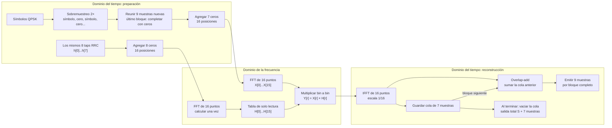

# Diagrama general del filtro en frecuencia — propuesta anterior

Este diagrama conserva el esquema discutido antes del cambio de [consigna](../consigna-original.md): RRC de ocho taps, nueve muestras nuevas por bloque, FFT/IFFT de 16 puntos y overlap-add. **Es una referencia histórica, no la arquitectura aprobada para la consigna actual.** El IIR de segundo orden y la superposición del 50 % obligan a revisar el método antes de implementarlo.

