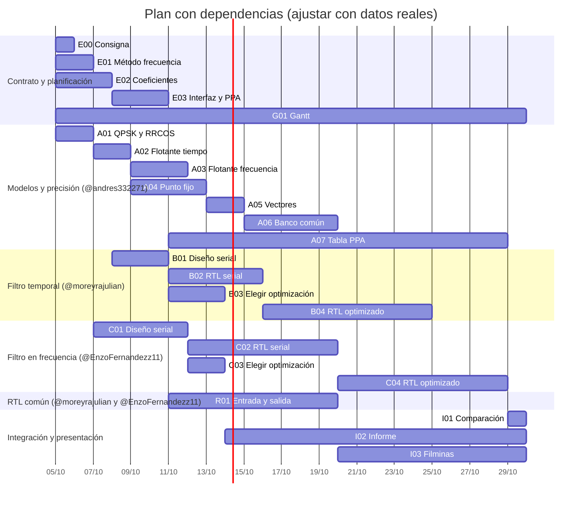

# Gantt del proyecto

**Versión inicial:** 2026-10-02. **Revisión con dependencias:** 2026-10-03. **Ajuste a la fecha límite:** 2026-10-05. **Alta de R01 y avance real:** 2026-10-07. **Responsables:** @andres332271 = modelos/precisión, @moreyrajulian = tiempo, @EnzoFernandezz11 = frecuencia. Las fechas son una estimación para organizar el trabajo en días corridos (incluye fines de semana); todo debe estar terminado antes del **30/10**, fecha límite de la presentación. Los IDs y dependencias corresponden al [backlog](backlog.md).

## Plan

Cada tarea arranca con `after` sobre sus dependencias **para empezar**, de modo que no puede comenzar antes que ellas; al cambiar una duración, las tareas siguientes se corren solas. Las dependencias **para cerrar** no se dibujan: la duración de cada barra se eligió para terminar después de ellas, y `tests/test_plan.py` falla si alguna regla se rompe. En Mermaid el fin es exclusivo: una barra que termina el 07/10 libera a la siguiente ese mismo día.

G01, I02 e I03 terminan el 29/10, el día anterior a la presentación. Para entrar en el plazo, B03 y C03 se hacen en paralelo con el serial, I03 arranca con los resultados seriales, I01 dura un día y C04 baja a 9 días. C04 queda en el camino crítico sin margen; B04 tiene 4 días de holgura.

**Corte de C04 (lunes 26/10):** si C04 no pasa el vector matching, se presenta C serial (C02) contra B optimizado (B04), C04 queda como trabajo futuro en el informe y se avisa al profesor.

## Avance real

Esta tabla registra lo que efectivamente pasó y quién lo hizo, que es lo exigido para explicar el reparto real. Las fechas planificadas están solo en el diagrama: anotar aquí inicio y fin reales cuando ocurran, sin tocar el plan salvo para replanificar.

**Al 07/10:** 6 de 24 tareas iniciadas (E00, E01, E02, G01, A01, R01), 1 integrada (E00) y 0 verificadas. E01 y A01 llevan un día de atraso. E01 es el más delicado: está en la cadena E01 → C01 → C02 → C04, que no tiene holgura, así que cada día de demora sin recuperar llega al corte del 26/10. Las fechas son locales; GitHub muestra UTC, y un PR abierto de noche puede figurar con el día siguiente.

| ID | Responsable real | Inicio real | Fin real | Estado/notas |
|---|---|---|---|---|
| [E00](https://github.com/EnzoFernandezz11/rrc-fir-rtl/issues/1) | @andres332271 | 05/10 | 07/10 | Consigna actualizada en #27 y segunda versión en #29 (06/10). |
| [E01](https://github.com/EnzoFernandezz11/rrc-fir-rtl/issues/2) | @EnzoFernandezz11 | 05/10 | — | PR #28 en revisión, con cambios pedidos. Plan: fin 06/10. |
| [E02](https://github.com/EnzoFernandezz11/rrc-fir-rtl/issues/3) | @andres332271 | 07/10 | — | PR #33 en revisión; necesita el acuerdo de los tres. |
| [E03](https://github.com/EnzoFernandezz11/rrc-fir-rtl/issues/4) | — | — | — | — |
| [G01](https://github.com/EnzoFernandezz11/rrc-fir-rtl/issues/5) | @andres332271 | 03/10 | — | #24, #27 y este registro. Actualizar semanalmente. |
| [A01](https://github.com/EnzoFernandezz11/rrc-fir-rtl/issues/6) | @andres332271 | 07/10 | — | PR #32 en revisión. Plan: fin 06/10. |
| [A02](https://github.com/EnzoFernandezz11/rrc-fir-rtl/issues/7) | — | — | — | — |
| [A03](https://github.com/EnzoFernandezz11/rrc-fir-rtl/issues/8) | — | — | — | — |
| [A04](https://github.com/EnzoFernandezz11/rrc-fir-rtl/issues/9) | — | — | — | — |
| [A05](https://github.com/EnzoFernandezz11/rrc-fir-rtl/issues/10) | — | — | — | Corte para cerrar B02/C02. |
| [B01](https://github.com/EnzoFernandezz11/rrc-fir-rtl/issues/11) | — | — | — | — |
| [B02](https://github.com/EnzoFernandezz11/rrc-fir-rtl/issues/12) | — | — | — | — |
| [C01](https://github.com/EnzoFernandezz11/rrc-fir-rtl/issues/13) | — | — | — | — |
| [C02](https://github.com/EnzoFernandezz11/rrc-fir-rtl/issues/14) | — | — | — | — |
| [R01](https://github.com/EnzoFernandezz11/rrc-fir-rtl/issues/31) | @moreyrajulian y @EnzoFernandezz11 | 07/10 | — | Reparto acordado; contrato de interfaces propuesto en la issue. |
| [A06](https://github.com/EnzoFernandezz11/rrc-fir-rtl/issues/15) | — | — | — | — |
| [B03](https://github.com/EnzoFernandezz11/rrc-fir-rtl/issues/16) | — | — | — | — |
| [B04](https://github.com/EnzoFernandezz11/rrc-fir-rtl/issues/17) | — | — | — | — |
| [C03](https://github.com/EnzoFernandezz11/rrc-fir-rtl/issues/18) | — | — | — | — |
| [C04](https://github.com/EnzoFernandezz11/rrc-fir-rtl/issues/19) | — | — | — | Camino crítico hasta I01. |
| [A07](https://github.com/EnzoFernandezz11/rrc-fir-rtl/issues/20) | — | — | — | Empieza con variantes disponibles. |
| [I01](https://github.com/EnzoFernandezz11/rrc-fir-rtl/issues/21) | — | — | — | — |
| [I02](https://github.com/EnzoFernandezz11/rrc-fir-rtl/issues/22) | — | — | — | Borrador temprano; conclusiones tras I01. |
| [I03](https://github.com/EnzoFernandezz11/rrc-fir-rtl/issues/23) | — | — | — | Presentación 30/10. |

## Corte del viernes 16/10

Meta: 21 de 24 tareas con evidencia de inicio (88 %). Es el máximo que permite el plan sin violar dependencias; solo I01 y C04 (y por lo tanto el cierre de I03) dependen de resultados posteriores. El avance real se comunica separado en tres cifras: **iniciadas**, **integradas** y **verificadas**. La cantidad de tarjetas movidas no sustituye el vector matching. Si E01 o C02 se retrasan, registrar la causa y ajustar fechas y responsable; no empezar C04 sin C02 para mejorar el porcentaje.
