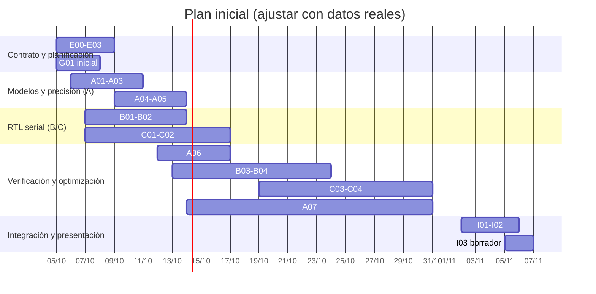

# Gantt del proyecto

**Versión inicial:** 2026-10-02. **Responsables:** A = modelos/precisión, B = tiempo, C = frecuencia. Las fechas son una estimación para organizar el trabajo; la presentación será en una fecha acordada con el profesor antes de fin de 2026. Anotar el inicio y fin reales cuando ocurran, sin borrar las fechas previstas. Los IDs corresponden al [backlog](backlog.md).

El diagrama resume grupos de tareas. La tabla siguiente registra **cada tarea y su responsable**, que es lo exigido para explicar el reparto real. El final de G01 e I03 se completará cuando se confirme la fecha de presentación.

| ID | Responsable | Inicio previsto | Fin previsto | Inicio real | Fin real | Estado/notas |
|---|---|---|---|---|---|---|
| [E00](https://github.com/EnzoFernandezz11/rrc-fir-rtl/issues/1) | A, B, C | 05/10 | 05/10 | — | — | — |
| [E01](https://github.com/EnzoFernandezz11/rrc-fir-rtl/issues/2) | C; A/B revisan | 05/10 | 06/10 | — | — | Consulta docente si hace falta. |
| [E02](https://github.com/EnzoFernandezz11/rrc-fir-rtl/issues/3) | A; B/C revisan | 05/10 | 07/10 | — | — | — |
| [E03](https://github.com/EnzoFernandezz11/rrc-fir-rtl/issues/4) | B/C; A revisa | 06/10 | 08/10 | — | — | — |
| [G01](https://github.com/EnzoFernandezz11/rrc-fir-rtl/issues/5) | A; B/C actualizan | 05/10 | Presentación | — | — | Actualizar semanalmente. |
| [A01](https://github.com/EnzoFernandezz11/rrc-fir-rtl/issues/6) | A | 06/10 | 07/10 | — | — | — |
| [A02](https://github.com/EnzoFernandezz11/rrc-fir-rtl/issues/7) | A | 07/10 | 08/10 | — | — | — |
| [A03](https://github.com/EnzoFernandezz11/rrc-fir-rtl/issues/8) | A; C revisa | 07/10 | 09/10 | — | — | Depende de E01. |
| [A04](https://github.com/EnzoFernandezz11/rrc-fir-rtl/issues/9) | A | 09/10 | 12/10 | — | — | — |
| [A05](https://github.com/EnzoFernandezz11/rrc-fir-rtl/issues/10) | A | 12/10 | 13/10 | — | — | Corte para RTL. |
| [B01](https://github.com/EnzoFernandezz11/rrc-fir-rtl/issues/11) | B | 07/10 | 09/10 | — | — | — |
| [B02](https://github.com/EnzoFernandezz11/rrc-fir-rtl/issues/12) | B | 09/10 | 13/10 | — | — | — |
| [C01](https://github.com/EnzoFernandezz11/rrc-fir-rtl/issues/13) | C | 07/10 | 09/10 | — | — | — |
| [C02](https://github.com/EnzoFernandezz11/rrc-fir-rtl/issues/14) | C | 09/10 | 16/10 | — | — | Puede seguir en curso al 16/10. |
| [A06](https://github.com/EnzoFernandezz11/rrc-fir-rtl/issues/15) | A; B/C colaboran | 12/10 | 16/10 | — | — | — |
| [B03](https://github.com/EnzoFernandezz11/rrc-fir-rtl/issues/16) | B | 13/10 | 15/10 | — | — | — |
| [B04](https://github.com/EnzoFernandezz11/rrc-fir-rtl/issues/17) | B | 15/10 | 23/10 | — | — | — |
| [C03](https://github.com/EnzoFernandezz11/rrc-fir-rtl/issues/18) | C | 19/10 | 20/10 | — | — | Depende de C02 correcto. |
| [C04](https://github.com/EnzoFernandezz11/rrc-fir-rtl/issues/19) | C | 20/10 | 30/10 | — | — | — |
| [A07](https://github.com/EnzoFernandezz11/rrc-fir-rtl/issues/20) | A; B/C colaboran | 14/10 | 30/10 | — | — | Empieza con variantes disponibles. |
| [I01](https://github.com/EnzoFernandezz11/rrc-fir-rtl/issues/21) | A, B, C | 02/11 | 03/11 | — | — | — |
| [I02](https://github.com/EnzoFernandezz11/rrc-fir-rtl/issues/22) | A; B/C redactan | 14/10 | 05/11 | — | — | Borrador temprano; conclusiones tras I01. |
| [I03](https://github.com/EnzoFernandezz11/rrc-fir-rtl/issues/23) | A, B, C | 05/11 | Presentación | — | — | Fecha final pendiente de acordar. |

## Corte del viernes 16/10

Meta **optimista**: 19 de 23 tareas con evidencia de inicio (83 %). El avance real se comunica separado en tres cifras: **iniciadas**, **integradas** y **verificadas**. La cantidad de tarjetas movidas no sustituye el vector matching. Si E01 o C02 se retrasan, registrar la causa y ajustar fechas y responsable; no empezar C03 para mejorar el porcentaje.
