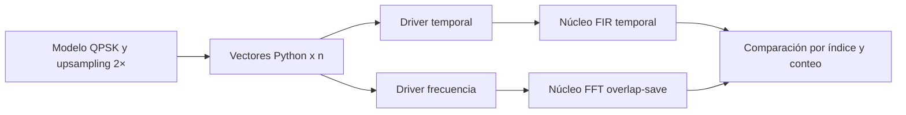

# Revisión de C01 con el contexto del 9/10/2026

**Fecha:** 2026-10-09. **Estado:** decisiones de trabajo de C01; el contrato externo requiere acuerdo en E03 y los formatos fijos, validación en A04. No asigna tareas RTL comunes.

Fuentes: [consigna vigente](consigna-actualizada.md), [contrato técnico](contrato-tecnico.md), contratos de [frecuencia](contratos/frecuencia.md), [señales](contratos/senales-y-formatos.md), [interfaz](contratos/interfaz-rtl.md) y [verificación](contratos/verificacion-y-ppa.md), [backlog](backlog.md), `config/project.json` y modelos/pruebas locales. Se verificó el estado de las issues E01 (#2), E02 (#3), A01 (#6), R01 (#31), E03 (#4), A03 (#8) y A04 (#9) el 9/10/2026.

La [arquitectura RTL serial](arquitectura-rtl-frecuencia-serial.md) convierte estas decisiones en archivos previstos, puertos y bloques internos para C02.

## 1. Qué cambia y qué se conserva

La consigna pide dos implementaciones del mismo FIR complejo RRCOS de ocho taps y roll-off 0,5: convolución temporal y procesamiento FFT con superposición del 50 %. Ambas deben corresponder con las mismas entradas y coeficientes. E01, E02 y A01 están cerradas; E03, A03 y A04 siguen abiertas. El cierre de una issue no actualizó automáticamente todos los rótulos «propuesto» de los contratos locales.

| Requisito / decisión | Resultado de la revisión | Acción |
|---|---|---|
| FIR temporal y frecuencia con igual función | E01 cerrada; ambos núcleos implementan la misma convolución causal | Conservar la selección overlap-save de E01 |
| Ocho taps, roll-off 0,5 y QPSK I/Q = ±1 | A01 y E02 cerradas; `config/project.json` contiene los ocho taps con energía unitaria y E02 incorporó el mapeo de bits | Consumir la tabla y el orden de E02; A04 fija su cuantización |
| Superposición del 50 % | FFT16 con ocho anteriores y ocho nuevas cumple | Conservar overlap-save y avance ocho |
| Salida causal con mismo índice | Selección IFFT 8…15 es compatible | Aplicar el mismo inicio en reposo y recorte sin cola al FIR temporal, conforme a la propuesta E01 |
| Upsampling 2× | Confirmado por Enzo; los modelos generan símbolo, cero | Inyectar directamente las muestras exportadas por Python en cada núcleo; M0 queda fuera de C01 |
| Interfaz serie | `valid/ready` sigue elegido; `last` acompaña a la última muestra aceptada | Usar `rst_n` asíncrono bajo como decisión local de C01; acordar el contrato con B01/E03 |
| FFT folded DIT y motor FFT/IFFT compartido | Compatible como base serial de un bloque a la vez | Conservar; no resuelve el requisito posterior de máxima paralelización |
| Optimización FFT, producto e IFFT | C03/C04 la contemplan en el backlog | Comparar arquitectura optimizada contra esta base; todavía falta diseñarla y medirla |
| Comparación flotante/fijo y SQNR ≥ 40 dB | Modelo de bloques flotante disponible; formatos y evidencia SQNR pendientes | A04 y modelos fijos por arquitectura |
| Reloj ≥ 10 MHz lento / ≥ 100 MHz rápido | Mínimos adicionales registrados; sin RTL ni timing medido | Completar cronograma C01 y verificación RTL/PPA posterior |
| Diagrama completo y descripción | La arquitectura RTL contiene flujo, estados y puertos; esta revisión fija recursos y cronograma base | Completar el detalle numérico y las interfaces tras E03/A04 |
| RTL común R01 | R01 cerrada: el vector matching usará vectores Python en cada núcleo | No exigir generador, upsampler ni salida comunes en C01 |

Siguen vigentes las elecciones internas que no contradice el contexto nuevo: bancos de 16 y ocho posiciones complejas, radix-2 folded DIT, motor FFT/IFFT compartido, ocho twiddles explícitos, H por simetría conjugada, salida desde el banco y FSM global con controles locales. Las decisiones nuevas de recursos, orden y ciclos se detallan en §4.

## 2. Qué significa obtener la misma salida

Ambas ramas deben representar `y[n] = Σ(k=0…7) h[k]·x[n−k]`, con `x[n]=0` antes del inicio de la trama. Para la salida de bloque b y posición conservada r=8…15, `n=8b+r−8`. Todos los términos cumplen `r−k≥1`, por lo que no se envuelven circularmente y producen ese mismo y[n]. La posición 7 también es válida, pero se descarta porque pertenece al tramo anterior. El avance es ocho, aunque la variante convencional con solo siete muestras de historial podría avanzar nueve.

Para comparar, ambos núcleos deben recibir la misma **secuencia de muestras aceptadas**, usar el mismo orden y ganancia de taps, comenzar con historial compatible y producir el mismo número de salidas. Con upsampling 2× confirmado por Enzo y sin cola: S símbolos → 2S entradas → 2S salidas en ambas ramas. Las latencias y pausas pueden diferir; se compara el índice n, no el ciclo de reloj.

En punto fijo hay tres verificaciones distintas:

1. Cada modelo fijo se compara con una referencia flotante común para evaluar SQNR.
2. Cada RTL se compara con las palabras de su modelo fijo, que debe reproducir su aritmética.
3. Las salidas temporal y de frecuencia se comparan con el criterio entre dominios que acuerden A04/E03.

Los documentos actuales proponen tolerancia para la tercera comparación. La frase «correspondencia de resultados» de la consigna no fija una tolerancia ni aclara identidad bit a bit. Hay que confirmar ese criterio antes de cerrar la aritmética; ambos núcleos deben cumplir las reglas acordadas aunque sus redondeos internos y su código sean propios.

**Origen de H en punto fijo, elegido para C01:** cuantizar primero los taps comunes `h_q` y generar `H_q = Q_H(DFT16([h_q, 0…0]))`. Ambos diseños parten así del mismo filtro cuantizado. A04 debe fijar `Q_H`, anchos y redondeos, y medir el error adicional de H, twiddles y operaciones. La tabla integrada de E02 en `config/project.json` es la fuente de taps; los coeficientes ilustrativos de las pruebas no la reemplazan.

## 3. Frontera de C01 y reutilización

El [cierre de R01 / #31](https://github.com/EnzoFernandezz11/rrc-fir-rtl/issues/31) reemplaza la propuesta de cuatro bloques RTL comunes: los testbenches de B02/C02 tomarán vectores exportados por Python e inyectarán las muestras directamente en cada núcleo. El generador QPSK y `upsample()` del modelo A01 producen estímulos con el mismo mapeo y factor 2×; M0 ya no es un módulo RTL de C01. El núcleo de frecuencia conserva una entrada de muestras, no de símbolos.

Cada núcleo acepta `{I, Q, last}` con `valid && ready` y entrega resultados con `out_valid && out_ready`. `in_last` se acepta junto con la última muestra de la trama; `out_last` acompaña solo al último resultado calculado. Una trama vacía no tiene transferencias ni resultados ni requiere comando adicional. `rst_n` es asíncrono activo bajo: cancela operaciones y datos pendientes, reinicia contadores e historial, y no permite transferencias mientras esté activo. Este reset es una elección local de C01 que debe acordarse en E03 con el filtro temporal; la interfaz externa definitiva, incluidos anchos de salida, sigue abierta.

Durante una pausa con `valid=1 && ready=0`, el productor mantiene datos, `last` y `valid` hasta la aceptación o el reset. El núcleo mantiene `in_ready=0` mientras calcula o emite y no cambia una salida presentada hasta que el receptor la acepta.

Los núcleos se simulan y sintetizan por separado. Los drivers entregan la misma secuencia de muestras aceptadas y comparan salidas por índice, no por ciclo; un cero del upsampling es una muestra válida, mientras que una burbuja `valid=0` no avanza ningún contador. El modelo Python y el banco común A06 reutilizan taps, vectores, índices y métricas. Cada autor mantiene dentro de su núcleo operadores, memorias y conversiones.

Los drivers, generadores de vectores y comparador quedan fuera del núcleo medido para PPA. Drivers independientes evitan conectar directamente una sola fuente `valid/ready` a receptores con `ready` distintos.

## 4. Decisiones por módulo de C01

| Bloque | Decisión de trabajo al 9/10 | Relación con la elección anterior |
|---|---|---|
| M0 — upsampling | Fuera de C01; el modelo y los vectores generan `a[m], 0` | Cambia por el cierre de R01; el factor 2× sigue vigente |
| M1 — entrada | `valid/ready`, `in_last` en la última muestra aceptada, `rst_n` asíncrono bajo | Se conserva `valid/ready`; trama y reset se concretan aquí, pendientes de E03 |
| M2 — ventana | `work[0…15]` e `history[0…7]` en registros; un bloque por vez; cargar `work[bitrev4(r)]` al copiar historial y recibir nuevas muestras | Se conservan ambos bancos; la carga en bit reversal evita una permutación inicial |
| M3/M6 — FFT/IFFT | Una mariposa radix-2 DIT y un motor compartido; ocho twiddles explícitos; un multiplicador real compartido también con M5 | Se conserva la estructura; se elige el recurso aritmético mínimo |
| M4 — H | Guardar `H[0…8]` y reconstruir `H[9…15]` por conjugación; generar H desde `h_q` | La simetría sigue válida porque E02 usa taps reales |
| M5 — producto | Producto complejo directo: cuatro productos reales secuenciales por bin, en orden natural; escribir `Y[k]` en `work[k]` tras leer `X[k]` | Nueva secuencia con el multiplicador compartido; no pisa bins no leídos |
| M6 — orden y escala | Tras los 16 productos, seis intercambios de bit reversal en `work`; ejecutar IFFT DIT y aplicar escala total `1/16` al final | Evita un banco auxiliar; A04 debe fijar anchos y redondeos |
| M7 — salida | Emitir `work[8]…work[15]`, o solo p resultados de un parcial, con `valid/ready`; proteger el banco hasta la última aceptación | Se conserva la salida desde el banco, sin etapa común obligatoria |
| M8 — control | FSM global de captura → FFT → producto → permutación → IFFT → emisión, con controles locales | Se conserva la separación de control; reiniciar historial entre tramas |

Para M2, `work` admite dos lecturas y dos escrituras complejas por ciclo mediante registros y multiplexores. Se copia el historial anterior antes de que las muestras nuevas lo sustituyan; cada muestra aceptada actualiza la posición nueva de `work` y su posición en `history`. Si `last` llega con p<8, las posiciones nuevas restantes se rellenan con ceros para el cálculo y solo se emiten p resultados. Si llega en la octava muestra, no se agrega un bloque extra. La trama siguiente no se acepta hasta terminar la emisión anterior y reiniciar el historial.

## 5. Recursos y cronograma base

La base serial reutiliza **un multiplicador real** entre mariposas FFT/IFFT y los 16 productos espectrales. Cada multiplicación compleja general usa cuatro productos reales registrados, sin atajos para twiddles triviales en este presupuesto. Las lecturas de `work` y de las tablas H/W se consideran combinacionales; las escrituras y los resultados aritméticos se registran en flanco. A04 fijará la precisión, los cortes y la política de overflow.

| Operación | Ciclos ideales | Desglose |
|---|---:|---|
| Copiar historial a `work` en bit reversal | 8 | Una posición por ciclo. |
| Capturar ocho posiciones nuevas | 8 | Una muestra aceptada o un cero de relleno por ciclo. Esperas de entrada agregan ciclos. |
| FFT16 | 224 | 32 mariposas × 7 ciclos. |
| Productos espectrales | 96 | 16 bins × 6 ciclos. |
| Permutar Y para la IFFT | 6 | Seis parejas no triviales intercambiadas en un ciclo cada una. |
| IFFT16 | 224 | 32 mariposas × 7 ciclos. |
| Emitir bloque completo | 8 | Una salida aceptada por ciclo; esperas de salida agregan ciclos. |

Una mariposa ocupa un ciclo para capturar operandos y twiddle, cuatro para los productos reales, uno para formar el producto complejo y otro para calcular `A±T` y escribir ambas posiciones. Un producto espectral ocupa un ciclo de lectura, cuatro productos reales y uno para combinar y escribir `Y[k]`. Ninguna fase se solapa con otra. El banco queda protegido mientras se emite.

Con entrada disponible, salida siempre lista, multiplicador capaz de iniciar y registrar un producto real por ciclo y transiciones de FSM sin ciclos vacíos, un bloque completo ocupa **574 ciclos** desde el inicio de la copia de historial hasta la aceptación de su octava salida: `8 + 8 + 224 + 96 + 6 + 224 + 8`. La primera salida se acepta en el ciclo 567 si el ciclo 1 es la primera copia. Para un bloque parcial con p=1…7, los `8−p` ceros ocupan las posiciones restantes de captura y se emiten p resultados: **566+p ciclos** bajo las mismas condiciones. Una trama vacía no inicia bloque. Estas cifras son un presupuesto estructural, no latencia medida ni prueba de frecuencia máxima.

## 6. Dependencias para cerrar C01

1. E03 debe acordar con B01 la interfaz común, especialmente `valid/ready`, `last`, reset y formatos externos. `rst_n` asíncrono bajo y la ausencia de comando de trama vacía son decisiones locales hasta ese acuerdo.
2. A03 debe aportar la comparación flotante con el FIR temporal usando la tabla integrada de E02 y casos completos y parciales.
3. A04 debe elegir anchos, cuantización de `h_q`, H y twiddles, redondeo/saturación y correspondencia numérica entre ramas; debe verificar SQNR ≥ 40 dB. Escalar la IFFT `1/16` al final exige ancho interno suficiente para evitar overflow.
4. C01 debe convertir este presupuesto en diagrama físico, señales de control y calendario coherente. La tasa y el reloj objetivo se validarán después con RTL y síntesis; C03/C04 compararán la versión optimizada contra esta base mínima.

## 7. Evidencia y límites

La evidencia histórica de E01 del 7/10/2026 fue `make smoke` **PASS** con nueve pruebas Python, incluidas cinco de reconstrucción overlap-save. `model/frequency.py` representa FFT16/IFFT16 mediante DFT directa y contrasta la salida contra convolución causal independiente con error absoluto menor que `1e−10`; cubre QPSK, tramas vacías/completas/parciales, taps asimétricos y complejos e impulsos en fronteras. A01/E02 incorporaron después el modelo QPSK, la tabla RRCOS de ocho taps y su configuración reproducible.

El árbol revisado el 9/10/2026 todavía no contiene fuentes ni testbenches RTL y el registro de variantes integrado está vacío. Tampoco contiene un modelo fijo. Las pruebas Python respaldan el algoritmo overlap-save; no verifican el motor folded DIT, el protocolo por ciclos, los **574 ciclos** presupuestados, SQNR ni PPA. La interfaz y los detalles de punto fijo siguen condicionados por E03 y A04.
