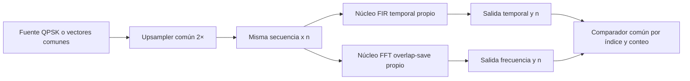

# Revisión de C01 y propuesta de módulos comunes

**Fecha:** 2026-10-07. **Estado:** revisión del árbol local y propuestas para conversar con Julián y Andrés; no constituye aprobación de E02/E03/A04 ni asignación nueva de tareas.

Fuentes: [consigna vigente](consigna-actualizada.md), [contrato técnico](contrato-tecnico.md), contratos de [frecuencia](contratos/frecuencia.md), [señales](contratos/senales-y-formatos.md), [interfaz](contratos/interfaz-rtl.md) y [verificación](contratos/verificacion-y-ppa.md), [borrador C01](diseno-frecuencia-serial.md), [backlog](backlog.md) y modelos/pruebas locales. E01 ya está integrado en esta rama; se revisó HEAD `365f3eb`.

## 1. Qué cambia y qué se conserva

La consigna vigente pide dos implementaciones del mismo FIR complejo RRCOS de ocho taps y roll-off 0,5: convolución temporal y procesamiento FFT con superposición del 50 %. Ambas deben corresponder con las mismas entradas y coeficientes. El contexto anterior de filtros de distinta función quedó reemplazado.

| Requisito / decisión | Resultado de la revisión | Acción |
|---|---|---|
| FIR temporal y frecuencia con igual función | E01 y contrato técnico ya están alineados; C01 todavía citaba el contexto anterior | Corregido el alcance de C01 y su referencia a E01 integrado |
| Ocho taps, roll-off 0,5 y QPSK I/Q = ±1 | Compatible con la base de C01 | E02/A01 deben fijar tabla, fase, normalización y mapeo únicos |
| Superposición del 50 % | FFT16 con ocho anteriores y ocho nuevas cumple | Conservar overlap-save y avance ocho |
| Salida causal con mismo índice | Selección IFFT 8…15 es compatible | Aplicar el mismo inicio en reposo y recorte sin cola al FIR temporal, conforme a la propuesta E01 |
| Upsampling 2× | Confirmado por Enzo el 7/10/2026 como decisión de diseño; la consigna no fija el factor | Usar un upsampler común en ambas cadenas |
| Interfaz serie | `valid/ready` elegido en C01 sirve para las pausas del núcleo | Proponer la misma semántica a B01/E03; reset y trama siguen abiertos |
| FFT folded DIT y motor FFT/IFFT compartido | Compatible como base serial de un bloque a la vez | Conservar; no resuelve el requisito posterior de máxima paralelización |
| Optimización FFT, producto e IFFT | C03/C04 la contemplan en el backlog | Comparar arquitectura optimizada contra esta base; todavía falta diseñarla y medirla |
| Comparación flotante/fijo y SQNR ≥ 40 dB | Modelo de bloques flotante disponible; formatos y evidencia SQNR pendientes | A04 y modelos fijos por arquitectura |
| Reloj ≥ 10 MHz lento / ≥ 100 MHz rápido | Mínimos adicionales registrados; sin RTL ni timing medido | Completar cronograma C01 y verificación RTL/PPA posterior |
| Diagrama completo y descripción | C01 describe funciones; falta diagrama físico y calendario | Completar tras acordar recursos, puertos y módulos comunes |
| Gantt y aportes individuales | Documentación y responsables existentes | Registrar futuros acuerdos de implementación compartida sin duplicar tareas |

Las elecciones internas de C01 se conservan: bancos de 16 y ocho posiciones complejas, radix-2 folded DIT, motor FFT/IFFT compartido, ocho twiddles explícitos, H almacenada por simetría conjugada, salida desde el banco y FSM global con controles locales. Multiplicadores, puertos, bit-reversal, escalado y ciclos siguen pendientes.

## 2. Qué significa obtener la misma salida

Ambas ramas deben representar `y[n] = Σ(k=0…7) h[k]·x[n−k]`, con `x[n]=0` antes del inicio de la trama. Para la salida de bloque b y posición conservada r=8…15, `n=8b+r−8`. Todos los términos cumplen `r−k≥1`, por lo que no se envuelven circularmente y producen ese mismo y[n]. La posición 7 también es válida, pero se descarta porque pertenece al tramo anterior. El avance es ocho, aunque la variante convencional con solo siete muestras de historial podría avanzar nueve.

Para comparar, ambos núcleos deben recibir la misma **secuencia de muestras aceptadas**, usar el mismo orden y ganancia de taps, comenzar con historial compatible y producir el mismo número de salidas. Con upsampling 2× confirmado por Enzo y sin cola: S símbolos → 2S entradas → 2S salidas en ambas ramas. Las latencias y pausas pueden diferir; se compara el índice n, no el ciclo de reloj.

En punto fijo hay tres verificaciones distintas:

1. Cada modelo fijo se compara con una referencia flotante común para evaluar SQNR.
2. Cada RTL se compara con las palabras de su modelo fijo, que debe reproducir su aritmética.
3. Las salidas temporal y de frecuencia se comparan con el criterio entre dominios que acuerden A04/E03.

Los documentos actuales proponen tolerancia para la tercera comparación. La frase «correspondencia de resultados» de la consigna no fija una tolerancia ni aclara identidad bit a bit. Hay que confirmar ese criterio antes de cerrar la aritmética; ambos núcleos deben cumplir las reglas acordadas aunque sus redondeos internos y su código sean propios.

**Origen de H en punto fijo:** una propuesta para A04 es definir primero los taps cuantizados comunes `h_q`, interpretarlos con su escala y generar `H_q = Q_H(DFT16([h_q, 0…0]))`. Así, ambos diseños parten del mismo filtro cuantizado; después se estudia el error adicional de H, twiddles y operaciones. Generar H desde taps ideales mientras el FIR usa taps cuantizados requiere medir y justificar esa diferencia. La tabla definitiva de E02, su versión y configuración deben ser la única fuente; el RRC ilustrativo del test no la reemplaza.

## 3. Código que conviene reutilizar

Compartir aquí significa **una implementación fuente con instancias independientes cuando haga falta**. Cada filtro debe poder simularse y sintetizarse por separado. La reutilización del motor FFT/IFFT dentro del filtro en frecuencia es otra decisión, ya tomada en C01.

**Alcance actualizado por Enzo el 7/10:** compartir RTL de generación de símbolos, upsampler e interfaces de entrada/salida; cada uno diseña el núcleo completo de su filtro. Multiplicadores, memorias de coeficientes y conversiones internas quedan dentro de cada núcleo. El reparto RTL se acuerda entre Enzo y Julián; las tareas de modelos y coeficientes conservan su organización existente.

| Bloque o utilidad | Reutilización propuesta | Condiciones y estado |
|---|---|---|
| Generador QPSK RTL | Una fuente reproducible independiente del filtro | Compartido entre Enzo y Julián; algoritmo, mapeo, semilla y control de trama pendientes. La utilidad Python existente sigue siendo referencia de estímulos |
| Upsampler | Un módulo en `rtl/common/`, instanciado por ambas cadenas | 2× confirmado por Enzo; acordar I/Q, `valid/ready`, reset y fin de trama iguales |
| Frontera de muestras y wrapper de entrada | Contrato común y adaptación externa para cualquiera de los núcleos | Semántica compartida; usar conexiones o registros según necesidad, sin imponer FIFO |
| Registro de salida con pausas | Mismo módulo pequeño, si ambos lo necesitan | No obliga a añadir buffers ni sustituye la selección 8…15 de frecuencia |
| Coeficientes y constantes generadas | Un script/configuración de origen para h y H | FIR consume h; frecuencia consume H y twiddles. Tablas derivadas distintas con trazabilidad común |
| Driver, lector de vectores, comprobación y métricas | Banco común A06 y utilidades Python | Usar aceptación `valid && ready`, índices y conteos; tolerancias y modelos propios cuando corresponda |

Los núcleos entregan muestras ya calculadas, ordenadas y convertidas al formato externo acordado. La salida común no ejecuta acumulación FIR, selección de posiciones IFFT ni normalización. Los scripts/configuración y el banco de verificación de la tabla son infraestructura existente del proyecto; no forman parte del nuevo reparto RTL entre Enzo y Julián.

## 4. Módulos que conservan diseños propios

| Temporal — B01/B02 | Frecuencia — C01/C02 |
|---|---|
| Línea de retardos y acceso a taps | Formador de ventanas, historial de ocho y banco FFT |
| Acumulación FIR, índices y secuencia MAC | Motor FFT/IFFT, bit-reversal y direcciones por etapa |
| Control de emisión por muestra y estado temporal | H por simetría, producto espectral y selección 8…15 |
| FSM y cronograma temporal | FSM de captura → FFT → producto → IFFT → emisión |
| Multiplicadores, memoria h y conversiones internas | Multiplicadores, memorias H/W, escalado y conversiones internas |

Los estados y memorias preservan historias diferentes. Compartir la interfaz permite verificar ambos diseños sin unificar artificialmente sus FSM o bancos. La memoria de h, la tabla H y la tabla W contienen información distinta, aunque procedan de scripts coordinados.

## 5. Frontera propuesta para las dos cadenas

Es un mapa lógico de comparación. Se propone empezar ejecutando los mismos vectores en simulaciones independientes: el driver de cada variante avanza únicamente cuando su receptor acepta. Unir físicamente una salida `valid/ready` a dos receptores con `ready` distintos puede duplicar muestras en la rama rápida. Si se desea una simulación simultánea, hace falta un distribuidor que registre qué rama ya aceptó cada muestra, o drivers independientes con la misma secuencia; una conjunción simple de `ready` sin adaptar las señales de validez no basta. En salida, el comparador retira datos solo al aceptarse la transferencia de la rama correspondiente.

La generación de estímulos, el distribuidor de comparación y el scoreboard quedan fuera del núcleo medido para PPA. Debe declararse si el upsampler y los adaptadores se incluyen, usando el mismo alcance en todas las variantes.

## 6. Acuerdos para conversar antes de continuar C01

1. Ambas cadenas usan un upsampler 2×, confirmado por Enzo. Acordar su implementación común y núcleos que reciben muestras, con generador y upsampler separados.
2. Acordar con Julián `valid/ready`, formatos externos, reset y señalización de trama. El fin de bloque FFT es interno; el fin de trama debe tener el mismo significado para ambos filtros.
3. Acordar con Andrés la tabla h común, generación de H en punto fijo y referencia de SQNR; definir o confirmar con el docente el criterio de correspondencia numérica.
4. Enzo y Julián acuerdan responsables de generador QPSK RTL, upsampler e interfaces de entrada/salida. Los operadores y memorias de cada núcleo quedan a cargo de su autor; el reparto fue aceptado: Julián implementa generador y salida; Enzo, upsampler y entrada, con revisión cruzada. Se registra en [R01 / #31](https://github.com/EnzoFernandezz11/rrc-fir-rtl/issues/31) y el [contrato RTL común](contratos/rtl-comun.md).
5. Retomar cronogramas y operadores propios de C01 con esas interfaces. Las variantes optimizadas deben conservar el contrato funcional.

## 7. Evidencia y límites de esta revisión

`make smoke` ejecutado el 7/10/2026: **PASS**, nueve pruebas Python, incluidas las cinco de reconstrucción de E01. El modelo `model/frequency.py` usa DFT directa para representar FFT16/IFFT16; se compara contra convolución causal independiente. Hay casos QPSK con semilla, tramas vacías/completas/parciales, taps asimétricos y complejos, impulsos en fronteras y retardo del último tap, con error absoluto menor que `1e−10` y conteo exacto.

No hay fuentes RTL ni testbenches implementados en el árbol revisado; el registro de variantes está vacío. Tampoco hay modelo fijo ni tabla RRC definitiva. Estas pruebas respaldan la elección de overlap-save; todavía no demuestran equivalencia del RTL temporal/frecuencia, el motor folded DIT, SQNR, protocolo por ciclos ni PPA. La propuesta de reutilización se basa en responsabilidades funcionales; deberá contrastarse con el diseño B01 de Julián cuando esté disponible.
