## Comparación C02 / C04

Corridas: [C02](../../frequency_serial/sky130/manifest.json) / [C04](../../frequency_optimized/sky130/manifest.json). Benchmark: QPSK 2×, semilla 1, 2048 muestras exactas.

Las diferencias porcentuales son (C04/C02 − 1) × 100; un signo positivo no siempre significa mejora.

Medición física; revisar PASS/FAIL por corner antes de interpretar las tasas.

| Métrica | Unidad | C02 | C04 | Cambio C04/C02 | Condición / procedencia |
|---|---|---:|---:|---:|---|
| Muestras aceptadas | muestras | 2048 | 2048 | 0 % | local_metrics.json / resources.json |
| Muestras exactas | muestras | 2048 | 2048 | 0 % | local_metrics.json / resources.json |
| Reloj configurado | MHz | 10 | 100 | 900 % | Objetivos propios, 10/100 MHz; hipotético si timing FAIL |
| Latencia | ciclos | 559 | 26 | -95.348837 % | local_metrics.json / resources.json |
| Intervalo por bloque | ciclos | 575 | 8 | -98.608696 % | local_metrics.json / resources.json |
| Ciclos activos del benchmark | ciclos | 147200 | 2074 | -98.591033 % | local_metrics.json / resources.json |
| Latencia temporal | ns | 55900 | 260 | -99.534884 % | Objetivos propios, 10/100 MHz; hipotético si timing FAIL |
| Throughput sostenido | muestras/s | 139130.434783 | 1e+08 | 71775 % | Objetivos propios, 10/100 MHz; hipotético si timing FAIL |
| Throughput efectivo | muestras/s | 139130.434783 | 9.87464e+07 | 70873.963356 % | Objetivos propios, 10/100 MHz; hipotético si timing FAIL |
| Celdas de síntesis | celdas | 4474 | 48295 | 979.459097 % | local_metrics.json / resources.json |
| Flip-flops de síntesis | FF | 610 | 6562 | 975.737705 % | local_metrics.json / resources.json |
| Celdas combinacionales de síntesis | celdas | 3864 | 41733 | 980.046584 % | local_metrics.json / resources.json |
| Área de celdas de síntesis | µm² | 38448.1248 | 382962.2912 | 896.049335 % | local_metrics.json / resources.json |
| Área final de celdas | µm² | 57365 | 541302 | 843.610215 % | physical_metrics.json |
| Área del núcleo | µm² | 144863.936 | 1432473.856 | 888.840905 % | physical_metrics.json |
| Área del die | µm² | 157743.082425 | 1472699.144 | 833.606166 % | physical_metrics.json |
| Potencia interna | W | 0.000456245 | 0.04498 | 9758.745248 % | Netlist final / SPEF / VCD, TT; objetivos propios |
| Potencia de conmutación | W | 0.00020175 | 0.018494 | 9066.694233 % | Netlist final / SPEF / VCD, TT; objetivos propios |
| Potencia dinámica | W | 0.000657995 | 0.063474 | 9546.553486 % | Netlist final / SPEF / VCD, TT; objetivos propios |
| Leakage del núcleo | W | 3.88315e-08 | 3.45756e-07 | 790.401946 % | Netlist final / SPEF / VCD, TT; objetivos propios |
| Potencia total | W | 0.000658034 | 0.063474 | 9546.036627 % | Netlist final / SPEF / VCD, TT; objetivos propios |
| Energía dinámica por muestra | J/muestra | 4.72934e-09 | 6.42796e-10 | -86.408321 % | Netlist final / SPEF / VCD, TT; objetivos propios |
| Energía total por muestra | J/muestra | 4.72962e-09 | 6.428e-10 | -86.409049 % | Netlist final / SPEF / VCD, TT; objetivos propios |
| Pines con actividad VCD/reloj/constante | % | 100 | 100 | 0 % | physical_metrics.json |

### Radares normalizados

100 es el mejor valor **de esta pareja** en cada eje. Más afuera es mejor. Beneficios: 100 × valor/máximo; costos: 100 × mínimo/valor. Empate en cero: ambos 100; costo cero frente a costo positivo: 100 frente a 0. La superficie no es una puntuación global. Valores originales en la tabla.

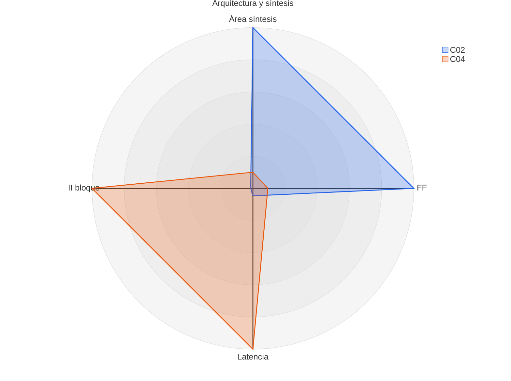
```mermaid
---
config:
  theme: base
  themeVariables:
    cScale0: '#2563eb'
    cScale1: '#ea580c'
    fontSize: 18px
    radar:
      curveOpacity: 0.25
      axisLabelFontSize: 16px
      legendFontSize: 16px
  radar:
    width: 900
    height: 700
    axisScaleFactor: 1
    marginTop: 60
    marginBottom: 60
    marginLeft: 100
    marginRight: 100
    curveTension: 0
---
radar-beta
    title Arquitectura y síntesis
    axis a0["Área síntesis"], a1["FF"], a2["Latencia"], a3["II bloque"]
    curve c02["C02"]{100.00000, 100.00000, 4.65116, 1.39130}
    curve c04["C04"]{10.03966, 9.29595, 100.00000, 100.00000}
    min 0
    max 100
    ticks 5
    showLegend true
```

[Fuente Mermaid](radar-arquitectura.mmd)

### Barras: objetivos propios

Cada gráfico usa una unidad; menor costo favorece la variante más pequeña.

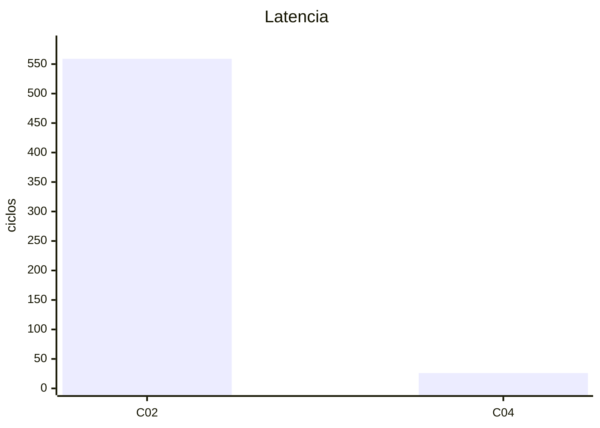
```mermaid
xychart-beta
    title "Latencia"
    x-axis ["C02", "C04"]
    y-axis "ciclos" 0.000000000000 --> 586.950000000000
    bar [559.000000000000, 26.000000000000]
```

[Fuente Mermaid](latency_cycles.mmd)

| ciclos | C02 | C04 |
|---|---:|---:|
| Latencia | 559 | 26 |

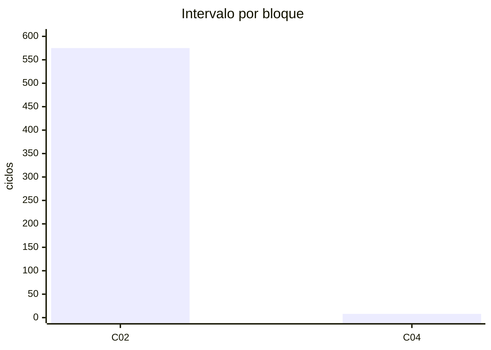
```mermaid
xychart-beta
    title "Intervalo por bloque"
    x-axis ["C02", "C04"]
    y-axis "ciclos" 0.000000000000 --> 603.750000000000
    bar [575.000000000000, 8.000000000000]
```

[Fuente Mermaid](block_cycles.mmd)

| ciclos | C02 | C04 |
|---|---:|---:|
| Intervalo por bloque | 575 | 8 |

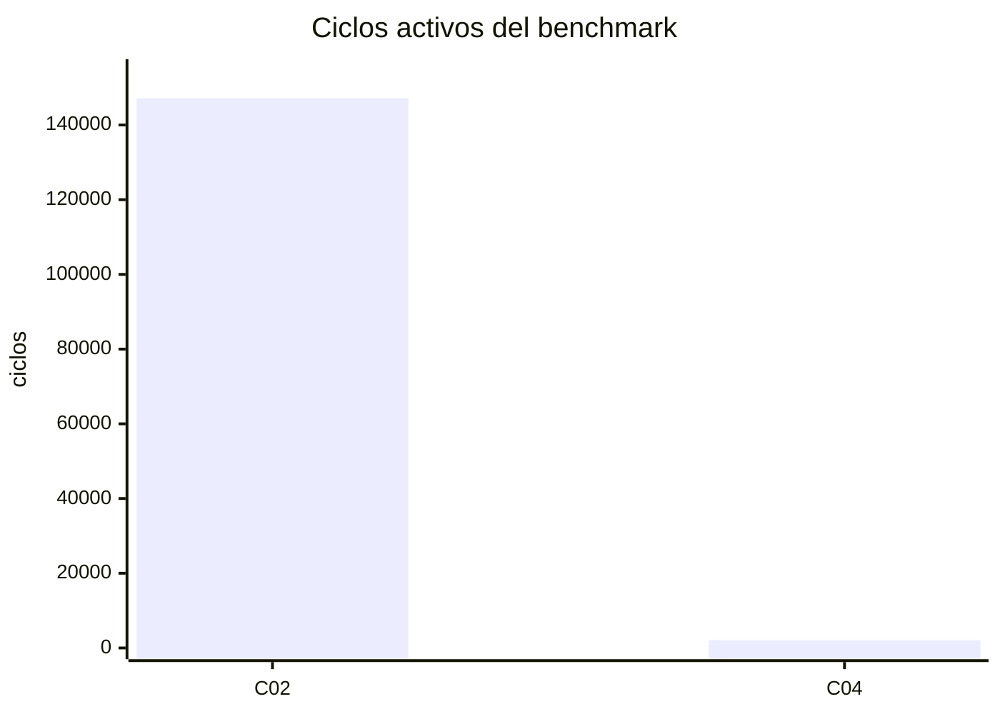
```mermaid
xychart-beta
    title "Ciclos activos del benchmark"
    x-axis ["C02", "C04"]
    y-axis "ciclos" 0.000000000000 --> 154560.000000000000
    bar [147200.000000000000, 2074.000000000000]
```

[Fuente Mermaid](active_cycles.mmd)

| ciclos | C02 | C04 |
|---|---:|---:|
| Ciclos activos del benchmark | 147200 | 2074 |

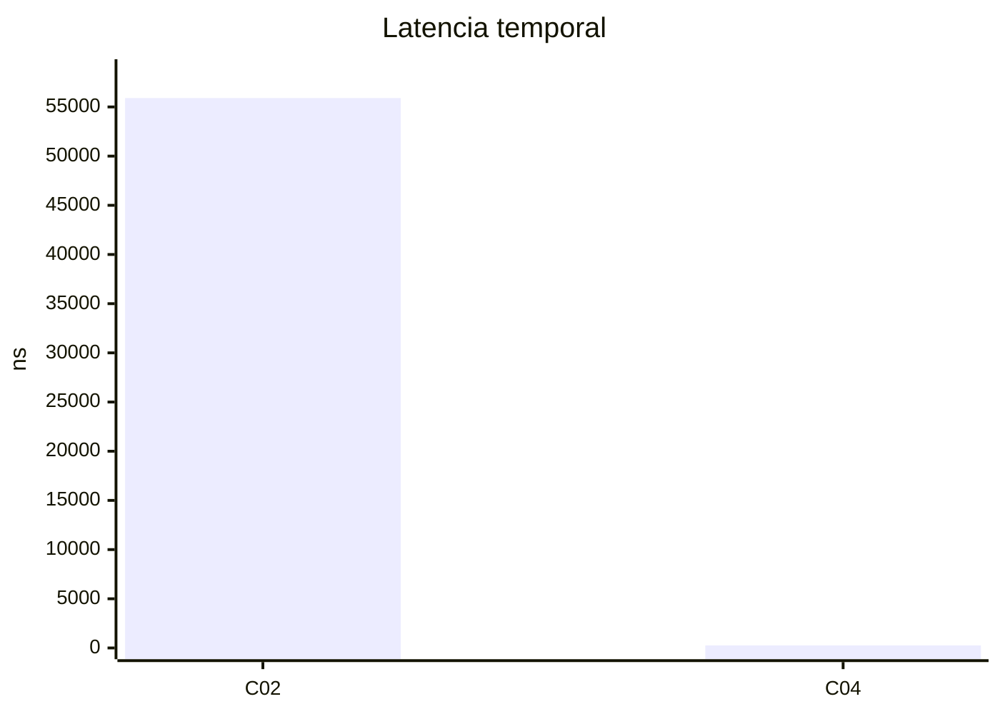
```mermaid
xychart-beta
    title "Latencia temporal"
    x-axis ["C02", "C04"]
    y-axis "ns" 0.000000000000 --> 58695.000000000000
    bar [55900.000000000000, 260.000000000000]
```

[Fuente Mermaid](latency_ns.mmd)

| ns | C02 | C04 |
|---|---:|---:|
| Latencia temporal | 55900 | 260 |

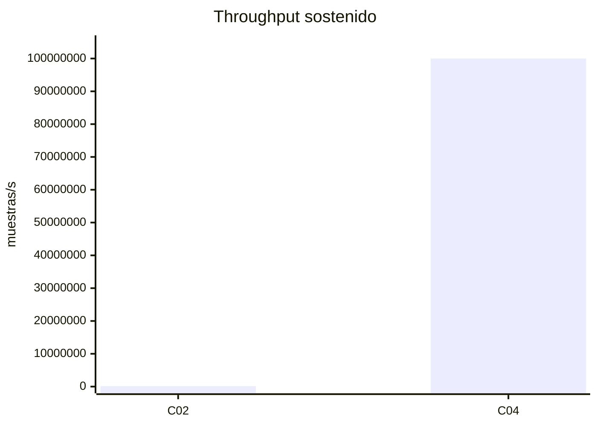
```mermaid
xychart-beta
    title "Throughput sostenido"
    x-axis ["C02", "C04"]
    y-axis "muestras/s" 0.000000000000 --> 105000000.000000000000
    bar [139130.434782608703, 100000000.000000000000]
```

[Fuente Mermaid](sustained_sps.mmd)

| muestras/s | C02 | C04 |
|---|---:|---:|
| Throughput sostenido | 139130.434783 | 1e+08 |

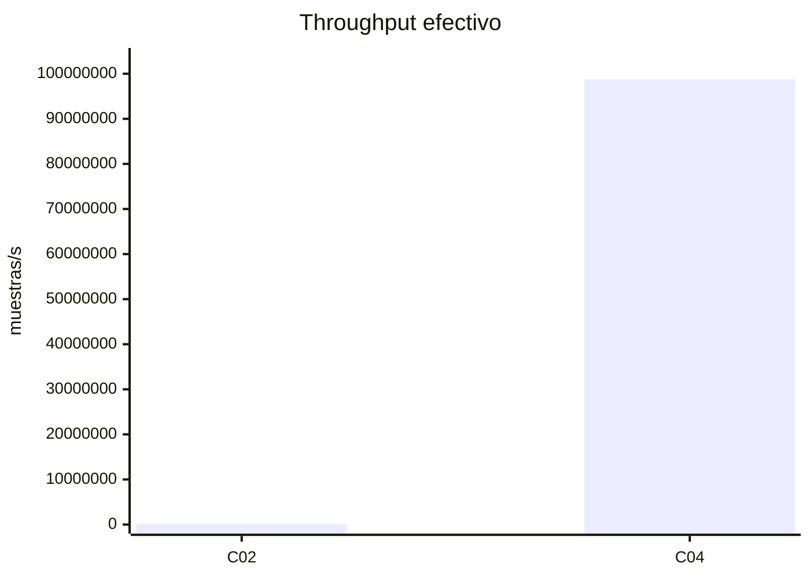
```mermaid
xychart-beta
    title "Throughput efectivo"
    x-axis ["C02", "C04"]
    y-axis "muestras/s" 0.000000000000 --> 103683702.989392489195
    bar [139130.434782608994, 98746383.799421414733]
```

[Fuente Mermaid](effective_sps.mmd)

| muestras/s | C02 | C04 |
|---|---:|---:|
| Throughput efectivo | 139130.434783 | 9.87464e+07 |

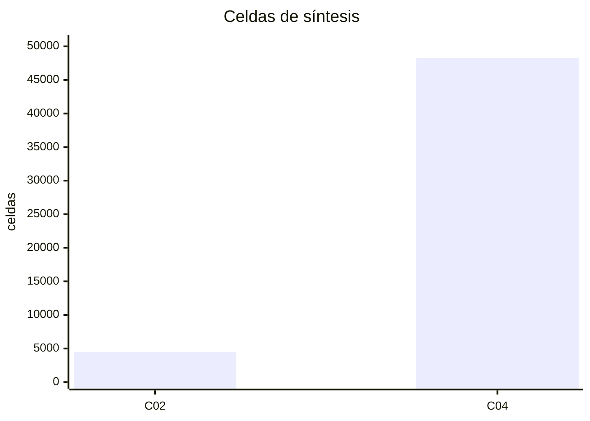
```mermaid
xychart-beta
    title "Celdas de síntesis"
    x-axis ["C02", "C04"]
    y-axis "celdas" 0.000000000000 --> 50709.750000000000
    bar [4474.000000000000, 48295.000000000000]
```

[Fuente Mermaid](cells.mmd)

| celdas | C02 | C04 |
|---|---:|---:|
| Celdas de síntesis | 4474 | 48295 |

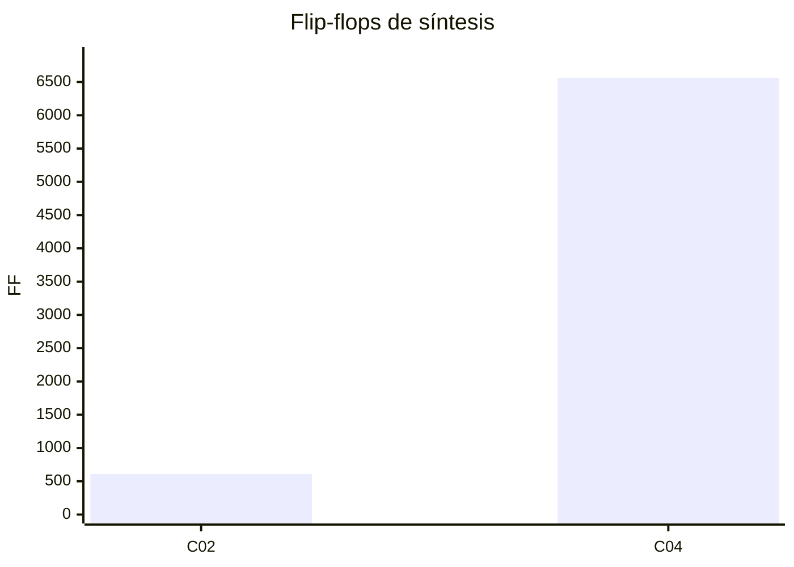
```mermaid
xychart-beta
    title "Flip-flops de síntesis"
    x-axis ["C02", "C04"]
    y-axis "FF" 0.000000000000 --> 6890.100000000000
    bar [610.000000000000, 6562.000000000000]
```

[Fuente Mermaid](flip_flops.mmd)

| FF | C02 | C04 |
|---|---:|---:|
| Flip-flops de síntesis | 610 | 6562 |

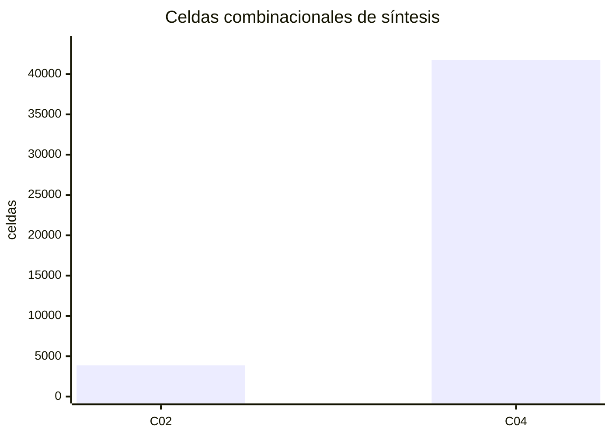
```mermaid
xychart-beta
    title "Celdas combinacionales de síntesis"
    x-axis ["C02", "C04"]
    y-axis "celdas" 0.000000000000 --> 43819.650000000001
    bar [3864.000000000000, 41733.000000000000]
```

[Fuente Mermaid](combinational_cells.mmd)

| celdas | C02 | C04 |
|---|---:|---:|
| Celdas combinacionales de síntesis | 3864 | 41733 |

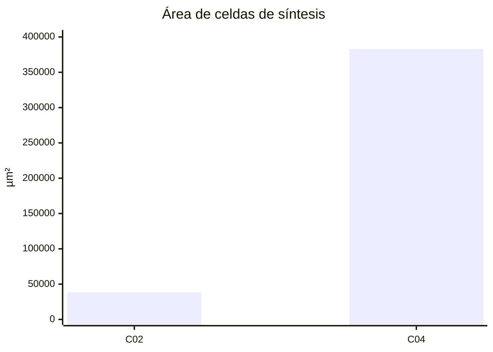
```mermaid
xychart-beta
    title "Área de celdas de síntesis"
    x-axis ["C02", "C04"]
    y-axis "µm²" 0.000000000000 --> 402110.405759999994
    bar [38448.124799999998, 382962.291199999978]
```

[Fuente Mermaid](cell_area_um2.mmd)

| µm² | C02 | C04 |
|---|---:|---:|
| Área de celdas de síntesis | 38448.1248 | 382962.2912 |

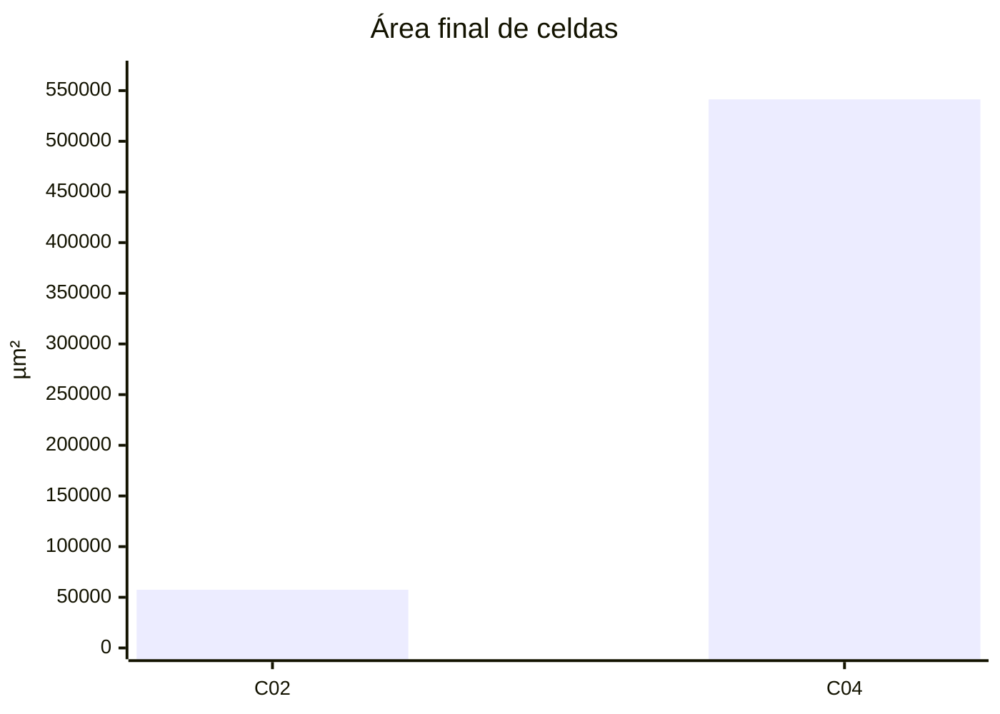
```mermaid
xychart-beta
    title "Área final de celdas"
    x-axis ["C02", "C04"]
    y-axis "µm²" 0.000000000000 --> 568367.099999999977
    bar [57365.000000000000, 541302.000000000000]
```

[Fuente Mermaid](final_cell_area_um2.mmd)

| µm² | C02 | C04 |
|---|---:|---:|
| Área final de celdas | 57365 | 541302 |

```mermaid
xychart-beta
    title "Área del núcleo"
    x-axis ["C02", "C04"]
    y-axis "µm²" 0.000000000000 --> 1504097.548800000222
    bar [144863.936000000016, 1432473.856000000145]
```

[Fuente Mermaid](core_area_um2.mmd)

| µm² | C02 | C04 |
|---|---:|---:|
| Área del núcleo | 144863.936 | 1432473.856 |

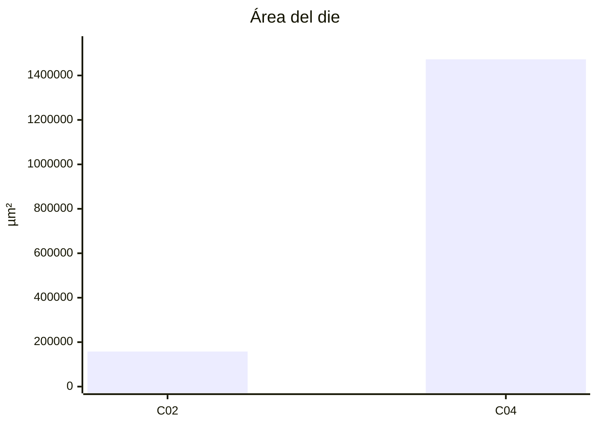
```mermaid
xychart-beta
    title "Área del die"
    x-axis ["C02", "C04"]
    y-axis "µm²" 0.000000000000 --> 1546334.101200000150
    bar [157743.082425000001, 1472699.144000000088]
```

[Fuente Mermaid](die_area_um2.mmd)

| µm² | C02 | C04 |
|---|---:|---:|
| Área del die | 157743.082425 | 1472699.144 |

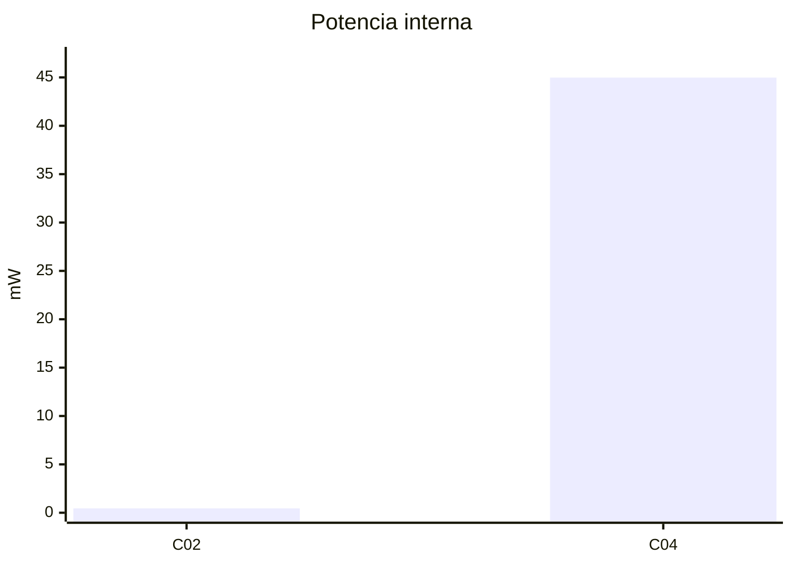
```mermaid
xychart-beta
    title "Potencia interna"
    x-axis ["C02", "C04"]
    y-axis "mW" 0.000000000000 --> 47.229039742142
    bar [0.456245056739, 44.980037849659]
```

[Fuente Mermaid](internal_w.mmd)

| W | C02 | C04 |
|---|---:|---:|
| Potencia interna | 0.000456245 | 0.04498 |

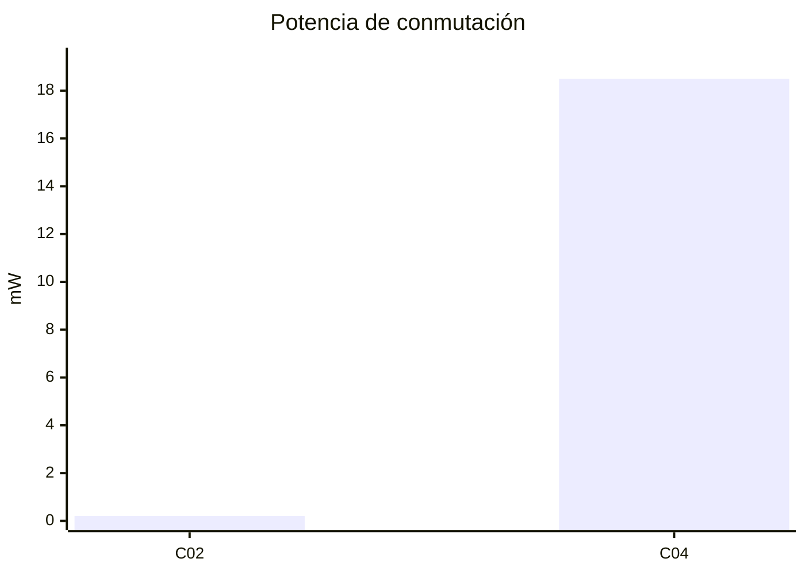
```mermaid
xychart-beta
    title "Potencia de conmutación"
    x-axis ["C02", "C04"]
    y-axis "mW" 0.000000000000 --> 19.418463427412
    bar [0.201749662665, 18.493774692773]
```

[Fuente Mermaid](switching_w.mmd)

| W | C02 | C04 |
|---|---:|---:|
| Potencia de conmutación | 0.00020175 | 0.018494 |

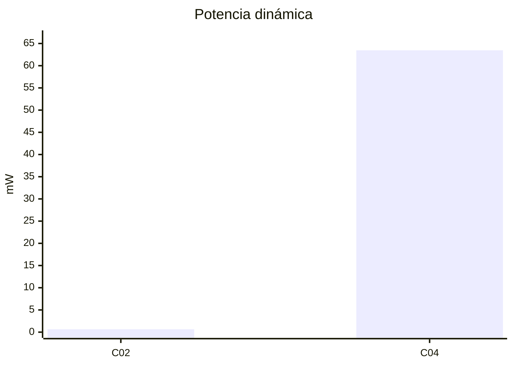
```mermaid
xychart-beta
    title "Potencia dinámica"
    x-axis ["C02", "C04"]
    y-axis "mW" 0.000000000000 --> 66.647503169553
    bar [0.657994719404, 63.473812542432]
```

[Fuente Mermaid](dynamic_w.mmd)

| W | C02 | C04 |
|---|---:|---:|
| Potencia dinámica | 0.000657995 | 0.063474 |

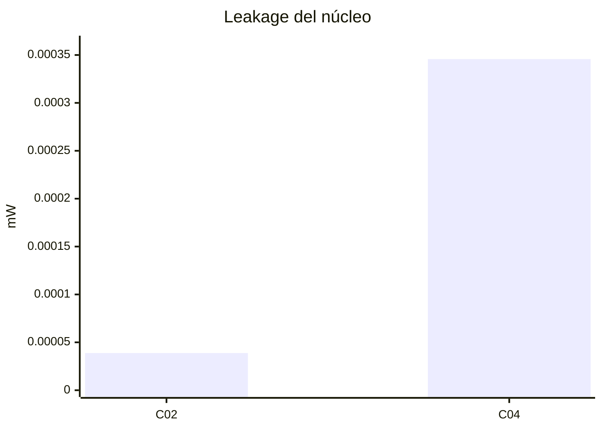
```mermaid
xychart-beta
    title "Leakage del núcleo"
    x-axis ["C02", "C04"]
    y-axis "mW" 0.000000000000 --> 0.000363044221
    bar [0.000038831497, 0.000345756401]
```

[Fuente Mermaid](leakage_w.mmd)

| W | C02 | C04 |
|---|---:|---:|
| Leakage del núcleo | 3.88315e-08 | 3.45756e-07 |

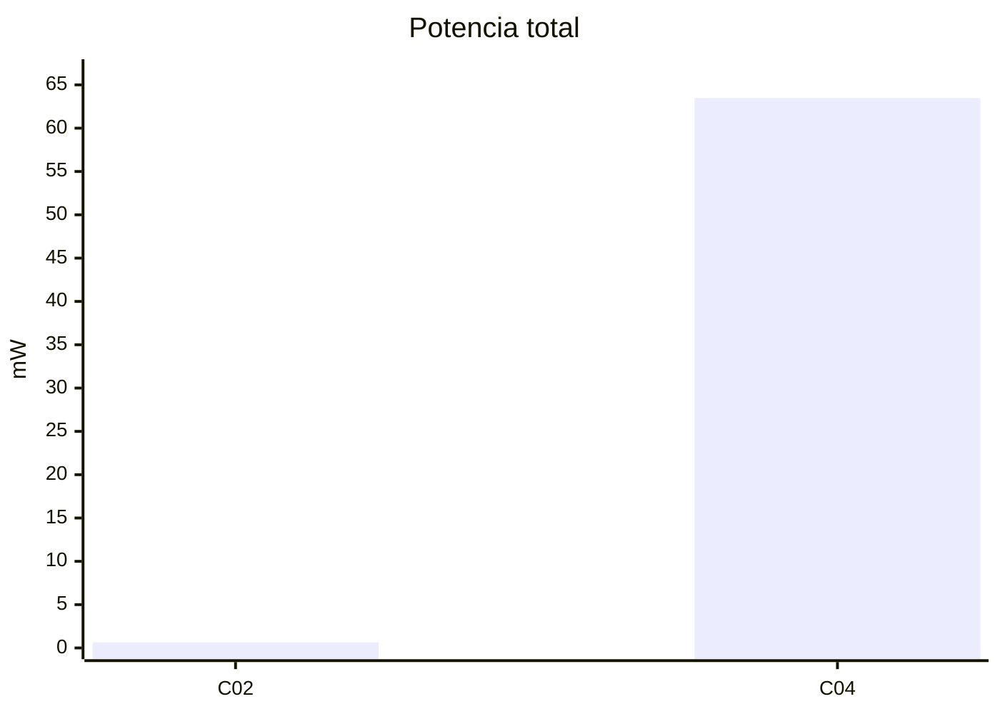
```mermaid
xychart-beta
    title "Potencia total"
    x-axis ["C02", "C04"]
    y-axis "mW" 0.000000000000 --> 66.647865050612
    bar [0.658033549371, 63.474157191059]
```

[Fuente Mermaid](total_w.mmd)

| W | C02 | C04 |
|---|---:|---:|
| Potencia total | 0.000658034 | 0.063474 |

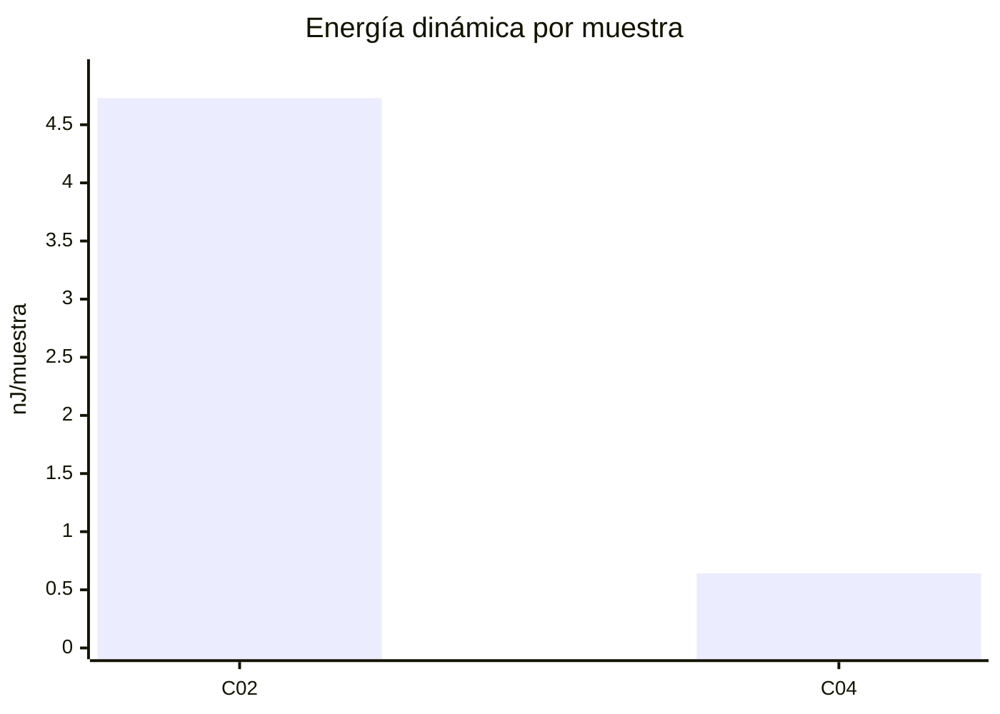
```mermaid
xychart-beta
    title "Energía dinámica por muestra"
    x-axis ["C02", "C04"]
    y-axis "nJ/muestra" 0.000000000000 --> 4.965803898003
    bar [4.729337045717, 0.642796324282]
```

[Fuente Mermaid](dynamic_energy_j.mmd)

| J/muestra | C02 | C04 |
|---|---:|---:|
| Energía dinámica por muestra | 4.72934e-09 | 6.42796e-10 |

```mermaid
xychart-beta
    title "Energía total por muestra"
    x-axis ["C02", "C04"]
    y-axis "nJ/muestra" 0.000000000000 --> 4.966096942908
    bar [4.729616136103, 0.642799814523]
```

[Fuente Mermaid](total_energy_j.mmd)

| J/muestra | C02 | C04 |
|---|---:|---:|
| Energía total por muestra | 4.72962e-09 | 6.428e-10 |

```mermaid
xychart-beta
    title "Pines con actividad VCD/reloj/constante"
    x-axis ["C02", "C04"]
    y-axis "%" 0.000000000000 --> 105.000000000000
    bar [100.000000000000, 100.000000000000]
```

[Fuente Mermaid](activity_coverage_pct.mmd)

| % | C02 | C04 |
|---|---:|---:|
| Pines con actividad VCD/reloj/constante | 100 | 100 |

### Reloj común: 10 MHz

Potencia común medida por variante (TT/25 °C/1,8 V), aunque el estado global no habilite gráficas:

| Métrica | Unidad | C02 | C04 |
|---|---|---:|---:|
| internal_w | W | 0.000456245 | 0.004498 |
| switching_w | W | 0.00020175 | 0.001849 |
| dynamic_w | W | 0.000657995 | 0.006347 |
| leakage_w | W | 3.88315e-08 | 3.45756e-07 |
| total_w | W | 0.000658034 | 0.006348 |
| dynamic_energy_j | J/muestra | 4.72934e-09 | 6.42805e-10 |
| total_energy_j | J/muestra | 4.72962e-09 | 6.4284e-10 |
Pendiente: ambas implementaciones deben demostrar timing a 10 MHz. No se grafican datos físicos supuestos.

### Timing por corner

Escenario target: C02 setup/hold **PASS**, eléctrico/restricciones **FAIL**, global **FAIL**; C04 setup/hold **FAIL**, eléctrico/restricciones **FAIL**, global **FAIL**.

| Estado | C02 | C04 |
|---|---|---|
| Setup/hold | PASS | FAIL |
| Eléctrico/restricciones | FAIL | FAIL |
| Global | FAIL | FAIL |

| Corner | Métrica | C02 | C04 |
|---|---|---:|---:|
| nom_tt_025C_1v80 | setup_ws_ns | 57.821582 | 2.330294 |
| nom_tt_025C_1v80 | hold_ws_ns | 0.310596 | 0.303278 |
| nom_tt_025C_1v80 | setup_wns_ns | 0 | 0 |
| nom_tt_025C_1v80 | hold_wns_ns | 0 | 0 |
| nom_tt_025C_1v80 | setup_tns_ns | 0 | 0 |
| nom_tt_025C_1v80 | hold_tns_ns | 0 | 0 |
| nom_tt_025C_1v80 | setup_violations | 0 | 0 |
| nom_tt_025C_1v80 | hold_violations | 0 | 0 |
| nom_tt_025C_1v80 | max_slew_violations | 0 | 6 |
| nom_tt_025C_1v80 | max_cap_violations | 1 | 1 |
| nom_tt_025C_1v80 | max_fanout_violations | 22 | 183 |
| nom_tt_025C_1v80 | unannotated_routed_nets | 0 | 0 |
| nom_tt_025C_1v80 | fmax_estimate_mhz | No medida | 144.903827 |
| nom_tt_025C_1v80 | constraint_warnings | 0 | 0 |
| nom_tt_025C_1v80 | unconstrained_endpoints | 0 | 0 |
| nom_ss_100C_1v60 | setup_ws_ns | 56.236922 | -3.162587 |
| nom_ss_100C_1v60 | hold_ws_ns | 0.86842 | -0.331913 |
| nom_ss_100C_1v60 | setup_wns_ns | 0 | -3.162587 |
| nom_ss_100C_1v60 | hold_wns_ns | 0 | -0.331913 |
| nom_ss_100C_1v60 | setup_tns_ns | 0 | -406.348261 |
| nom_ss_100C_1v60 | hold_tns_ns | 0 | -1.803331 |
| nom_ss_100C_1v60 | setup_violations | 0 | 448 |
| nom_ss_100C_1v60 | hold_violations | 0 | 7 |
| nom_ss_100C_1v60 | max_slew_violations | 60 | 418 |
| nom_ss_100C_1v60 | max_cap_violations | 1 | 1 |
| nom_ss_100C_1v60 | max_fanout_violations | 22 | 183 |
| nom_ss_100C_1v60 | unannotated_routed_nets | 0 | 0 |
| nom_ss_100C_1v60 | fmax_estimate_mhz | No medida | 75.972907 |
| nom_ss_100C_1v60 | constraint_warnings | 0 | 0 |
| nom_ss_100C_1v60 | unconstrained_endpoints | 0 | 0 |
| nom_ff_n40C_1v95 | setup_ws_ns | 58.455791 | 3.485214 |
| nom_ff_n40C_1v95 | hold_ws_ns | 0.110389 | 0.10003 |
| nom_ff_n40C_1v95 | setup_wns_ns | 0 | 0 |
| nom_ff_n40C_1v95 | hold_wns_ns | 0 | 0 |
| nom_ff_n40C_1v95 | setup_tns_ns | 0 | 0 |
| nom_ff_n40C_1v95 | hold_tns_ns | 0 | 0 |
| nom_ff_n40C_1v95 | setup_violations | 0 | 0 |
| nom_ff_n40C_1v95 | hold_violations | 0 | 0 |
| nom_ff_n40C_1v95 | max_slew_violations | 0 | 0 |
| nom_ff_n40C_1v95 | max_cap_violations | 1 | 1 |
| nom_ff_n40C_1v95 | max_fanout_violations | 22 | 183 |
| nom_ff_n40C_1v95 | unannotated_routed_nets | 0 | 0 |
| nom_ff_n40C_1v95 | fmax_estimate_mhz | No medida | 224.593783 |
| nom_ff_n40C_1v95 | constraint_warnings | 0 | 0 |
| nom_ff_n40C_1v95 | unconstrained_endpoints | 0 | 0 |
| min_tt_025C_1v80 | setup_ws_ns | 57.877949 | 2.474242 |
| min_tt_025C_1v80 | hold_ws_ns | 0.307922 | 0.300486 |
| min_tt_025C_1v80 | setup_wns_ns | 0 | 0 |
| min_tt_025C_1v80 | hold_wns_ns | 0 | 0 |
| min_tt_025C_1v80 | setup_tns_ns | 0 | 0 |
| min_tt_025C_1v80 | hold_tns_ns | 0 | 0 |
| min_tt_025C_1v80 | setup_violations | 0 | 0 |
| min_tt_025C_1v80 | hold_violations | 0 | 0 |
| min_tt_025C_1v80 | max_slew_violations | 0 | 0 |
| min_tt_025C_1v80 | max_cap_violations | 0 | 0 |
| min_tt_025C_1v80 | max_fanout_violations | 22 | 183 |
| min_tt_025C_1v80 | unannotated_routed_nets | 0 | 0 |
| min_tt_025C_1v80 | fmax_estimate_mhz | No medida | 145.92505 |
| min_tt_025C_1v80 | constraint_warnings | 0 | 0 |
| min_tt_025C_1v80 | unconstrained_endpoints | 0 | 0 |
| min_ss_100C_1v60 | setup_ws_ns | 56.337763 | -3.037316 |
| min_ss_100C_1v60 | hold_ws_ns | 0.863378 | -0.199806 |
| min_ss_100C_1v60 | setup_wns_ns | 0 | -3.037316 |
| min_ss_100C_1v60 | hold_wns_ns | 0 | -0.199806 |
| min_ss_100C_1v60 | setup_tns_ns | 0 | -357.997588 |
| min_ss_100C_1v60 | hold_tns_ns | 0 | -0.927088 |
| min_ss_100C_1v60 | setup_violations | 0 | 397 |
| min_ss_100C_1v60 | hold_violations | 0 | 7 |
| min_ss_100C_1v60 | max_slew_violations | 39 | 236 |
| min_ss_100C_1v60 | max_cap_violations | 0 | 0 |
| min_ss_100C_1v60 | max_fanout_violations | 22 | 183 |
| min_ss_100C_1v60 | unannotated_routed_nets | 0 | 0 |
| min_ss_100C_1v60 | fmax_estimate_mhz | No medida | 76.702904 |
| min_ss_100C_1v60 | constraint_warnings | 0 | 0 |
| min_ss_100C_1v60 | unconstrained_endpoints | 0 | 0 |
| min_ff_n40C_1v95 | setup_ws_ns | 58.493031 | 3.582549 |
| min_ff_n40C_1v95 | hold_ws_ns | 0.108772 | 0.099976 |
| min_ff_n40C_1v95 | setup_wns_ns | 0 | 0 |
| min_ff_n40C_1v95 | hold_wns_ns | 0 | 0 |
| min_ff_n40C_1v95 | setup_tns_ns | 0 | 0 |
| min_ff_n40C_1v95 | hold_tns_ns | 0 | 0 |
| min_ff_n40C_1v95 | setup_violations | 0 | 0 |
| min_ff_n40C_1v95 | hold_violations | 0 | 0 |
| min_ff_n40C_1v95 | max_slew_violations | 0 | 0 |
| min_ff_n40C_1v95 | max_cap_violations | 0 | 0 |
| min_ff_n40C_1v95 | max_fanout_violations | 22 | 183 |
| min_ff_n40C_1v95 | unannotated_routed_nets | 0 | 0 |
| min_ff_n40C_1v95 | fmax_estimate_mhz | No medida | 226.599726 |
| min_ff_n40C_1v95 | constraint_warnings | 0 | 0 |
| min_ff_n40C_1v95 | unconstrained_endpoints | 0 | 0 |
| max_tt_025C_1v80 | setup_ws_ns | 57.764419 | 2.196895 |
| max_tt_025C_1v80 | hold_ws_ns | 0.313966 | 0.305665 |
| max_tt_025C_1v80 | setup_wns_ns | 0 | 0 |
| max_tt_025C_1v80 | hold_wns_ns | 0 | 0 |
| max_tt_025C_1v80 | setup_tns_ns | 0 | 0 |
| max_tt_025C_1v80 | hold_tns_ns | 0 | 0 |
| max_tt_025C_1v80 | setup_violations | 0 | 0 |
| max_tt_025C_1v80 | hold_violations | 0 | 0 |
| max_tt_025C_1v80 | max_slew_violations | 0 | 8 |
| max_tt_025C_1v80 | max_cap_violations | 1 | 3 |
| max_tt_025C_1v80 | max_fanout_violations | 22 | 183 |
| max_tt_025C_1v80 | unannotated_routed_nets | 0 | 0 |
| max_tt_025C_1v80 | fmax_estimate_mhz | No medida | 143.370656 |
| max_tt_025C_1v80 | constraint_warnings | 0 | 0 |
| max_tt_025C_1v80 | unconstrained_endpoints | 0 | 0 |
| max_ss_100C_1v60 | setup_ws_ns | 56.134981 | -3.280996 |
| max_ss_100C_1v60 | hold_ws_ns | 0.875171 | -0.499415 |
| max_ss_100C_1v60 | setup_wns_ns | 0 | -3.280996 |
| max_ss_100C_1v60 | hold_wns_ns | 0 | -0.499415 |
| max_ss_100C_1v60 | setup_tns_ns | 0 | -464.008237 |
| max_ss_100C_1v60 | hold_tns_ns | 0 | -3.389989 |
| max_ss_100C_1v60 | setup_violations | 0 | 488 |
| max_ss_100C_1v60 | hold_violations | 0 | 13 |
| max_ss_100C_1v60 | max_slew_violations | 86 | 544 |
| max_ss_100C_1v60 | max_cap_violations | 1 | 3 |
| max_ss_100C_1v60 | max_fanout_violations | 22 | 183 |
| max_ss_100C_1v60 | unannotated_routed_nets | 0 | 0 |
| max_ss_100C_1v60 | fmax_estimate_mhz | No medida | 75.295558 |
| max_ss_100C_1v60 | constraint_warnings | 0 | 0 |
| max_ss_100C_1v60 | unconstrained_endpoints | 0 | 0 |
| max_ff_n40C_1v95 | setup_ws_ns | 58.417457 | 3.391547 |
| max_ff_n40C_1v95 | hold_ws_ns | 0.111838 | 0.101807 |
| max_ff_n40C_1v95 | setup_wns_ns | 0 | 0 |
| max_ff_n40C_1v95 | hold_wns_ns | 0 | 0 |
| max_ff_n40C_1v95 | setup_tns_ns | 0 | 0 |
| max_ff_n40C_1v95 | hold_tns_ns | 0 | 0 |
| max_ff_n40C_1v95 | setup_violations | 0 | 0 |
| max_ff_n40C_1v95 | hold_violations | 0 | 0 |
| max_ff_n40C_1v95 | max_slew_violations | 0 | 0 |
| max_ff_n40C_1v95 | max_cap_violations | 1 | 3 |
| max_ff_n40C_1v95 | max_fanout_violations | 22 | 183 |
| max_ff_n40C_1v95 | unannotated_routed_nets | 0 | 0 |
| max_ff_n40C_1v95 | fmax_estimate_mhz | No medida | 221.800653 |
| max_ff_n40C_1v95 | constraint_warnings | 0 | 0 |
| max_ff_n40C_1v95 | unconstrained_endpoints | 0 | 0 |

Escenarios discretos de proceso/interconexión: **C02 azul**, **C04 naranja**. Las líneas no interpolan corners físicos nuevos.

```mermaid
---
config:
  themeVariables:
    xyChart:
      plotColorPalette: '#2563eb, #ea580c'
---
xychart-beta
    title "setup_ws_ns: target"
    x-axis ["nom-TT", "nom-SS", "nom-FF", "min-TT", "min-SS", "min-FF", "max-TT", "max-SS", "max-FF"]
    y-axis "ns" -3.280996012190 --> 61.417682278364
    line [57.821582047871, 56.236922488334, 58.455791195465, 57.877949404693, 56.337762716245, 58.493030741299, 57.764418883162, 56.134980919151, 58.417457413786]
    line [2.330293801658, -3.162586726462, 3.485214437918, 2.474241770388, -3.037316262248, 3.582549469596, 2.196894728317, -3.280996012190, 3.391546695038]
```

[Fuente Mermaid](target-setup_ws_ns.mmd)

```mermaid
---
config:
  themeVariables:
    xyChart:
      plotColorPalette: '#2563eb, #ea580c'
---
xychart-beta
    title "hold_ws_ns: target"
    x-axis ["nom-TT", "nom-SS", "nom-FF", "min-TT", "min-SS", "min-FF", "max-TT", "max-SS", "max-FF"]
    y-axis "ns" -0.499414967961 --> 0.918929741643
    line [0.310595891131, 0.868420249181, 0.110388756816, 0.307922140945, 0.863377616060, 0.108772438579, 0.313965751173, 0.875171182517, 0.111838041993]
    line [0.303278077902, -0.331912728918, 0.100030320192, 0.300486311005, -0.199806177259, 0.099975808240, 0.305664835428, -0.499414967961, 0.101807343215]
```

[Fuente Mermaid](target-hold_ws_ns.mmd)

```mermaid
---
config:
  themeVariables:
    xyChart:
      plotColorPalette: '#2563eb, #ea580c'
---
xychart-beta
    title "setup_tns_ns: target"
    x-axis ["nom-TT", "nom-SS", "nom-FF", "min-TT", "min-SS", "min-FF", "max-TT", "max-SS", "max-FF"]
    y-axis "ns" -464.008236966897 --> 0.000000000000
    line [0.000000000000, 0.000000000000, 0.000000000000, 0.000000000000, 0.000000000000, 0.000000000000, 0.000000000000, 0.000000000000, 0.000000000000]
    line [0.000000000000, -406.348260763418, 0.000000000000, 0.000000000000, -357.997588373478, 0.000000000000, 0.000000000000, -464.008236966897, 0.000000000000]
```

[Fuente Mermaid](target-setup_tns_ns.mmd)

```mermaid
---
config:
  themeVariables:
    xyChart:
      plotColorPalette: '#2563eb, #ea580c'
---
xychart-beta
    title "hold_tns_ns: target"
    x-axis ["nom-TT", "nom-SS", "nom-FF", "min-TT", "min-SS", "min-FF", "max-TT", "max-SS", "max-FF"]
    y-axis "ns" -3.389988608001 --> 0.000000000000
    line [0.000000000000, 0.000000000000, 0.000000000000, 0.000000000000, 0.000000000000, 0.000000000000, 0.000000000000, 0.000000000000, 0.000000000000]
    line [0.000000000000, -1.803330646964, 0.000000000000, 0.000000000000, -0.927087766130, 0.000000000000, 0.000000000000, -3.389988608001, 0.000000000000]
```

[Fuente Mermaid](target-hold_tns_ns.mmd)

Escenario common: C02 setup/hold **PASS**, eléctrico/restricciones **FAIL**, global **FAIL**; C04 setup/hold **PASS**, eléctrico/restricciones **FAIL**, global **FAIL**.

| Estado | C02 | C04 |
|---|---|---|
| Setup/hold | PASS | PASS |
| Eléctrico/restricciones | FAIL | FAIL |
| Global | FAIL | FAIL |

| Corner | Métrica | C02 | C04 |
|---|---|---:|---:|
| nom_tt_025C_1v80 | setup_ws_ns | 57.821582 | 56.330291 |
| nom_tt_025C_1v80 | hold_ws_ns | 0.310596 | 0.303278 |
| nom_tt_025C_1v80 | setup_wns_ns | 0 | 0 |
| nom_tt_025C_1v80 | hold_wns_ns | 0 | 0 |
| nom_tt_025C_1v80 | setup_tns_ns | 0 | 0 |
| nom_tt_025C_1v80 | hold_tns_ns | 0 | 0 |
| nom_tt_025C_1v80 | setup_violations | 0 | 0 |
| nom_tt_025C_1v80 | hold_violations | 0 | 0 |
| nom_tt_025C_1v80 | max_slew_violations | 0 | 6 |
| nom_tt_025C_1v80 | max_cap_violations | 1 | 1 |
| nom_tt_025C_1v80 | max_fanout_violations | 22 | 183 |
| nom_tt_025C_1v80 | unannotated_routed_nets | 0 | 0 |
| nom_tt_025C_1v80 | fmax_estimate_mhz | No medida | 144.9 |
| nom_tt_025C_1v80 | constraint_warnings | 0 | 0 |
| nom_tt_025C_1v80 | unconstrained_endpoints | 0 | 0 |
| nom_ss_100C_1v60 | setup_ws_ns | 56.236922 | 53.529762 |
| nom_ss_100C_1v60 | hold_ws_ns | 0.86842 | 0.827144 |
| nom_ss_100C_1v60 | setup_wns_ns | 0 | 0 |
| nom_ss_100C_1v60 | hold_wns_ns | 0 | 0 |
| nom_ss_100C_1v60 | setup_tns_ns | 0 | 0 |
| nom_ss_100C_1v60 | hold_tns_ns | 0 | 0 |
| nom_ss_100C_1v60 | setup_violations | 0 | 0 |
| nom_ss_100C_1v60 | hold_violations | 0 | 0 |
| nom_ss_100C_1v60 | max_slew_violations | 60 | 418 |
| nom_ss_100C_1v60 | max_cap_violations | 1 | 1 |
| nom_ss_100C_1v60 | max_fanout_violations | 22 | 183 |
| nom_ss_100C_1v60 | unannotated_routed_nets | 0 | 0 |
| nom_ss_100C_1v60 | fmax_estimate_mhz | No medida | 75.97 |
| nom_ss_100C_1v60 | constraint_warnings | 0 | 0 |
| nom_ss_100C_1v60 | unconstrained_endpoints | 0 | 0 |
| nom_ff_n40C_1v95 | setup_ws_ns | 58.455791 | 57.485211 |
| nom_ff_n40C_1v95 | hold_ws_ns | 0.110389 | 0.10003 |
| nom_ff_n40C_1v95 | setup_wns_ns | 0 | 0 |
| nom_ff_n40C_1v95 | hold_wns_ns | 0 | 0 |
| nom_ff_n40C_1v95 | setup_tns_ns | 0 | 0 |
| nom_ff_n40C_1v95 | hold_tns_ns | 0 | 0 |
| nom_ff_n40C_1v95 | setup_violations | 0 | 0 |
| nom_ff_n40C_1v95 | hold_violations | 0 | 0 |
| nom_ff_n40C_1v95 | max_slew_violations | 0 | 0 |
| nom_ff_n40C_1v95 | max_cap_violations | 1 | 1 |
| nom_ff_n40C_1v95 | max_fanout_violations | 22 | 183 |
| nom_ff_n40C_1v95 | unannotated_routed_nets | 0 | 0 |
| nom_ff_n40C_1v95 | fmax_estimate_mhz | No medida | 224.59 |
| nom_ff_n40C_1v95 | constraint_warnings | 0 | 0 |
| nom_ff_n40C_1v95 | unconstrained_endpoints | 0 | 0 |
| min_tt_025C_1v80 | setup_ws_ns | 57.877949 | 56.474237 |
| min_tt_025C_1v80 | hold_ws_ns | 0.307922 | 0.300486 |
| min_tt_025C_1v80 | setup_wns_ns | 0 | 0 |
| min_tt_025C_1v80 | hold_wns_ns | 0 | 0 |
| min_tt_025C_1v80 | setup_tns_ns | 0 | 0 |
| min_tt_025C_1v80 | hold_tns_ns | 0 | 0 |
| min_tt_025C_1v80 | setup_violations | 0 | 0 |
| min_tt_025C_1v80 | hold_violations | 0 | 0 |
| min_tt_025C_1v80 | max_slew_violations | 0 | 0 |
| min_tt_025C_1v80 | max_cap_violations | 0 | 0 |
| min_tt_025C_1v80 | max_fanout_violations | 22 | 183 |
| min_tt_025C_1v80 | unannotated_routed_nets | 0 | 0 |
| min_tt_025C_1v80 | fmax_estimate_mhz | No medida | 145.93 |
| min_tt_025C_1v80 | constraint_warnings | 0 | 0 |
| min_tt_025C_1v80 | unconstrained_endpoints | 0 | 0 |
| min_ss_100C_1v60 | setup_ws_ns | 56.337763 | 53.780484 |
| min_ss_100C_1v60 | hold_ws_ns | 0.863378 | 0.824435 |
| min_ss_100C_1v60 | setup_wns_ns | 0 | 0 |
| min_ss_100C_1v60 | hold_wns_ns | 0 | 0 |
| min_ss_100C_1v60 | setup_tns_ns | 0 | 0 |
| min_ss_100C_1v60 | hold_tns_ns | 0 | 0 |
| min_ss_100C_1v60 | setup_violations | 0 | 0 |
| min_ss_100C_1v60 | hold_violations | 0 | 0 |
| min_ss_100C_1v60 | max_slew_violations | 39 | 236 |
| min_ss_100C_1v60 | max_cap_violations | 0 | 0 |
| min_ss_100C_1v60 | max_fanout_violations | 22 | 183 |
| min_ss_100C_1v60 | unannotated_routed_nets | 0 | 0 |
| min_ss_100C_1v60 | fmax_estimate_mhz | No medida | 76.7 |
| min_ss_100C_1v60 | constraint_warnings | 0 | 0 |
| min_ss_100C_1v60 | unconstrained_endpoints | 0 | 0 |
| min_ff_n40C_1v95 | setup_ws_ns | 58.493031 | 57.582552 |
| min_ff_n40C_1v95 | hold_ws_ns | 0.108772 | 0.099976 |
| min_ff_n40C_1v95 | setup_wns_ns | 0 | 0 |
| min_ff_n40C_1v95 | hold_wns_ns | 0 | 0 |
| min_ff_n40C_1v95 | setup_tns_ns | 0 | 0 |
| min_ff_n40C_1v95 | hold_tns_ns | 0 | 0 |
| min_ff_n40C_1v95 | setup_violations | 0 | 0 |
| min_ff_n40C_1v95 | hold_violations | 0 | 0 |
| min_ff_n40C_1v95 | max_slew_violations | 0 | 0 |
| min_ff_n40C_1v95 | max_cap_violations | 0 | 0 |
| min_ff_n40C_1v95 | max_fanout_violations | 22 | 183 |
| min_ff_n40C_1v95 | unannotated_routed_nets | 0 | 0 |
| min_ff_n40C_1v95 | fmax_estimate_mhz | No medida | 226.6 |
| min_ff_n40C_1v95 | constraint_warnings | 0 | 0 |
| min_ff_n40C_1v95 | unconstrained_endpoints | 0 | 0 |
| max_tt_025C_1v80 | setup_ws_ns | 57.764419 | 56.196898 |
| max_tt_025C_1v80 | hold_ws_ns | 0.313966 | 0.305665 |
| max_tt_025C_1v80 | setup_wns_ns | 0 | 0 |
| max_tt_025C_1v80 | hold_wns_ns | 0 | 0 |
| max_tt_025C_1v80 | setup_tns_ns | 0 | 0 |
| max_tt_025C_1v80 | hold_tns_ns | 0 | 0 |
| max_tt_025C_1v80 | setup_violations | 0 | 0 |
| max_tt_025C_1v80 | hold_violations | 0 | 0 |
| max_tt_025C_1v80 | max_slew_violations | 0 | 8 |
| max_tt_025C_1v80 | max_cap_violations | 1 | 3 |
| max_tt_025C_1v80 | max_fanout_violations | 22 | 183 |
| max_tt_025C_1v80 | unannotated_routed_nets | 0 | 0 |
| max_tt_025C_1v80 | fmax_estimate_mhz | No medida | 143.37 |
| max_tt_025C_1v80 | constraint_warnings | 0 | 0 |
| max_tt_025C_1v80 | unconstrained_endpoints | 0 | 0 |
| max_ss_100C_1v60 | setup_ws_ns | 56.134981 | 53.313409 |
| max_ss_100C_1v60 | hold_ws_ns | 0.875171 | 0.831592 |
| max_ss_100C_1v60 | setup_wns_ns | 0 | 0 |
| max_ss_100C_1v60 | hold_wns_ns | 0 | 0 |
| max_ss_100C_1v60 | setup_tns_ns | 0 | 0 |
| max_ss_100C_1v60 | hold_tns_ns | 0 | 0 |
| max_ss_100C_1v60 | setup_violations | 0 | 0 |
| max_ss_100C_1v60 | hold_violations | 0 | 0 |
| max_ss_100C_1v60 | max_slew_violations | 86 | 544 |
| max_ss_100C_1v60 | max_cap_violations | 1 | 3 |
| max_ss_100C_1v60 | max_fanout_violations | 22 | 183 |
| max_ss_100C_1v60 | unannotated_routed_nets | 0 | 0 |
| max_ss_100C_1v60 | fmax_estimate_mhz | No medida | 75.3 |
| max_ss_100C_1v60 | constraint_warnings | 0 | 0 |
| max_ss_100C_1v60 | unconstrained_endpoints | 0 | 0 |
| max_ff_n40C_1v95 | setup_ws_ns | 58.417457 | 57.391547 |
| max_ff_n40C_1v95 | hold_ws_ns | 0.111838 | 0.101807 |
| max_ff_n40C_1v95 | setup_wns_ns | 0 | 0 |
| max_ff_n40C_1v95 | hold_wns_ns | 0 | 0 |
| max_ff_n40C_1v95 | setup_tns_ns | 0 | 0 |
| max_ff_n40C_1v95 | hold_tns_ns | 0 | 0 |
| max_ff_n40C_1v95 | setup_violations | 0 | 0 |
| max_ff_n40C_1v95 | hold_violations | 0 | 0 |
| max_ff_n40C_1v95 | max_slew_violations | 0 | 0 |
| max_ff_n40C_1v95 | max_cap_violations | 1 | 3 |
| max_ff_n40C_1v95 | max_fanout_violations | 22 | 183 |
| max_ff_n40C_1v95 | unannotated_routed_nets | 0 | 0 |
| max_ff_n40C_1v95 | fmax_estimate_mhz | No medida | 221.8 |
| max_ff_n40C_1v95 | constraint_warnings | 0 | 0 |
| max_ff_n40C_1v95 | unconstrained_endpoints | 0 | 0 |

Escenarios discretos de proceso/interconexión: **C02 azul**, **C04 naranja**. Las líneas no interpolan corners físicos nuevos.

```mermaid
---
config:
  themeVariables:
    xyChart:
      plotColorPalette: '#2563eb, #ea580c'
---
xychart-beta
    title "setup_ws_ns: common"
    x-axis ["nom-TT", "nom-SS", "nom-FF", "min-TT", "min-SS", "min-FF", "max-TT", "max-SS", "max-FF"]
    y-axis "ns" 0.000000000000 --> 61.417682278364
    line [57.821582047871, 56.236922488334, 58.455791195465, 57.877949404693, 56.337762716245, 58.493030741299, 57.764418883162, 56.134980919151, 58.417457413786]
    line [56.330291359167, 53.529761693952, 57.485211107249, 56.474236663362, 53.780483810783, 57.582551912087, 56.196897614897, 53.313408530221, 57.391547361172]
```

[Fuente Mermaid](common-setup_ws_ns.mmd)

```mermaid
---
config:
  themeVariables:
    xyChart:
      plotColorPalette: '#2563eb, #ea580c'
---
xychart-beta
    title "hold_ws_ns: common"
    x-axis ["nom-TT", "nom-SS", "nom-FF", "min-TT", "min-SS", "min-FF", "max-TT", "max-SS", "max-FF"]
    y-axis "ns" 0.000000000000 --> 0.918929741643
    line [0.310595891131, 0.868420249181, 0.110388756816, 0.307922140945, 0.863377616060, 0.108772438579, 0.313965751173, 0.875171182517, 0.111838041993]
    line [0.303278077902, 0.827144154359, 0.100030320192, 0.300486311005, 0.824434543969, 0.099975808240, 0.305664835428, 0.831591707922, 0.101807343215]
```

[Fuente Mermaid](common-hold_ws_ns.mmd)

```mermaid
---
config:
  themeVariables:
    xyChart:
      plotColorPalette: '#2563eb, #ea580c'
---
xychart-beta
    title "setup_tns_ns: common"
    x-axis ["nom-TT", "nom-SS", "nom-FF", "min-TT", "min-SS", "min-FF", "max-TT", "max-SS", "max-FF"]
    y-axis "ns" 0.000000000000 --> 1.000000000000
    line [0.000000000000, 0.000000000000, 0.000000000000, 0.000000000000, 0.000000000000, 0.000000000000, 0.000000000000, 0.000000000000, 0.000000000000]
    line [0.000000000000, 0.000000000000, 0.000000000000, 0.000000000000, 0.000000000000, 0.000000000000, 0.000000000000, 0.000000000000, 0.000000000000]
```

[Fuente Mermaid](common-setup_tns_ns.mmd)

```mermaid
---
config:
  themeVariables:
    xyChart:
      plotColorPalette: '#2563eb, #ea580c'
---
xychart-beta
    title "hold_tns_ns: common"
    x-axis ["nom-TT", "nom-SS", "nom-FF", "min-TT", "min-SS", "min-FF", "max-TT", "max-SS", "max-FF"]
    y-axis "ns" 0.000000000000 --> 1.000000000000
    line [0.000000000000, 0.000000000000, 0.000000000000, 0.000000000000, 0.000000000000, 0.000000000000, 0.000000000000, 0.000000000000, 0.000000000000]
    line [0.000000000000, 0.000000000000, 0.000000000000, 0.000000000000, 0.000000000000, 0.000000000000, 0.000000000000, 0.000000000000, 0.000000000000]
```

[Fuente Mermaid](common-hold_tns_ns.mmd)
