## Comparación B02 / B04

Corridas: [B02](../time_serial/sky130/manifest.json) / [B04](../time_optimized/sky130/manifest.json). Benchmark: QPSK 2×, semilla 1, 2048 muestras exactas.

Las diferencias porcentuales son (B04/B02 − 1) × 100; un signo positivo no siempre significa mejora.

Medición física; revisar PASS/FAIL por corner antes de interpretar las tasas.

| Métrica | Unidad | B02 | B04 | Cambio B04/B02 | Condición / procedencia |
|---|---|---:|---:|---:|---|
| Muestras aceptadas | muestras | 2048 | 2048 | 0 % | local_metrics.json / resources.json |
| Muestras exactas | muestras | 2048 | 2048 | 0 % | local_metrics.json / resources.json |
| Reloj configurado | MHz | 10 | 100 | 900 % | Objetivos propios, 10/100 MHz; hipotético si timing FAIL |
| Latencia | ciclos | 9 | 1 | -88.888889 % | local_metrics.json / resources.json |
| Intervalo entre muestras (II) | ciclos | 10 | 1 | -90 % | local_metrics.json / resources.json |
| Ciclos activos del benchmark | ciclos | 20480 | 2049 | -89.995117 % | local_metrics.json / resources.json |
| Latencia temporal | ns | 900 | 10 | -98.888889 % | Objetivos propios, 10/100 MHz; hipotético si timing FAIL |
| Throughput sostenido | muestras/s | 1000000 | 1e+08 | 9900 % | Objetivos propios, 10/100 MHz; hipotético si timing FAIL |
| Throughput efectivo | muestras/s | 1000000 | 9.99512e+07 | 9895.119571 % | Objetivos propios, 10/100 MHz; hipotético si timing FAIL |
| Celdas de síntesis | celdas | 396 | 779 | 96.717172 % | local_metrics.json / resources.json |
| Flip-flops de síntesis | FF | 63 | 132 | 109.52381 % | local_metrics.json / resources.json |
| Celdas combinacionales de síntesis | celdas | 333 | 647 | 94.294294 % | local_metrics.json / resources.json |
| Área de celdas de síntesis | µm² | 3298.1632 | 6459.9456 | 95.864947 % | local_metrics.json / resources.json |
| Área final de celdas | µm² | 4748.3 | 8413.07 | 77.180675 % | physical_metrics.json |
| Área del núcleo | µm² | 11272.0608 | 19526.2272 | 73.226773 % | physical_metrics.json |
| Área del die | µm² | 15064.621425 | 24749.1785 | 64.28676 % | physical_metrics.json |
| Potencia interna | W | 5.87349e-05 | 0.001547 | 2533.451738 % | Netlist final / SPEF / VCD, TT; objetivos propios |
| Potencia de conmutación | W | 2.80832e-05 | 0.000686461 | 2344.384566 % | Netlist final / SPEF / VCD, TT; objetivos propios |
| Potencia dinámica | W | 8.68181e-05 | 0.002233 | 2472.293904 % | Netlist final / SPEF / VCD, TT; objetivos propios |
| Leakage del núcleo | W | 3.45368e-09 | 5.23353e-09 | 51.534822 % | Netlist final / SPEF / VCD, TT; objetivos propios |
| Potencia total | W | 8.68216e-05 | 0.002233 | 2472.197594 % | Netlist final / SPEF / VCD, TT; objetivos propios |
| Energía dinámica por muestra | J/muestra | 8.68181e-11 | 2.23431e-11 | -74.264501 % | Netlist final / SPEF / VCD, TT; objetivos propios |
| Energía total por muestra | J/muestra | 8.68216e-11 | 2.23431e-11 | -74.265465 % | Netlist final / SPEF / VCD, TT; objetivos propios |
| Pines con actividad VCD/reloj/constante | % | 100 | 100 | 0 % | physical_metrics.json |

### Radares normalizados

100 es el mejor valor **de esta pareja** en cada eje. Más afuera es mejor. Beneficios: 100 × valor/máximo; costos: 100 × mínimo/valor. Empate en cero: ambos 100; costo cero frente a costo positivo: 100 frente a 0. La superficie no es una puntuación global. Valores originales en la tabla.

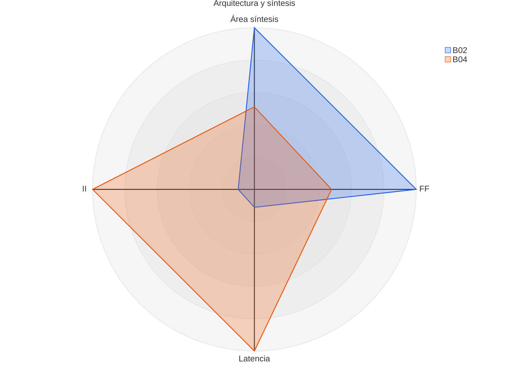
```mermaid
---
config:
  theme: base
  themeVariables:
    cScale0: '#2563eb'
    cScale1: '#ea580c'
    fontSize: 18px
    radar:
      curveOpacity: 0.25
      axisLabelFontSize: 16px
      legendFontSize: 16px
  radar:
    width: 900
    height: 700
    axisScaleFactor: 1
    marginTop: 60
    marginBottom: 60
    marginLeft: 100
    marginRight: 100
    curveTension: 0
---
radar-beta
    title Arquitectura y síntesis
    axis a0["Área síntesis"], a1["FF"], a2["Latencia"], a3["II"]
    curve b02["B02"]{100.00000, 100.00000, 11.11111, 10.00000}
    curve b04["B04"]{51.05559, 47.72727, 100.00000, 100.00000}
    min 0
    max 100
    ticks 5
    showLegend true
```

[Fuente Mermaid](radar-arquitectura.mmd)

### Barras: objetivos propios

Cada gráfico usa una unidad; menor costo favorece la variante más pequeña.

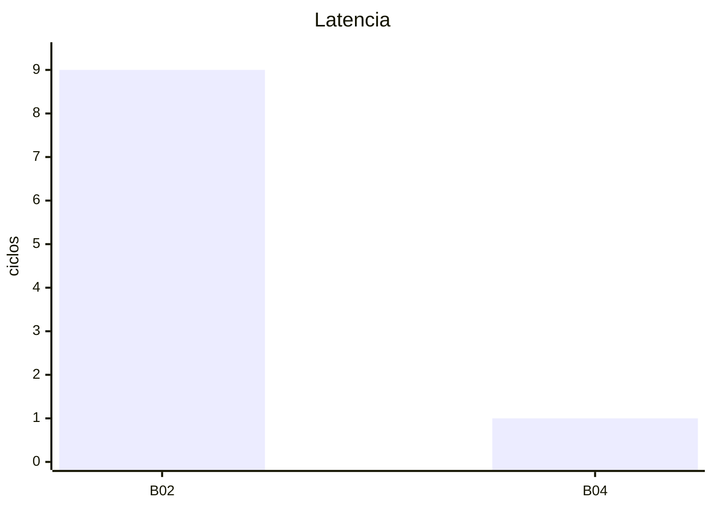
```mermaid
xychart-beta
    title "Latencia"
    x-axis ["B02", "B04"]
    y-axis "ciclos" 0.000000000000 --> 9.450000000000
    bar [9.000000000000, 1.000000000000]
```

[Fuente Mermaid](latency_cycles.mmd)

| ciclos | B02 | B04 |
|---|---:|---:|
| Latencia | 9 | 1 |

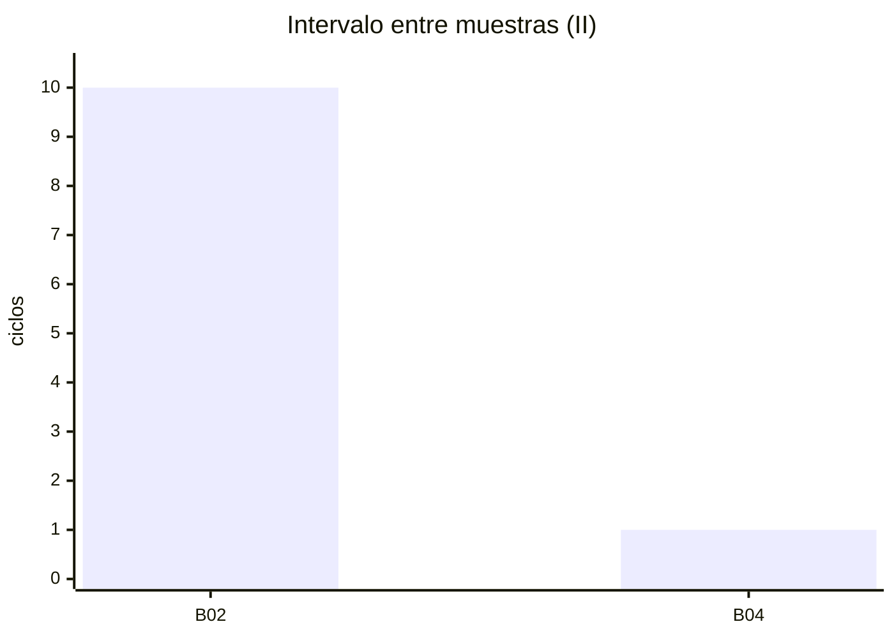
```mermaid
xychart-beta
    title "Intervalo entre muestras (II)"
    x-axis ["B02", "B04"]
    y-axis "ciclos" 0.000000000000 --> 10.500000000000
    bar [10.000000000000, 1.000000000000]
```

[Fuente Mermaid](block_cycles.mmd)

| ciclos | B02 | B04 |
|---|---:|---:|
| Intervalo entre muestras (II) | 10 | 1 |

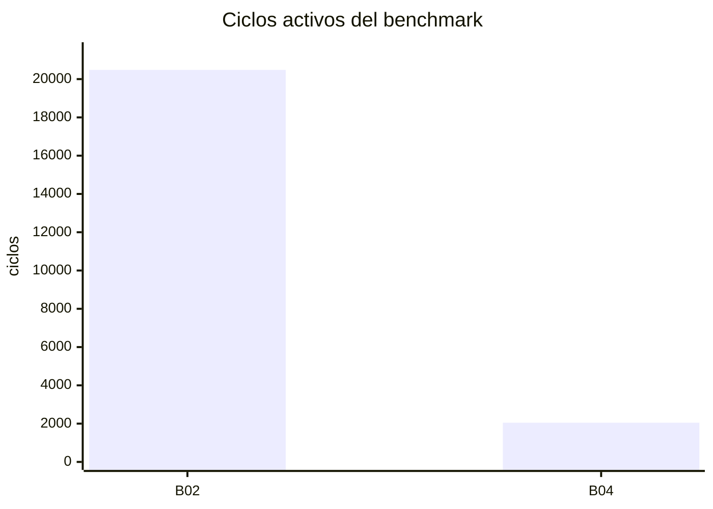
```mermaid
xychart-beta
    title "Ciclos activos del benchmark"
    x-axis ["B02", "B04"]
    y-axis "ciclos" 0.000000000000 --> 21504.000000000000
    bar [20480.000000000000, 2049.000000000000]
```

[Fuente Mermaid](active_cycles.mmd)

| ciclos | B02 | B04 |
|---|---:|---:|
| Ciclos activos del benchmark | 20480 | 2049 |

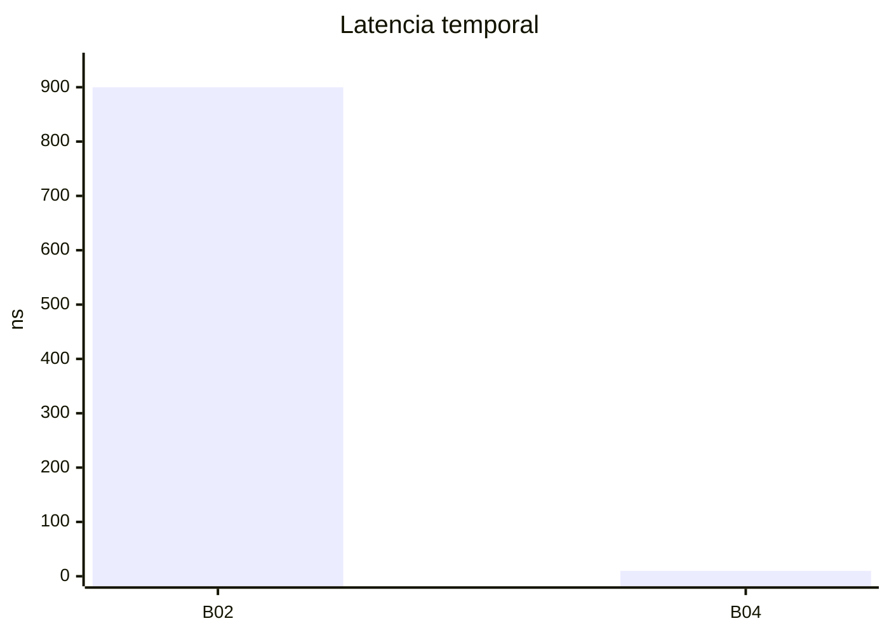
```mermaid
xychart-beta
    title "Latencia temporal"
    x-axis ["B02", "B04"]
    y-axis "ns" 0.000000000000 --> 945.000000000000
    bar [900.000000000000, 10.000000000000]
```

[Fuente Mermaid](latency_ns.mmd)

| ns | B02 | B04 |
|---|---:|---:|
| Latencia temporal | 900 | 10 |

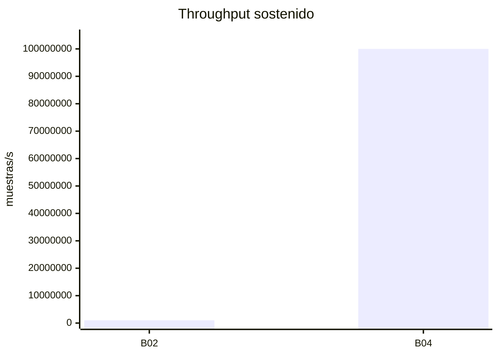
```mermaid
xychart-beta
    title "Throughput sostenido"
    x-axis ["B02", "B04"]
    y-axis "muestras/s" 0.000000000000 --> 105000000.000000000000
    bar [1000000.000000000000, 100000000.000000000000]
```

[Fuente Mermaid](sustained_sps.mmd)

| muestras/s | B02 | B04 |
|---|---:|---:|
| Throughput sostenido | 1000000 | 1e+08 |

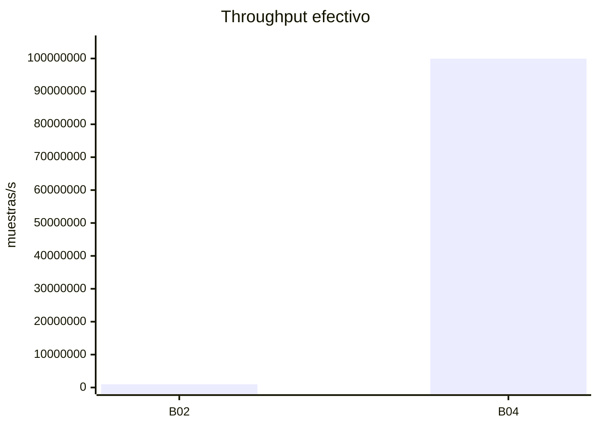
```mermaid
xychart-beta
    title "Throughput efectivo"
    x-axis ["B02", "B04"]
    y-axis "muestras/s" 0.000000000000 --> 104948755.490483164787
    bar [1000000.000000000000, 99951195.705222055316]
```

[Fuente Mermaid](effective_sps.mmd)

| muestras/s | B02 | B04 |
|---|---:|---:|
| Throughput efectivo | 1000000 | 9.99512e+07 |

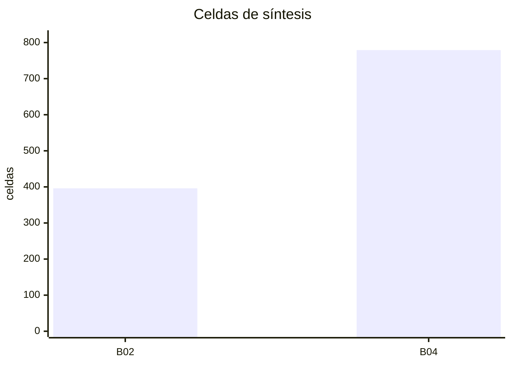
```mermaid
xychart-beta
    title "Celdas de síntesis"
    x-axis ["B02", "B04"]
    y-axis "celdas" 0.000000000000 --> 817.950000000000
    bar [396.000000000000, 779.000000000000]
```

[Fuente Mermaid](cells.mmd)

| celdas | B02 | B04 |
|---|---:|---:|
| Celdas de síntesis | 396 | 779 |

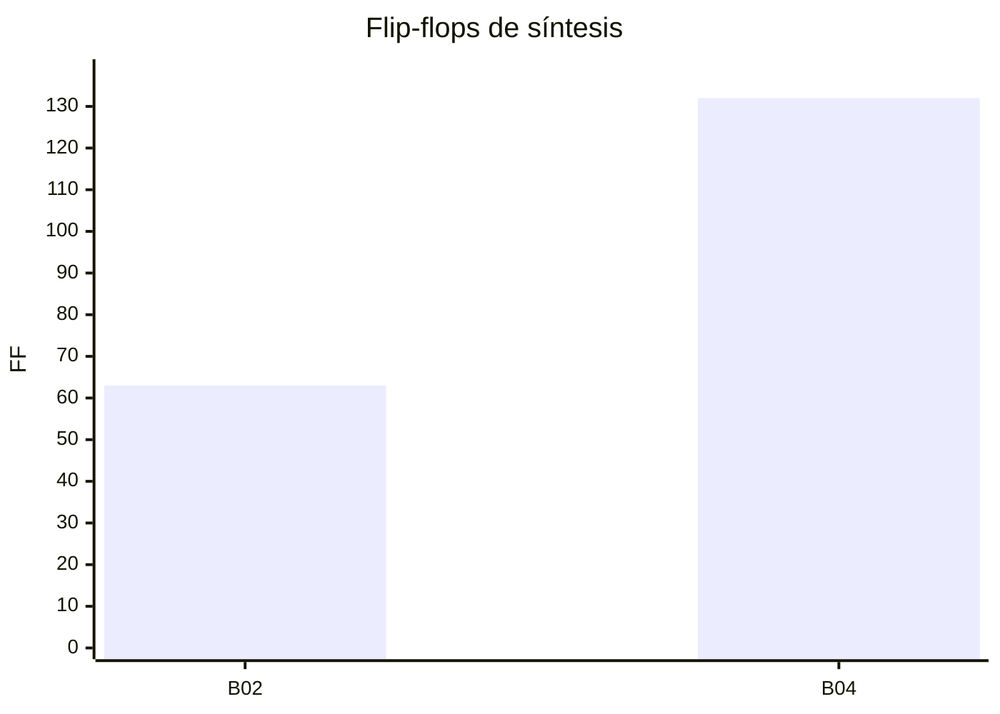
```mermaid
xychart-beta
    title "Flip-flops de síntesis"
    x-axis ["B02", "B04"]
    y-axis "FF" 0.000000000000 --> 138.600000000000
    bar [63.000000000000, 132.000000000000]
```

[Fuente Mermaid](flip_flops.mmd)

| FF | B02 | B04 |
|---|---:|---:|
| Flip-flops de síntesis | 63 | 132 |

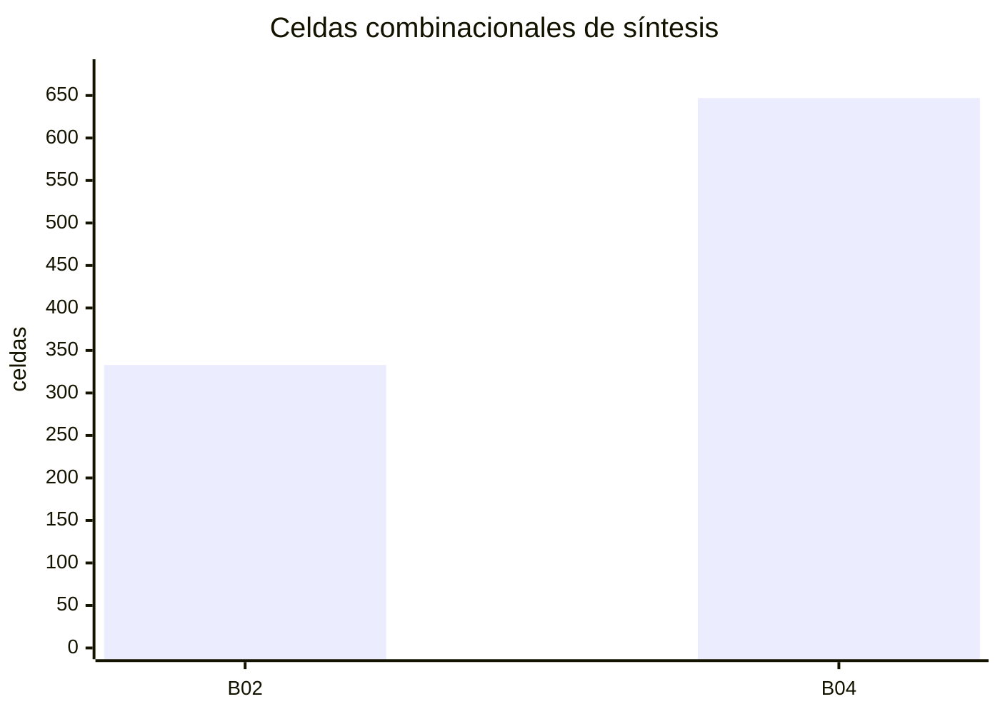
```mermaid
xychart-beta
    title "Celdas combinacionales de síntesis"
    x-axis ["B02", "B04"]
    y-axis "celdas" 0.000000000000 --> 679.350000000000
    bar [333.000000000000, 647.000000000000]
```

[Fuente Mermaid](combinational_cells.mmd)

| celdas | B02 | B04 |
|---|---:|---:|
| Celdas combinacionales de síntesis | 333 | 647 |

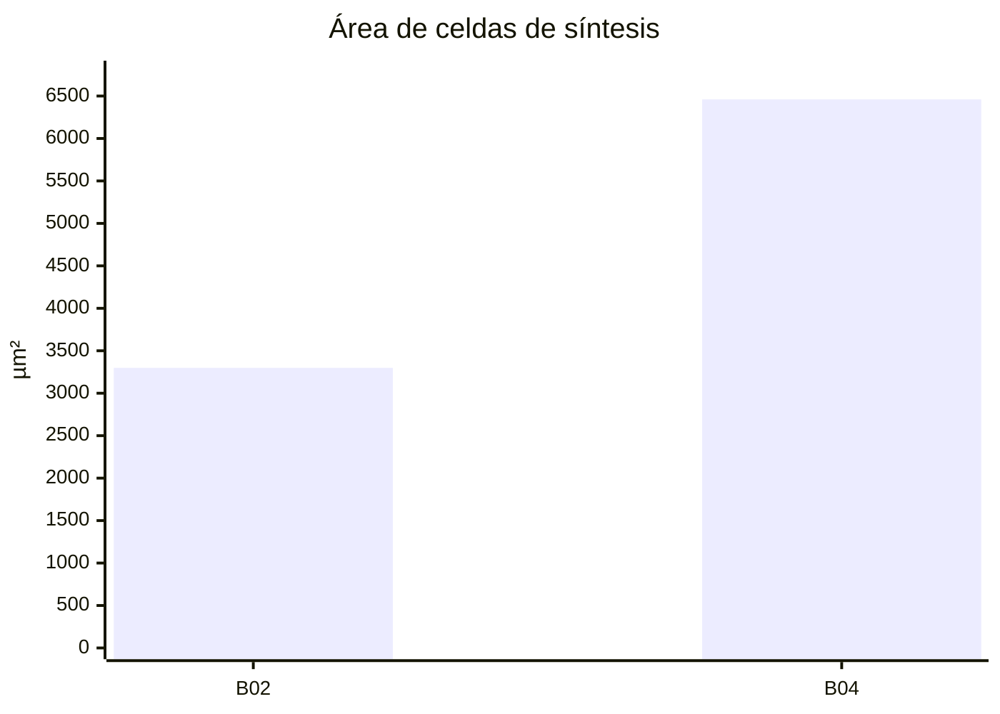
```mermaid
xychart-beta
    title "Área de celdas de síntesis"
    x-axis ["B02", "B04"]
    y-axis "µm²" 0.000000000000 --> 6782.942880000001
    bar [3298.163200000000, 6459.945600000000]
```

[Fuente Mermaid](cell_area_um2.mmd)

| µm² | B02 | B04 |
|---|---:|---:|
| Área de celdas de síntesis | 3298.1632 | 6459.9456 |

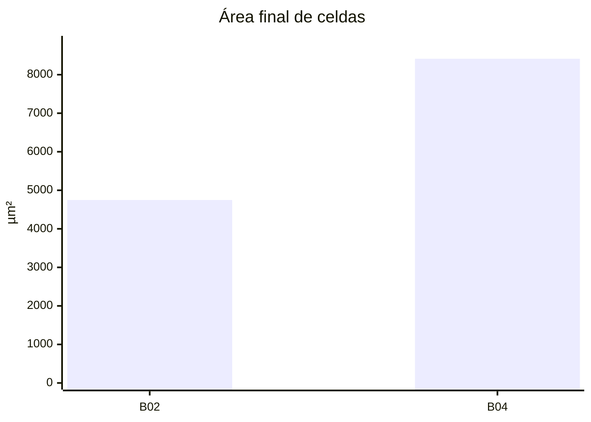
```mermaid
xychart-beta
    title "Área final de celdas"
    x-axis ["B02", "B04"]
    y-axis "µm²" 0.000000000000 --> 8833.723500000000
    bar [4748.300000000000, 8413.070000000000]
```

[Fuente Mermaid](final_cell_area_um2.mmd)

| µm² | B02 | B04 |
|---|---:|---:|
| Área final de celdas | 4748.3 | 8413.07 |

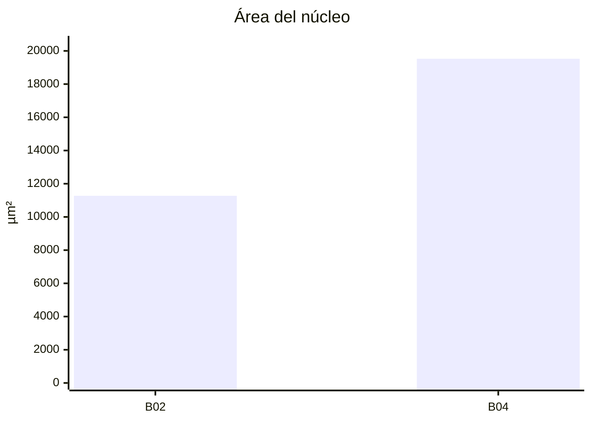
```mermaid
xychart-beta
    title "Área del núcleo"
    x-axis ["B02", "B04"]
    y-axis "µm²" 0.000000000000 --> 20502.538559999997
    bar [11272.060800000001, 19526.227199999998]
```

[Fuente Mermaid](core_area_um2.mmd)

| µm² | B02 | B04 |
|---|---:|---:|
| Área del núcleo | 11272.0608 | 19526.2272 |

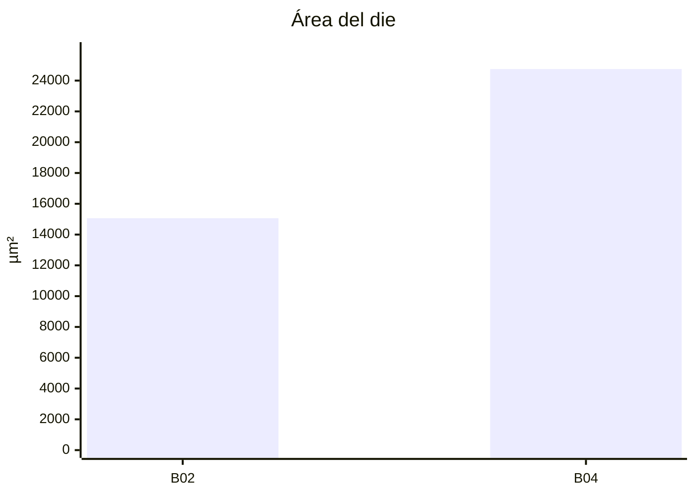
```mermaid
xychart-beta
    title "Área del die"
    x-axis ["B02", "B04"]
    y-axis "µm²" 0.000000000000 --> 25986.637425000004
    bar [15064.621425000001, 24749.178500000002]
```

[Fuente Mermaid](die_area_um2.mmd)

| µm² | B02 | B04 |
|---|---:|---:|
| Área del die | 15064.621425 | 24749.1785 |

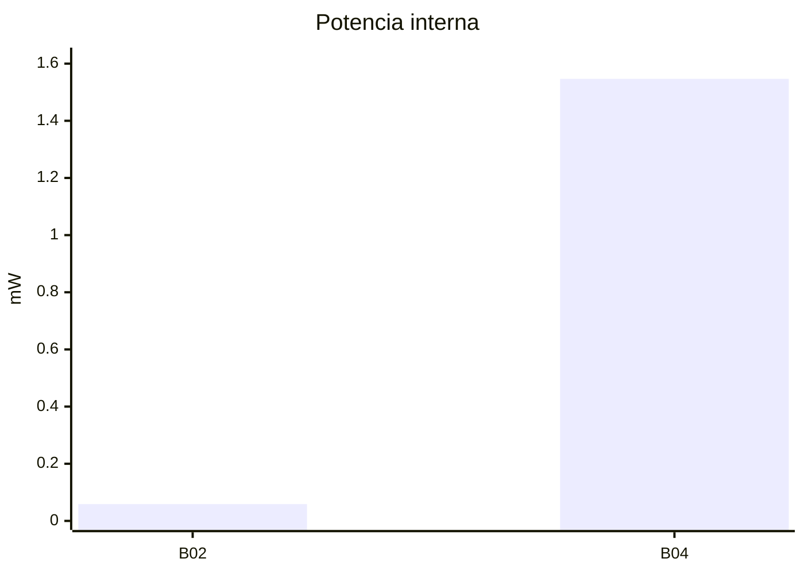
```mermaid
xychart-beta
    title "Potencia interna"
    x-axis ["B02", "B04"]
    y-axis "mW" 0.000000000000 --> 1.624093629431
    bar [0.058734922504, 1.546755837553]
```

[Fuente Mermaid](internal_w.mmd)

| W | B02 | B04 |
|---|---:|---:|
| Potencia interna | 5.87349e-05 | 0.001547 |

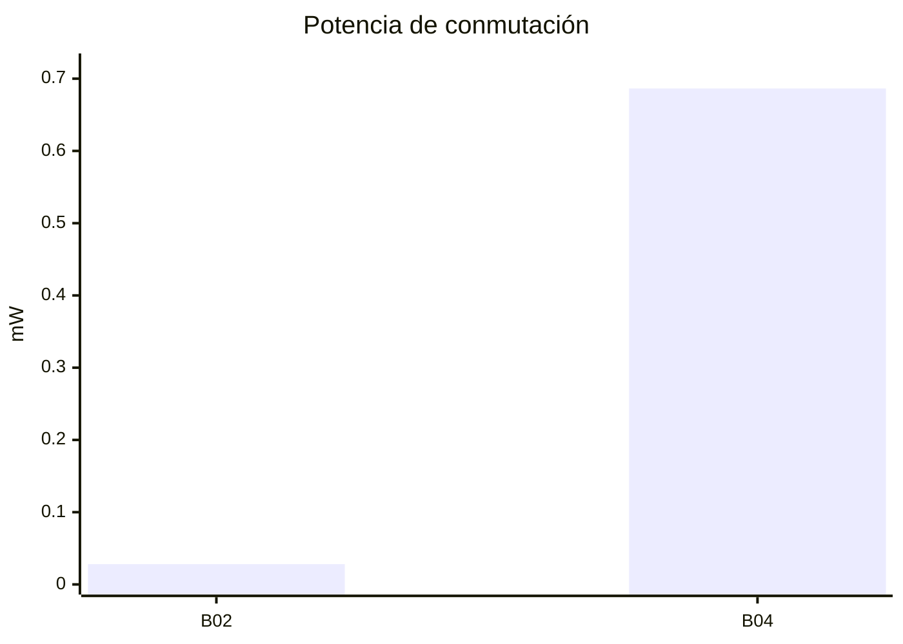
```mermaid
xychart-beta
    title "Potencia de conmutación"
    x-axis ["B02", "B04"]
    y-axis "mW" 0.000000000000 --> 0.720783900213
    bar [0.028083177540, 0.686460857346]
```

[Fuente Mermaid](switching_w.mmd)

| W | B02 | B04 |
|---|---:|---:|
| Potencia de conmutación | 2.80832e-05 | 0.000686461 |

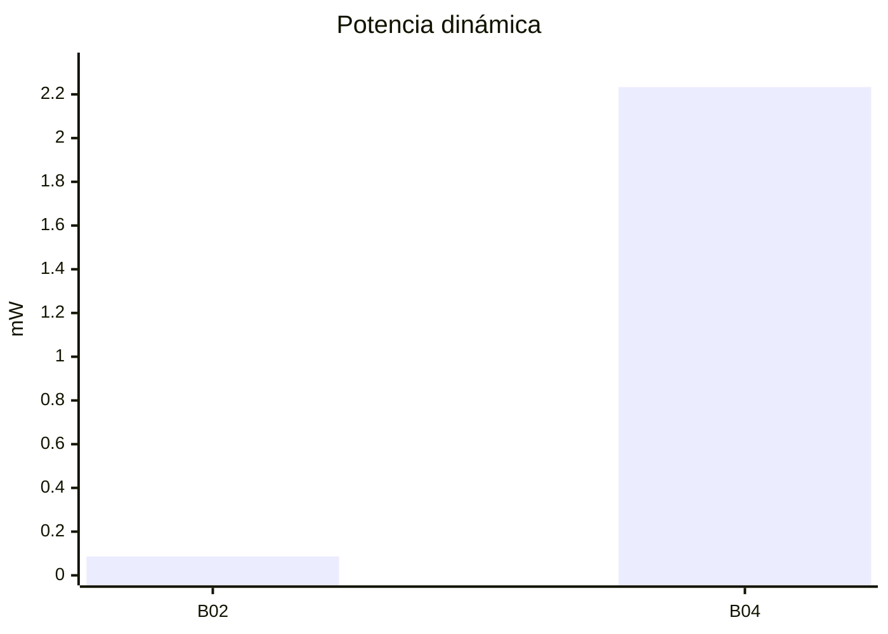
```mermaid
xychart-beta
    title "Potencia dinámica"
    x-axis ["B02", "B04"]
    y-axis "mW" 0.000000000000 --> 2.344877529644
    bar [0.086818100044, 2.233216694899]
```

[Fuente Mermaid](dynamic_w.mmd)

| W | B02 | B04 |
|---|---:|---:|
| Potencia dinámica | 8.68181e-05 | 0.002233 |

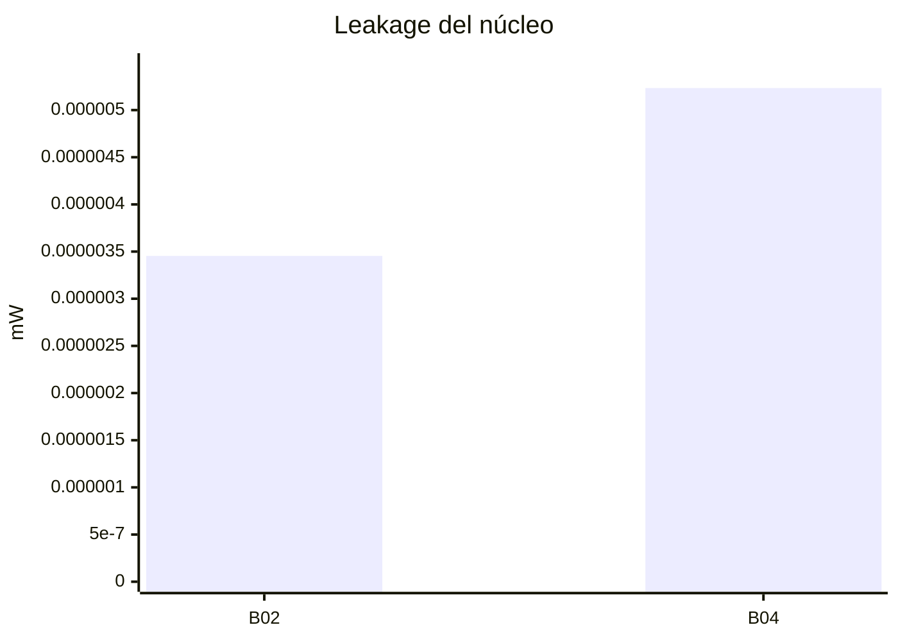
```mermaid
xychart-beta
    title "Leakage del núcleo"
    x-axis ["B02", "B04"]
    y-axis "mW" 0.000000000000 --> 0.000005495204
    bar [0.000003453680, 0.000005233528]
```

[Fuente Mermaid](leakage_w.mmd)

| W | B02 | B04 |
|---|---:|---:|
| Leakage del núcleo | 3.45368e-09 | 5.23353e-09 |

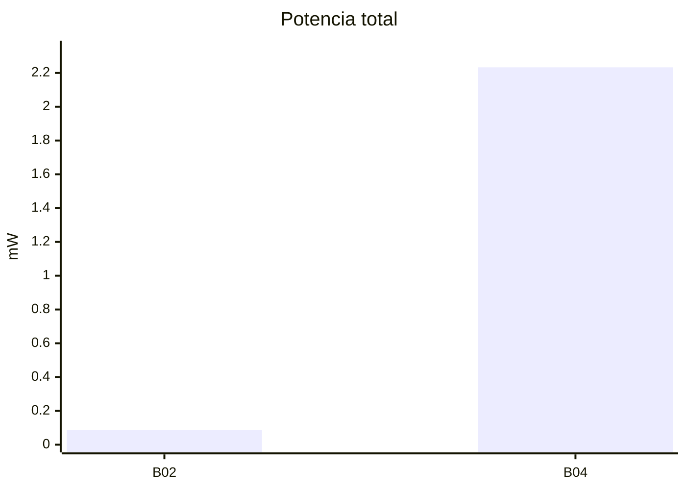
```mermaid
xychart-beta
    title "Potencia total"
    x-axis ["B02", "B04"]
    y-axis "mW" 0.000000000000 --> 2.344883002677
    bar [0.086821553396, 2.233221907311]
```

[Fuente Mermaid](total_w.mmd)

| W | B02 | B04 |
|---|---:|---:|
| Potencia total | 8.68216e-05 | 0.002233 |

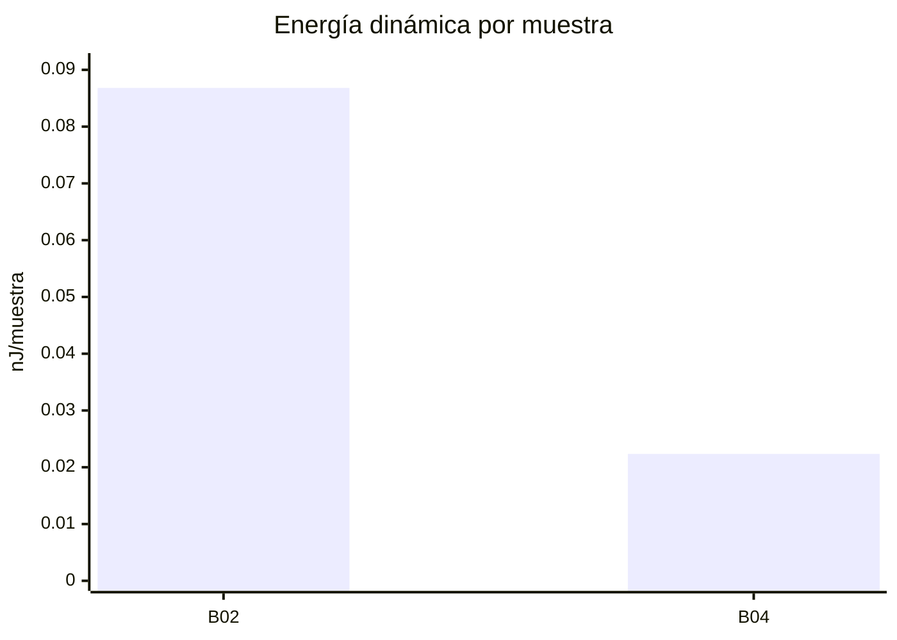
```mermaid
xychart-beta
    title "Energía dinámica por muestra"
    x-axis ["B02", "B04"]
    y-axis "nJ/muestra" 0.000000000000 --> 0.091159005046
    bar [0.086818100044, 0.022343071327]
```

[Fuente Mermaid](dynamic_energy_j.mmd)

| J/muestra | B02 | B04 |
|---|---:|---:|
| Energía dinámica por muestra | 8.68181e-11 | 2.23431e-11 |

```mermaid
xychart-beta
    title "Energía total por muestra"
    x-axis ["B02", "B04"]
    y-axis "nJ/muestra" 0.000000000000 --> 0.091162631065
    bar [0.086821553396, 0.022343123477]
```

[Fuente Mermaid](total_energy_j.mmd)

| J/muestra | B02 | B04 |
|---|---:|---:|
| Energía total por muestra | 8.68216e-11 | 2.23431e-11 |

```mermaid
xychart-beta
    title "Pines con actividad VCD/reloj/constante"
    x-axis ["B02", "B04"]
    y-axis "%" 0.000000000000 --> 105.000000000000
    bar [100.000000000000, 100.000000000000]
```

[Fuente Mermaid](activity_coverage_pct.mmd)

| % | B02 | B04 |
|---|---:|---:|
| Pines con actividad VCD/reloj/constante | 100 | 100 |

### Reloj común: 10 MHz

Potencia común medida por variante (TT/25 °C/1,8 V), aunque el estado global no habilite gráficas:

| Métrica | Unidad | B02 | B04 |
|---|---|---:|---:|
| internal_w | W | 5.87349e-05 | 0.000154676 |
| switching_w | W | 2.80832e-05 | 6.86461e-05 |
| dynamic_w | W | 8.68181e-05 | 0.000223322 |
| leakage_w | W | 3.45368e-09 | 5.23353e-09 |
| total_w | W | 8.68216e-05 | 0.000223327 |
| dynamic_energy_j | J/muestra | 8.68181e-11 | 2.23431e-11 |
| total_energy_j | J/muestra | 8.68216e-11 | 2.23436e-11 |
Pendiente: ambas implementaciones deben demostrar timing a 10 MHz. No se grafican datos físicos supuestos.

### Timing por corner

Escenario target: B02 setup/hold **PASS**, eléctrico/restricciones **FAIL**, global **FAIL**; B04 setup/hold **PASS**, eléctrico/restricciones **FAIL**, global **FAIL**.

| Estado | B02 | B04 |
|---|---|---|
| Setup/hold | PASS | PASS |
| Eléctrico/restricciones | FAIL | FAIL |
| Global | FAIL | FAIL |

| Corner | Métrica | B02 | B04 |
|---|---|---:|---:|
| nom_tt_025C_1v80 | setup_ws_ns | 58.797697 | 5.061288 |
| nom_tt_025C_1v80 | hold_ws_ns | 0.354654 | 0.338199 |
| nom_tt_025C_1v80 | setup_wns_ns | 0 | 0 |
| nom_tt_025C_1v80 | hold_wns_ns | 0 | 0 |
| nom_tt_025C_1v80 | setup_tns_ns | 0 | 0 |
| nom_tt_025C_1v80 | hold_tns_ns | 0 | 0 |
| nom_tt_025C_1v80 | setup_violations | 0 | 0 |
| nom_tt_025C_1v80 | hold_violations | 0 | 0 |
| nom_tt_025C_1v80 | max_slew_violations | 0 | 0 |
| nom_tt_025C_1v80 | max_cap_violations | 0 | 0 |
| nom_tt_025C_1v80 | max_fanout_violations | 1 | 1 |
| nom_tt_025C_1v80 | unannotated_routed_nets | 0 | 0 |
| nom_tt_025C_1v80 | fmax_estimate_mhz | 240.97 | 322.22 |
| nom_tt_025C_1v80 | constraint_warnings | 0 | 0 |
| nom_tt_025C_1v80 | unconstrained_endpoints | 0 | 0 |
| nom_ss_100C_1v60 | setup_ws_ns | 57.994549 | 2.326305 |
| nom_ss_100C_1v60 | hold_ws_ns | 0.953543 | 0.946097 |
| nom_ss_100C_1v60 | setup_wns_ns | 0 | 0 |
| nom_ss_100C_1v60 | hold_wns_ns | 0 | 0 |
| nom_ss_100C_1v60 | setup_tns_ns | 0 | 0 |
| nom_ss_100C_1v60 | hold_tns_ns | 0 | 0 |
| nom_ss_100C_1v60 | setup_violations | 0 | 0 |
| nom_ss_100C_1v60 | hold_violations | 0 | 0 |
| nom_ss_100C_1v60 | max_slew_violations | 0 | 0 |
| nom_ss_100C_1v60 | max_cap_violations | 0 | 0 |
| nom_ss_100C_1v60 | max_fanout_violations | 1 | 1 |
| nom_ss_100C_1v60 | unannotated_routed_nets | 0 | 0 |
| nom_ss_100C_1v60 | fmax_estimate_mhz | 125.64 | 173.47 |
| nom_ss_100C_1v60 | constraint_warnings | 0 | 0 |
| nom_ss_100C_1v60 | unconstrained_endpoints | 0 | 0 |
| nom_ff_n40C_1v95 | setup_ws_ns | 59.115694 | 5.292224 |
| nom_ff_n40C_1v95 | hold_ws_ns | 0.109737 | 0.112667 |
| nom_ff_n40C_1v95 | setup_wns_ns | 0 | 0 |
| nom_ff_n40C_1v95 | hold_wns_ns | 0 | 0 |
| nom_ff_n40C_1v95 | setup_tns_ns | 0 | 0 |
| nom_ff_n40C_1v95 | hold_tns_ns | 0 | 0 |
| nom_ff_n40C_1v95 | setup_violations | 0 | 0 |
| nom_ff_n40C_1v95 | hold_violations | 0 | 0 |
| nom_ff_n40C_1v95 | max_slew_violations | 0 | 0 |
| nom_ff_n40C_1v95 | max_cap_violations | 0 | 0 |
| nom_ff_n40C_1v95 | max_fanout_violations | 1 | 1 |
| nom_ff_n40C_1v95 | unannotated_routed_nets | 0 | 0 |
| nom_ff_n40C_1v95 | fmax_estimate_mhz | 380.76 | 469.39 |
| nom_ff_n40C_1v95 | constraint_warnings | 0 | 0 |
| nom_ff_n40C_1v95 | unconstrained_endpoints | 0 | 0 |
| min_tt_025C_1v80 | setup_ws_ns | 58.816555 | 5.068772 |
| min_tt_025C_1v80 | hold_ws_ns | 0.350368 | 0.334616 |
| min_tt_025C_1v80 | setup_wns_ns | 0 | 0 |
| min_tt_025C_1v80 | hold_wns_ns | 0 | 0 |
| min_tt_025C_1v80 | setup_tns_ns | 0 | 0 |
| min_tt_025C_1v80 | hold_tns_ns | 0 | 0 |
| min_tt_025C_1v80 | setup_violations | 0 | 0 |
| min_tt_025C_1v80 | hold_violations | 0 | 0 |
| min_tt_025C_1v80 | max_slew_violations | 0 | 0 |
| min_tt_025C_1v80 | max_cap_violations | 0 | 0 |
| min_tt_025C_1v80 | max_fanout_violations | 1 | 1 |
| min_tt_025C_1v80 | unannotated_routed_nets | 0 | 0 |
| min_tt_025C_1v80 | fmax_estimate_mhz | 243.17 | 329.75 |
| min_tt_025C_1v80 | constraint_warnings | 0 | 0 |
| min_tt_025C_1v80 | unconstrained_endpoints | 0 | 0 |
| min_ss_100C_1v60 | setup_ws_ns | 58.026396 | 2.390373 |
| min_ss_100C_1v60 | hold_ws_ns | 0.947701 | 0.93959 |
| min_ss_100C_1v60 | setup_wns_ns | 0 | 0 |
| min_ss_100C_1v60 | hold_wns_ns | 0 | 0 |
| min_ss_100C_1v60 | setup_tns_ns | 0 | 0 |
| min_ss_100C_1v60 | hold_tns_ns | 0 | 0 |
| min_ss_100C_1v60 | setup_violations | 0 | 0 |
| min_ss_100C_1v60 | hold_violations | 0 | 0 |
| min_ss_100C_1v60 | max_slew_violations | 0 | 0 |
| min_ss_100C_1v60 | max_cap_violations | 0 | 0 |
| min_ss_100C_1v60 | max_fanout_violations | 1 | 1 |
| min_ss_100C_1v60 | unannotated_routed_nets | 0 | 0 |
| min_ss_100C_1v60 | fmax_estimate_mhz | 126.71 | 175.08 |
| min_ss_100C_1v60 | constraint_warnings | 0 | 0 |
| min_ss_100C_1v60 | unconstrained_endpoints | 0 | 0 |
| min_ff_n40C_1v95 | setup_ws_ns | 59.127648 | 5.297113 |
| min_ff_n40C_1v95 | hold_ws_ns | 0.108355 | 0.110247 |
| min_ff_n40C_1v95 | setup_wns_ns | 0 | 0 |
| min_ff_n40C_1v95 | hold_wns_ns | 0 | 0 |
| min_ff_n40C_1v95 | setup_tns_ns | 0 | 0 |
| min_ff_n40C_1v95 | hold_tns_ns | 0 | 0 |
| min_ff_n40C_1v95 | setup_violations | 0 | 0 |
| min_ff_n40C_1v95 | hold_violations | 0 | 0 |
| min_ff_n40C_1v95 | max_slew_violations | 0 | 0 |
| min_ff_n40C_1v95 | max_cap_violations | 0 | 0 |
| min_ff_n40C_1v95 | max_fanout_violations | 1 | 1 |
| min_ff_n40C_1v95 | unannotated_routed_nets | 0 | 0 |
| min_ff_n40C_1v95 | fmax_estimate_mhz | 386.77 | 479.91 |
| min_ff_n40C_1v95 | constraint_warnings | 0 | 0 |
| min_ff_n40C_1v95 | unconstrained_endpoints | 0 | 0 |
| max_tt_025C_1v80 | setup_ws_ns | 58.779415 | 5.052206 |
| max_tt_025C_1v80 | hold_ws_ns | 0.357333 | 0.341338 |
| max_tt_025C_1v80 | setup_wns_ns | 0 | 0 |
| max_tt_025C_1v80 | hold_wns_ns | 0 | 0 |
| max_tt_025C_1v80 | setup_tns_ns | 0 | 0 |
| max_tt_025C_1v80 | hold_tns_ns | 0 | 0 |
| max_tt_025C_1v80 | setup_violations | 0 | 0 |
| max_tt_025C_1v80 | hold_violations | 0 | 0 |
| max_tt_025C_1v80 | max_slew_violations | 0 | 0 |
| max_tt_025C_1v80 | max_cap_violations | 0 | 0 |
| max_tt_025C_1v80 | max_fanout_violations | 1 | 1 |
| max_tt_025C_1v80 | unannotated_routed_nets | 0 | 0 |
| max_tt_025C_1v80 | fmax_estimate_mhz | 238.74 | 315.54 |
| max_tt_025C_1v80 | constraint_warnings | 0 | 0 |
| max_tt_025C_1v80 | unconstrained_endpoints | 0 | 0 |
| max_ss_100C_1v60 | setup_ws_ns | 57.963477 | 2.266873 |
| max_ss_100C_1v60 | hold_ws_ns | 0.956942 | 0.953093 |
| max_ss_100C_1v60 | setup_wns_ns | 0 | 0 |
| max_ss_100C_1v60 | hold_wns_ns | 0 | 0 |
| max_ss_100C_1v60 | setup_tns_ns | 0 | 0 |
| max_ss_100C_1v60 | hold_tns_ns | 0 | 0 |
| max_ss_100C_1v60 | setup_violations | 0 | 0 |
| max_ss_100C_1v60 | hold_violations | 0 | 0 |
| max_ss_100C_1v60 | max_slew_violations | 0 | 0 |
| max_ss_100C_1v60 | max_cap_violations | 0 | 0 |
| max_ss_100C_1v60 | max_fanout_violations | 1 | 1 |
| max_ss_100C_1v60 | unannotated_routed_nets | 0 | 0 |
| max_ss_100C_1v60 | fmax_estimate_mhz | 124.54 | 170.24 |
| max_ss_100C_1v60 | constraint_warnings | 0 | 0 |
| max_ss_100C_1v60 | unconstrained_endpoints | 0 | 0 |
| max_ff_n40C_1v95 | setup_ws_ns | 59.103913 | 5.286174 |
| max_ff_n40C_1v95 | hold_ws_ns | 0.111416 | 0.114879 |
| max_ff_n40C_1v95 | setup_wns_ns | 0 | 0 |
| max_ff_n40C_1v95 | hold_wns_ns | 0 | 0 |
| max_ff_n40C_1v95 | setup_tns_ns | 0 | 0 |
| max_ff_n40C_1v95 | hold_tns_ns | 0 | 0 |
| max_ff_n40C_1v95 | setup_violations | 0 | 0 |
| max_ff_n40C_1v95 | hold_violations | 0 | 0 |
| max_ff_n40C_1v95 | max_slew_violations | 0 | 0 |
| max_ff_n40C_1v95 | max_cap_violations | 0 | 0 |
| max_ff_n40C_1v95 | max_fanout_violations | 1 | 1 |
| max_ff_n40C_1v95 | unannotated_routed_nets | 0 | 0 |
| max_ff_n40C_1v95 | fmax_estimate_mhz | 375 | 460.22 |
| max_ff_n40C_1v95 | constraint_warnings | 0 | 0 |
| max_ff_n40C_1v95 | unconstrained_endpoints | 0 | 0 |

Escenarios discretos de proceso/interconexión: **B02 azul**, **B04 naranja**. Las líneas no interpolan corners físicos nuevos.

```mermaid
---
config:
  themeVariables:
    xyChart:
      plotColorPalette: '#2563eb, #ea580c'
---
xychart-beta
    title "setup_ws_ns: target"
    x-axis ["nom-TT", "nom-SS", "nom-FF", "min-TT", "min-SS", "min-FF", "max-TT", "max-SS", "max-FF"]
    y-axis "ns" 0.000000000000 --> 62.084030873527
    line [58.797697264155, 57.994549470929, 59.115693569111, 58.816555068895, 58.026395997246, 59.127648450978, 58.779414999047, 57.963477436215, 59.103912770219]
    line [5.061287532339, 2.326305436352, 5.292224142045, 5.068772212094, 2.390373300290, 5.297113120294, 5.052205907741, 2.266872975716, 5.286173870478]
```

[Fuente Mermaid](target-setup_ws_ns.mmd)

```mermaid
---
config:
  themeVariables:
    xyChart:
      plotColorPalette: '#2563eb, #ea580c'
---
xychart-beta
    title "hold_ws_ns: target"
    x-axis ["nom-TT", "nom-SS", "nom-FF", "min-TT", "min-SS", "min-FF", "max-TT", "max-SS", "max-FF"]
    y-axis "ns" 0.000000000000 --> 1.004789446753
    line [0.354653538797, 0.953543049288, 0.109737499971, 0.350368466379, 0.947700833522, 0.108355216755, 0.357332562542, 0.956942330241, 0.111415824165]
    line [0.338198645328, 0.946097338362, 0.112667267593, 0.334616066549, 0.939589987964, 0.110247425420, 0.341338356130, 0.953092520771, 0.114878831921]
```

[Fuente Mermaid](target-hold_ws_ns.mmd)

```mermaid
---
config:
  themeVariables:
    xyChart:
      plotColorPalette: '#2563eb, #ea580c'
---
xychart-beta
    title "setup_tns_ns: target"
    x-axis ["nom-TT", "nom-SS", "nom-FF", "min-TT", "min-SS", "min-FF", "max-TT", "max-SS", "max-FF"]
    y-axis "ns" 0.000000000000 --> 1.000000000000
    line [0.000000000000, 0.000000000000, 0.000000000000, 0.000000000000, 0.000000000000, 0.000000000000, 0.000000000000, 0.000000000000, 0.000000000000]
    line [0.000000000000, 0.000000000000, 0.000000000000, 0.000000000000, 0.000000000000, 0.000000000000, 0.000000000000, 0.000000000000, 0.000000000000]
```

[Fuente Mermaid](target-setup_tns_ns.mmd)

```mermaid
---
config:
  themeVariables:
    xyChart:
      plotColorPalette: '#2563eb, #ea580c'
---
xychart-beta
    title "hold_tns_ns: target"
    x-axis ["nom-TT", "nom-SS", "nom-FF", "min-TT", "min-SS", "min-FF", "max-TT", "max-SS", "max-FF"]
    y-axis "ns" 0.000000000000 --> 1.000000000000
    line [0.000000000000, 0.000000000000, 0.000000000000, 0.000000000000, 0.000000000000, 0.000000000000, 0.000000000000, 0.000000000000, 0.000000000000]
    line [0.000000000000, 0.000000000000, 0.000000000000, 0.000000000000, 0.000000000000, 0.000000000000, 0.000000000000, 0.000000000000, 0.000000000000]
```

[Fuente Mermaid](target-hold_tns_ns.mmd)

```mermaid
---
config:
  themeVariables:
    xyChart:
      plotColorPalette: '#2563eb, #ea580c'
---
xychart-beta
    title "fmax_estimate_mhz: target"
    x-axis ["nom-TT", "nom-SS", "nom-FF", "min-TT", "min-SS", "min-FF", "max-TT", "max-SS", "max-FF"]
    y-axis "MHz" 0.000000000000 --> 503.905500000000
    line [240.970000000000, 125.640000000000, 380.760000000000, 243.170000000000, 126.710000000000, 386.770000000000, 238.740000000000, 124.540000000000, 375.000000000000]
    line [322.220000000000, 173.470000000000, 469.390000000000, 329.750000000000, 175.080000000000, 479.910000000000, 315.540000000000, 170.240000000000, 460.220000000000]
```

[Fuente Mermaid](target-fmax_estimate_mhz.mmd)

Escenario common: B02 setup/hold **PASS**, eléctrico/restricciones **FAIL**, global **FAIL**; B04 setup/hold **PASS**, eléctrico/restricciones **FAIL**, global **FAIL**.

| Estado | B02 | B04 |
|---|---|---|
| Setup/hold | PASS | PASS |
| Eléctrico/restricciones | FAIL | FAIL |
| Global | FAIL | FAIL |

| Corner | Métrica | B02 | B04 |
|---|---|---:|---:|
| nom_tt_025C_1v80 | setup_ws_ns | 58.797697 | 59.061287 |
| nom_tt_025C_1v80 | hold_ws_ns | 0.354654 | 0.338199 |
| nom_tt_025C_1v80 | setup_wns_ns | 0 | 0 |
| nom_tt_025C_1v80 | hold_wns_ns | 0 | 0 |
| nom_tt_025C_1v80 | setup_tns_ns | 0 | 0 |
| nom_tt_025C_1v80 | hold_tns_ns | 0 | 0 |
| nom_tt_025C_1v80 | setup_violations | 0 | 0 |
| nom_tt_025C_1v80 | hold_violations | 0 | 0 |
| nom_tt_025C_1v80 | max_slew_violations | 0 | 0 |
| nom_tt_025C_1v80 | max_cap_violations | 0 | 0 |
| nom_tt_025C_1v80 | max_fanout_violations | 1 | 1 |
| nom_tt_025C_1v80 | unannotated_routed_nets | 0 | 0 |
| nom_tt_025C_1v80 | fmax_estimate_mhz | 240.97 | 322.22 |
| nom_tt_025C_1v80 | constraint_warnings | 0 | 0 |
| nom_tt_025C_1v80 | unconstrained_endpoints | 0 | 0 |
| nom_ss_100C_1v60 | setup_ws_ns | 57.994549 | 58.458491 |
| nom_ss_100C_1v60 | hold_ws_ns | 0.953543 | 0.946097 |
| nom_ss_100C_1v60 | setup_wns_ns | 0 | 0 |
| nom_ss_100C_1v60 | hold_wns_ns | 0 | 0 |
| nom_ss_100C_1v60 | setup_tns_ns | 0 | 0 |
| nom_ss_100C_1v60 | hold_tns_ns | 0 | 0 |
| nom_ss_100C_1v60 | setup_violations | 0 | 0 |
| nom_ss_100C_1v60 | hold_violations | 0 | 0 |
| nom_ss_100C_1v60 | max_slew_violations | 0 | 0 |
| nom_ss_100C_1v60 | max_cap_violations | 0 | 0 |
| nom_ss_100C_1v60 | max_fanout_violations | 1 | 1 |
| nom_ss_100C_1v60 | unannotated_routed_nets | 0 | 0 |
| nom_ss_100C_1v60 | fmax_estimate_mhz | 125.64 | 173.47 |
| nom_ss_100C_1v60 | constraint_warnings | 0 | 0 |
| nom_ss_100C_1v60 | unconstrained_endpoints | 0 | 0 |
| nom_ff_n40C_1v95 | setup_ws_ns | 59.115694 | 59.292221 |
| nom_ff_n40C_1v95 | hold_ws_ns | 0.109737 | 0.112667 |
| nom_ff_n40C_1v95 | setup_wns_ns | 0 | 0 |
| nom_ff_n40C_1v95 | hold_wns_ns | 0 | 0 |
| nom_ff_n40C_1v95 | setup_tns_ns | 0 | 0 |
| nom_ff_n40C_1v95 | hold_tns_ns | 0 | 0 |
| nom_ff_n40C_1v95 | setup_violations | 0 | 0 |
| nom_ff_n40C_1v95 | hold_violations | 0 | 0 |
| nom_ff_n40C_1v95 | max_slew_violations | 0 | 0 |
| nom_ff_n40C_1v95 | max_cap_violations | 0 | 0 |
| nom_ff_n40C_1v95 | max_fanout_violations | 1 | 1 |
| nom_ff_n40C_1v95 | unannotated_routed_nets | 0 | 0 |
| nom_ff_n40C_1v95 | fmax_estimate_mhz | 380.76 | 469.39 |
| nom_ff_n40C_1v95 | constraint_warnings | 0 | 0 |
| nom_ff_n40C_1v95 | unconstrained_endpoints | 0 | 0 |
| min_tt_025C_1v80 | setup_ws_ns | 58.816555 | 59.068769 |
| min_tt_025C_1v80 | hold_ws_ns | 0.350368 | 0.334616 |
| min_tt_025C_1v80 | setup_wns_ns | 0 | 0 |
| min_tt_025C_1v80 | hold_wns_ns | 0 | 0 |
| min_tt_025C_1v80 | setup_tns_ns | 0 | 0 |
| min_tt_025C_1v80 | hold_tns_ns | 0 | 0 |
| min_tt_025C_1v80 | setup_violations | 0 | 0 |
| min_tt_025C_1v80 | hold_violations | 0 | 0 |
| min_tt_025C_1v80 | max_slew_violations | 0 | 0 |
| min_tt_025C_1v80 | max_cap_violations | 0 | 0 |
| min_tt_025C_1v80 | max_fanout_violations | 1 | 1 |
| min_tt_025C_1v80 | unannotated_routed_nets | 0 | 0 |
| min_tt_025C_1v80 | fmax_estimate_mhz | 243.17 | 329.75 |
| min_tt_025C_1v80 | constraint_warnings | 0 | 0 |
| min_tt_025C_1v80 | unconstrained_endpoints | 0 | 0 |
| min_ss_100C_1v60 | setup_ws_ns | 58.026396 | 58.468517 |
| min_ss_100C_1v60 | hold_ws_ns | 0.947701 | 0.93959 |
| min_ss_100C_1v60 | setup_wns_ns | 0 | 0 |
| min_ss_100C_1v60 | hold_wns_ns | 0 | 0 |
| min_ss_100C_1v60 | setup_tns_ns | 0 | 0 |
| min_ss_100C_1v60 | hold_tns_ns | 0 | 0 |
| min_ss_100C_1v60 | setup_violations | 0 | 0 |
| min_ss_100C_1v60 | hold_violations | 0 | 0 |
| min_ss_100C_1v60 | max_slew_violations | 0 | 0 |
| min_ss_100C_1v60 | max_cap_violations | 0 | 0 |
| min_ss_100C_1v60 | max_fanout_violations | 1 | 1 |
| min_ss_100C_1v60 | unannotated_routed_nets | 0 | 0 |
| min_ss_100C_1v60 | fmax_estimate_mhz | 126.71 | 175.08 |
| min_ss_100C_1v60 | constraint_warnings | 0 | 0 |
| min_ss_100C_1v60 | unconstrained_endpoints | 0 | 0 |
| min_ff_n40C_1v95 | setup_ws_ns | 59.127648 | 59.297109 |
| min_ff_n40C_1v95 | hold_ws_ns | 0.108355 | 0.110247 |
| min_ff_n40C_1v95 | setup_wns_ns | 0 | 0 |
| min_ff_n40C_1v95 | hold_wns_ns | 0 | 0 |
| min_ff_n40C_1v95 | setup_tns_ns | 0 | 0 |
| min_ff_n40C_1v95 | hold_tns_ns | 0 | 0 |
| min_ff_n40C_1v95 | setup_violations | 0 | 0 |
| min_ff_n40C_1v95 | hold_violations | 0 | 0 |
| min_ff_n40C_1v95 | max_slew_violations | 0 | 0 |
| min_ff_n40C_1v95 | max_cap_violations | 0 | 0 |
| min_ff_n40C_1v95 | max_fanout_violations | 1 | 1 |
| min_ff_n40C_1v95 | unannotated_routed_nets | 0 | 0 |
| min_ff_n40C_1v95 | fmax_estimate_mhz | 386.77 | 479.91 |
| min_ff_n40C_1v95 | constraint_warnings | 0 | 0 |
| min_ff_n40C_1v95 | unconstrained_endpoints | 0 | 0 |
| max_tt_025C_1v80 | setup_ws_ns | 58.779415 | 59.052203 |
| max_tt_025C_1v80 | hold_ws_ns | 0.357333 | 0.341338 |
| max_tt_025C_1v80 | setup_wns_ns | 0 | 0 |
| max_tt_025C_1v80 | hold_wns_ns | 0 | 0 |
| max_tt_025C_1v80 | setup_tns_ns | 0 | 0 |
| max_tt_025C_1v80 | hold_tns_ns | 0 | 0 |
| max_tt_025C_1v80 | setup_violations | 0 | 0 |
| max_tt_025C_1v80 | hold_violations | 0 | 0 |
| max_tt_025C_1v80 | max_slew_violations | 0 | 0 |
| max_tt_025C_1v80 | max_cap_violations | 0 | 0 |
| max_tt_025C_1v80 | max_fanout_violations | 1 | 1 |
| max_tt_025C_1v80 | unannotated_routed_nets | 0 | 0 |
| max_tt_025C_1v80 | fmax_estimate_mhz | 238.74 | 315.54 |
| max_tt_025C_1v80 | constraint_warnings | 0 | 0 |
| max_tt_025C_1v80 | unconstrained_endpoints | 0 | 0 |
| max_ss_100C_1v60 | setup_ws_ns | 57.963477 | 58.442596 |
| max_ss_100C_1v60 | hold_ws_ns | 0.956942 | 0.953093 |
| max_ss_100C_1v60 | setup_wns_ns | 0 | 0 |
| max_ss_100C_1v60 | hold_wns_ns | 0 | 0 |
| max_ss_100C_1v60 | setup_tns_ns | 0 | 0 |
| max_ss_100C_1v60 | hold_tns_ns | 0 | 0 |
| max_ss_100C_1v60 | setup_violations | 0 | 0 |
| max_ss_100C_1v60 | hold_violations | 0 | 0 |
| max_ss_100C_1v60 | max_slew_violations | 0 | 0 |
| max_ss_100C_1v60 | max_cap_violations | 0 | 0 |
| max_ss_100C_1v60 | max_fanout_violations | 1 | 1 |
| max_ss_100C_1v60 | unannotated_routed_nets | 0 | 0 |
| max_ss_100C_1v60 | fmax_estimate_mhz | 124.54 | 170.24 |
| max_ss_100C_1v60 | constraint_warnings | 0 | 0 |
| max_ss_100C_1v60 | unconstrained_endpoints | 0 | 0 |
| max_ff_n40C_1v95 | setup_ws_ns | 59.103913 | 59.286171 |
| max_ff_n40C_1v95 | hold_ws_ns | 0.111416 | 0.114879 |
| max_ff_n40C_1v95 | setup_wns_ns | 0 | 0 |
| max_ff_n40C_1v95 | hold_wns_ns | 0 | 0 |
| max_ff_n40C_1v95 | setup_tns_ns | 0 | 0 |
| max_ff_n40C_1v95 | hold_tns_ns | 0 | 0 |
| max_ff_n40C_1v95 | setup_violations | 0 | 0 |
| max_ff_n40C_1v95 | hold_violations | 0 | 0 |
| max_ff_n40C_1v95 | max_slew_violations | 0 | 0 |
| max_ff_n40C_1v95 | max_cap_violations | 0 | 0 |
| max_ff_n40C_1v95 | max_fanout_violations | 1 | 1 |
| max_ff_n40C_1v95 | unannotated_routed_nets | 0 | 0 |
| max_ff_n40C_1v95 | fmax_estimate_mhz | 375 | 460.22 |
| max_ff_n40C_1v95 | constraint_warnings | 0 | 0 |
| max_ff_n40C_1v95 | unconstrained_endpoints | 0 | 0 |

Escenarios discretos de proceso/interconexión: **B02 azul**, **B04 naranja**. Las líneas no interpolan corners físicos nuevos.

```mermaid
---
config:
  themeVariables:
    xyChart:
      plotColorPalette: '#2563eb, #ea580c'
---
xychart-beta
    title "setup_ws_ns: common"
    x-axis ["nom-TT", "nom-SS", "nom-FF", "min-TT", "min-SS", "min-FF", "max-TT", "max-SS", "max-FF"]
    y-axis "ns" 0.000000000000 --> 62.261964812813
    line [58.797697264155, 57.994549470929, 59.115693569111, 58.816555068895, 58.026395997246, 59.127648450978, 58.779414999047, 57.963477436215, 59.103912770219]
    line [59.061287310295, 58.458491257937, 59.292220811375, 59.068769325514, 58.468517016222, 59.297109345536, 59.052203021161, 58.442596416489, 59.286170539809]
```

[Fuente Mermaid](common-setup_ws_ns.mmd)

```mermaid
---
config:
  themeVariables:
    xyChart:
      plotColorPalette: '#2563eb, #ea580c'
---
xychart-beta
    title "hold_ws_ns: common"
    x-axis ["nom-TT", "nom-SS", "nom-FF", "min-TT", "min-SS", "min-FF", "max-TT", "max-SS", "max-FF"]
    y-axis "ns" 0.000000000000 --> 1.004789446753
    line [0.354653538797, 0.953543049288, 0.109737499971, 0.350368466379, 0.947700833522, 0.108355216755, 0.357332562542, 0.956942330241, 0.111415824165]
    line [0.338198645328, 0.946097338362, 0.112667267593, 0.334616066549, 0.939589987964, 0.110247425420, 0.341338356130, 0.953092520771, 0.114878831921]
```

[Fuente Mermaid](common-hold_ws_ns.mmd)

```mermaid
---
config:
  themeVariables:
    xyChart:
      plotColorPalette: '#2563eb, #ea580c'
---
xychart-beta
    title "setup_tns_ns: common"
    x-axis ["nom-TT", "nom-SS", "nom-FF", "min-TT", "min-SS", "min-FF", "max-TT", "max-SS", "max-FF"]
    y-axis "ns" 0.000000000000 --> 1.000000000000
    line [0.000000000000, 0.000000000000, 0.000000000000, 0.000000000000, 0.000000000000, 0.000000000000, 0.000000000000, 0.000000000000, 0.000000000000]
    line [0.000000000000, 0.000000000000, 0.000000000000, 0.000000000000, 0.000000000000, 0.000000000000, 0.000000000000, 0.000000000000, 0.000000000000]
```

[Fuente Mermaid](common-setup_tns_ns.mmd)

```mermaid
---
config:
  themeVariables:
    xyChart:
      plotColorPalette: '#2563eb, #ea580c'
---
xychart-beta
    title "hold_tns_ns: common"
    x-axis ["nom-TT", "nom-SS", "nom-FF", "min-TT", "min-SS", "min-FF", "max-TT", "max-SS", "max-FF"]
    y-axis "ns" 0.000000000000 --> 1.000000000000
    line [0.000000000000, 0.000000000000, 0.000000000000, 0.000000000000, 0.000000000000, 0.000000000000, 0.000000000000, 0.000000000000, 0.000000000000]
    line [0.000000000000, 0.000000000000, 0.000000000000, 0.000000000000, 0.000000000000, 0.000000000000, 0.000000000000, 0.000000000000, 0.000000000000]
```

[Fuente Mermaid](common-hold_tns_ns.mmd)

```mermaid
---
config:
  themeVariables:
    xyChart:
      plotColorPalette: '#2563eb, #ea580c'
---
xychart-beta
    title "fmax_estimate_mhz: common"
    x-axis ["nom-TT", "nom-SS", "nom-FF", "min-TT", "min-SS", "min-FF", "max-TT", "max-SS", "max-FF"]
    y-axis "MHz" 0.000000000000 --> 503.905500000000
    line [240.970000000000, 125.640000000000, 380.760000000000, 243.170000000000, 126.710000000000, 386.770000000000, 238.740000000000, 124.540000000000, 375.000000000000]
    line [322.220000000000, 173.470000000000, 469.390000000000, 329.750000000000, 175.080000000000, 479.910000000000, 315.540000000000, 170.240000000000, 460.220000000000]
```

[Fuente Mermaid](common-fmax_estimate_mhz.mmd)
